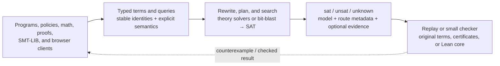

# Axeyum

**Axeyum answers hard questions about logic, math, and programs — and *proves*
its answers instead of asking you to trust them.**

Give it a supported claim ("this bit-vector formula can never be satisfied",
"this Rust function can't panic", "the derivative of x² + c is 2x") and Axeyum
tries to decide it. A definitive result is replayed or certified according to
the route; unsupported, incomplete, or resource-bounded cases remain an explicit
`unknown`. The exact current coverage is summarized in
[Project State](docs/PROJECT-STATE.md).

It's written entirely in Rust, has **no C or C++ in the default build**, and
**runs scalar QF_BV queries in the browser via WebAssembly** — no solver server
or install, with the same replay-checked SAT boundary as the native QF_BV
backend.

> **The one idea:** *untrusted fast search, trusted small checking.* Finding the
> answer is allowed to be big and clever; being *sure* of the answer is done by
> code small enough to audit.

> **The second idea:** *the loop.* A proof library is normally a one-way
> pipeline — people write proofs, a kernel checks them. Axeyum is a cycle: the
> library gives the solver facts to reason with, the solver decides goals the
> library needs, reconstruction turns those decisions into kernel-checked terms,
> and a [fact ledger](artifacts/facts/) records each result together with the
> exact set of assumptions it rests on. Every arrow exists today and the cycle
> has closed end to end. Making it turn *without a person on any arrow* is what
> this project is for.

The measure that goes with the second idea is deliberately one a reader can
check in a single command and a competitor cannot inflate: **how many
assumptions remain underneath a result, and how many results the system
established with nobody writing the proof.** Not throughput, and not benchmark
position. `python3 scripts/validate-facts.py` reports the ledger;
`theorem_axiom_footprint` reports what any individual theorem rests on.

**Choose a path:** [try a query](#start-here) ·
[see what you can build](#what-you-can-build-with-axeyum) ·
[understand the architecture](#how-axeyum-fits-together) ·
[check current support](docs/PROJECT-STATE.md) ·
[browse all documentation](docs/README.md)

## Four familiar tools, one proof-carrying stack

If you already use these, here's where Axeyum fits:

| If you reach for… | …Axeyum is | What's different |
|---|---|---|
| **Z3 / cvc5** (SMT solvers) | a pure-Rust SMT solver | supported certified routes return independently checkable evidence; uncovered routes remain explicit in the proof ledger |
| **Lean / Coq** (proof assistants) | an independent selected-profile Lean-core checker plus a designed certificate-first goal layer | supported solver proofs already reconstruct to checked terms; the native interactive goal/tactic layer is not built yet |
| **Mathematica / SymPy** (computer algebra) | a **proof-carrying CAS** | supported certificate-bearing operations use route-specific exact checks (normal-form witnesses, re-multiplication, substitution, or differentiate-and-check); compute-only APIs remain distinct |
| **a textbook + a lab** | a built-in library of tutorials, rules, axioms, and worked theorems | the same artifacts that *teach* a concept also *test* an Axeyum theory (double-duty) |

All four live in one pure-Rust workspace and follow the same fail-closed
discipline. Their IRs, certificate formats, and exact trust boundaries are
route-specific; they must not inherit assurance from one another.

## What you can build with Axeyum

Axeyum is a reusable reasoning and checking substrate. Some rows below are
working product surfaces, some are measured integrations, and some are explicit
destinations that already shape the architecture. The maturity column is part
of the claim: a shared solver does not make every consumer equally complete or
equally certified.

| Application family | What Axeyum contributes | Maturity and starting point |
|---|---|---|
| **Embedded constraint solving** | Typed Rust and SMT-LIB entry points for bit-vectors, arrays, equality, arithmetic, floating point, datatypes, bounded strings, quantifiers, and selected combinations. Useful as the decision core for configuration, equivalence, bounded planning, synthesis, and finite optimization. | **Built, broad but uneven.** Start with the [Rust embedding guide](docs/user-guide/rust-embedding.md), [supported logics](docs/reference/supported-logics.md), and [limitations](docs/user-guide/limitations.md). |
| **Software and systems verification** | Incremental symbolic execution, reachable-state enumeration, symbolic memory, bounded model checking, k-induction, and concrete counterexample traces for programs, protocols, and transition systems. | **Built on supported fragments.** See [how the engine works](#what-it-does-today-in-code) and the [bounded Rust verifier](crates/axeyum-verify/README.md). |
| **Property checking and test generation** | A typed prove-or-counterexample SDK that can minimize models and render deterministic Rust regression tests from replayed counterexamples. | **Built.** See [`axeyum-property`](crates/axeyum-property/README.md) and the [consumer scoreboards](docs/consumer-track/README.md). |
| **Binary analysis and security** | Typed path obligations, model replay, checked infeasible-path evidence, and deterministic resource behavior underneath a binary frontend and explorer. | **Real measured integration; frontend external.** Glaurung supplies binary semantics today; the boundary is documented in [agentic binary-security positioning](docs/research/02-ecosystems/agentic-binary-security-positioning.md). |
| **Smart-contract analysis** | Bounded symbolic execution of EVM bytecode with replayed calldata or multi-transaction witnesses and honest `Unknown` for unsupported behavior. | **Built, bounded.** See the [`axeyum-evm` bug hunter](crates/axeyum-evm/README.md). |
| **Formal proof and evidence infrastructure** | Model replay, DRAT/Farkas/Alethe and specialized checkers, selected solver-proof reconstruction, a small independent Lean-core checker, and fail-closed `lean4export` import. | **Substantial but partial.** See the [proof stack](docs/internals/proof-stack.md), [trust ledger](docs/reference/trust-ledger.md), and [prover-track boundary](docs/prover-track/README.md). |
| **Proof-carrying mathematics** | Exact symbolic algebra, calculus, linear algebra, number theory, transforms, and ODE operations with route-specific rechecking when a certificate-bearing API is used. | **Built research surface.** See [`axeyum-cas`](crates/axeyum-cas/README.md), the [CAS research notes](docs/research/10-cas/README.md), and [runnable examples](docs/reference/examples.md). |
| **Rules, policy, and compliance engineering** | Bounded consistency, coverage, monotonicity, threshold, version-equivalence, allocation, authorization, and workflow-reachability checks over human-authored formal models. | **Working verification lab, not automatic legal interpretation.** See the [Rules-as-Code Lab](docs/rules-as-code/README.md). |
| **Education and browser-native reasoning** | Executable curricula, worked theorems, certificate recipes, and self-checking exercises; scalar QF_BV runs client-side through WebAssembly. | **Built content and bounded browser surface.** See [Learn](docs/learn/README.md), the [formal-mathematics curriculum](docs/curriculum/README.md), and the [playground](docs/playground/README.md). |
| **Trustworthy LLM and agentic workflows** | Treat an LLM as an untrusted proposer of tests, rules, invariants, encodings, formalizations, or proof steps, then accept only independently checked results. | **Architectural fit and research direction, not a finished agent product.** See [LLM integration points](docs/research/03-architecture/llm-integration-points.md). |

The long-horizon objective is a general reasoning runtime for **constrained
program optimization and software verification**: first a dependable
finite-domain and arithmetic foundation, then Z3/cvc5-class solver breadth, and
eventually Lean- and angr/Unicorn-class functionality as first-class layers.
That is architectural direction, not a claim that those replacements exist
today. Read the [mission and scope](docs/research/00-orientation/mission-and-scope.md)
and [north star](docs/research/00-orientation/north-star.md) for the complete
ladder.

## Honest status

Axeyum today is a **broad, evidence-backed research implementation**, not merely
a design. It is competitive on selected measured solver fragments and has a
substantial Lean-checkable proof lane. It is not a drop-in Z3 replacement, a
conformant interactive SMT-LIB 2.7 implementation, or a replacement for the Lean
system, angr, or Unicorn.

The loop above is likewise real but not yet automatic. Each arrow has run, and
the whole cycle has run once end to end; what does not exist is a scheduler that
turns it without a person choosing the next goal. Both ledgers are gated rather
than asserted — `python3 scripts/validate-facts.py` and
`python3 scripts/validate-claims.py` re-derive them — and the honest reading of
any status here is whatever those commands print, not whatever this file says.

The current measured denominators, important negative results, and precise
meaning of "parity" are in **[Project State](docs/PROJECT-STATE.md)**. The
authoritative capability × assurance × evidence inventory is the
[capability matrix](docs/research/08-planning/capability-matrix.md). [PLAN.md](PLAN.md)
is the single live engineering tracker; [STATUS.md](STATUS.md) is only a
compatibility pointer to it.

## How Axeyum fits together

Applications share a reasoning foundation, not one undifferentiated assurance
claim. A query keeps the maps and provenance needed to check the answer at the
source boundary; each successful route then states exactly which checker, if
any, covers it.



The default path is pure Rust and denies `unsafe_code` workspace-wide. Native
solvers are optional oracle and benchmark leaves, not hidden runtime
dependencies. Deterministic traversal, explicit seeds and limits, source-model
replay, and first-class `unknown` are product contracts. For the crate-level
dataflow and trust boundaries, continue to the [architecture guide](docs/internals/architecture.md)
and [proof stack](docs/internals/proof-stack.md).

---

## Capability layers in detail

### 1. SMT solver (the Z3 / cvc5 angle)

A typed term IR → rewriting → query planning → solver backends, with a
**dependency-free pure-Rust path**: bit-blast to AIG → Tseitin CNF → a custom
CDCL SAT core. The major implemented theory surfaces are below. Their parser,
IR, evaluator, decision, model, and evidence layers do not all have equal
coverage; the [support matrix](docs/research/08-planning/support-matrix.md) is
the per-layer authority:

- **QF_BV** — full scalar operator set, widths to 2¹⁶; selected evidence routes
  can return a DRAT-checked proof and an end-to-end bit-blast faithfulness
  certificate. Decision coverage is broader than proof coverage; see the
  [measured evidence split](docs/PROJECT-STATE.md#evidence-and-lean).
- **Arrays and uninterpreted functions** — `QF_UF` uses online congruence
  closure over a backtrackable **e-graph**; supported `QF_ABV`/`QF_AUFBV`
  shapes use the retained online CDCL(T) array/UF path. Eager Ackermann and
  read-over-write elimination remain conservative fallbacks.
- **Linear arithmetic** — exact-rational `QF_LRA`, integer `QF_LIA`, and mixed
  `QF_LIRA`, with route-specific Farkas/Diophantine evidence. Supported
  Boolean structure uses online CDCL(T); `QF_UFLRA` and `QF_UFLIA` combine
  EUF with arithmetic by model-based equality sharing, with eager Ackermann
  fallback after an online `unknown`.
- **Floating point** (QF_FP) — IEEE 754 circuit builders for
  **F16/F32/F64/F128** and ML formats, differentially validated against native
  `f32`/`f64` and `rustc_apfloat`. Some conversions remain constant-only, and
  an UNSAT proof is modulo the trusted FP-to-circuit reduction.
- **Datatypes** (non-parametric algebraic and recursive; parametric declarations
  are rejected), **nonlinear** arithmetic (QF_NRA/NIA, sound-incomplete in
  general), **quantifiers** (complete finite Bool/BV expansion plus selected
  guarded Int/Real decisions, otherwise E-matching/MBQI/targeted CEGQI), and
  **strings / sequences** (`axeyum-strings`, the cvc5 normal-form procedure;
  bounded QF_S is BV-lowered today).

**Where Z3/cvc5 fit:** they are the differential oracle and the parity yardstick,
not a runtime dependency. The pure-Rust stack is the product; native backends
(`z3` first) are optional feature-gated leaves used for cross-checking and
head-to-head benchmarking (ADR-0002). Parity is a *measured* claim, kept honest
against public corpora.

### 2. Proof evidence and the Lean checker

Every `sat` is checkable by evaluation. Supported certificate-bearing
`unsat`/`valid` routes carry machine-checkable evidence; other definitive
routes keep their lower assurance explicit:

- selected `unsat` routes over the bit-vector-reducible core
  (QF_BV/ABV/UF/AUFBV/bounded-LIA/datatypes) → a rechecked **DRAT** certificate
  for the generated CNF; promoted routes also carry the independent
  bit-blast-faithfulness check. Broader decision routes and the default BatSat
  backend may remain explicitly proofless/lower-assurance.
- covered `QF_LRA` `unsat` paths → a **Farkas** refutation (exact-rational,
  self-verifying).
- supported **k-induction** proof routes emit and check a DRAT certificate for
  each admitted obligation.

`axeyum-lean-kernel` is an in-tree Rust implementation of a useful Lean core:
lifetime-free interned terms and universes, WHNF, definitional equality, type
checking, proof irrelevance, inductives, recursors, and iota reduction. Supported
solver proofs already reconstruct to kernel-checked terms and self-contained
Lean modules. A separate fail-closed `lean4export` 3.1 reader now independently
admits the retained direct, recursive-indexed, reflexive-higher-order, mutual,
nested, and pre-elaborated well-founded Lean 4.30 construct streams under
explicit population and computation gates. The fixed quotient package is an
offline TL2.10 M1--M3 result; its final differential/ADR credit remains open.
This is not a complete Lean kernel or ecosystem: String
literals, dependency-closed `Init`/`Std`/mathlib imports, native parsing/macros,
elaboration, tactics, modules/Lake, LSP, and compiler/runtime behavior remain
open.

"Lean compatible" means what the compatibility matrix measures: K0 1/1 and
K1 6/6 (an independent checker and a versioned import route), K2 through K6
at 0 — no native source, tactics, workflow, runtime, or ecosystem yet. Two
pins are distinct and every claim names which: `lean-toolchain`, the
cross-check pin (4.34.0-rc1, ADR-1594/1660), and the Mathlib corpus pin
(Lean 4.30.0, mathlib4 `c5ea0035`, lean4export `a3e35a58`). Independent
checkability is measured by replay in pinned Lean: 4,478 proved
declarations, 4,394 accepted, 50 `Type`-valued theorems Lean refuses, 34
blocked behind them (ADR-1661). Imports are a labeled tier, never the
axiom-free headline (ADR-0601, ADR-1664). `by axeyum` lets Lean check
axeyum-produced terms as a tactic (ADR-1666). Cross-library statement
identity runs through the carrier correspondence ledger (ADR-1665). Full
detail: [`docs/math-department/14-lean-lang.md`](docs/math-department/14-lean-lang.md).

See
[Project State](docs/PROJECT-STATE.md#evidence-and-lean) and the
[Lean-system strategy](docs/plan/lean-system-compatibility-roadmap-2026-07-21.md)
plus its [implementation plan](docs/plan/lean-system-implementation-plan-2026-07-21.md)
and [complete Lean 4.30 parity contract](docs/plan/lean4-complete-parity-contract-2026-07-22.md).
The first bounded U2 checkpoint derives
[3,678 default / 3,723 full-Lake CTest registrations](docs/plan/lean-u2-test-authority-2026-07-22.md)
from pinned upstream semantics while explicitly recording zero official,
Axeyum, or paired executions.
The next bounded checkpoint derives the pinned workflow into
[17 contexts, 153 cells, 111 declared CTest attempts, and eight exact selection
sets](docs/plan/lean-u2-official-ci-profiles-tl0.6.2-2026-07-22.md), while all
attempts remain not-run and all parity counters remain zero.
The prerequisite [execution-evidence contract](docs/plan/lean-execution-evidence-tl0.7.1-2026-07-22.md)
now freezes explicit resource lanes, typed terminations, immutable attempts and
completion-last records, but still records zero real runs or outcomes.

The separate [certificate-first prover track](docs/prover-track/README.md) is an
accepted design above this checker. Its P6.0 kernel-hardening prerequisites are
partly implemented, but the planned CIC/IR bridge, native goal/hole/unification
state, and certificate-tactic layer do not yet exist. Do not infer an interactive
proof assistant from the reconstruction and kernel features above.

### 3. Computer algebra (the Mathematica / SymPy angle)

`axeyum-cas` is a **proof-carrying CAS** (ADR-0301): pure Rust, WASM-safe,
oracle-free. Its supported certificate-bearing operations use CAS-local exact
checks such as a canonical difference witness, re-multiplication, substitution,
or differentiate-and-check. These are not automatically
`axeyum_solver::Evidence`, Alethe, or Lean proofs; compute-only APIs and
certificate envelopes remain distinct. Exact rational work is bounded by the
current checked `i128` representation, and an uncertifiable or overflowing
certificate-bearing route declines. Current surface:

- **Calculus** — `differentiate`/`differentiate_n`, `integrate` (polynomial, full
  rational via Horowitz + Rothstein–Trager, `∫p·eˣ`, `∫p·sin|cos`),
  `definite_integrate` (FTC), `limit`, `series`/`series_at` (Taylor), summation,
  and checker-backed WZ families for fixed-shift binomial convolutions and
  squared-binomial falling-factorial moments through order 255 and
  Stirling-composed raw moments through order 35, plus Laplace pairs with
  repeated real/rational-frequency quadratic poles, arbitrary-order rational-
  scale/shift Bessel `Jₙ` and modified-Bessel `Iₙ` forward pairs, exact inverse
  `J₀`/`J₁` and `I₀`/`I₁` pairs, bounded polynomial-geometric Z-transform
  pairs, and Fourier series with exact rational-trig coefficients on the
  canonical symmetric period.
- **Algebra** — `expand`, `simplify`, `factor` (full ℤ/ℚ, Berlekamp–Zassenhaus),
  `cancel`, `apart`, `poly_gcd`, `resultant`, `discriminant`, `solve` (rational,
  quadratic, complex, factorable degree ≥ 3), Gröbner bases, radical simplification.
- **Linear algebra** — matrices (determinant, RREF, inverse, null space, rank,
  trace), characteristic/minimal polynomials, eigenvalues/eigenvectors; vector
  calculus (gradient, Jacobian, divergence, curl).
- **Number theory** — primality, factorization, φ, CRT, Legendre/Jacobi,
  primitive roots, discrete log (BSGS), continued fractions, Pell.
- **ODEs** — constant-coefficient homogeneous/inhomogeneous, including generic
  non-polynomial first-order routing through the certified integrating-factor
  solver; certified first-order families; and exact or symbolic initial-value
  specialization whenever the evaluated basis matrix is rational.

The coverage target is *at least* SymPy's compute surface, aiming at
Mathematica's, measured against the 23-node
[formal-mathematics curriculum](docs/curriculum/README.md). See the
[CAS notes](docs/research/10-cas/README.md).

### 4. The pre-built library (tutorials, rules, axioms, theorems)

Axeyum ships a curated, machine-readable knowledge layer — not just a solver but
a *place to learn and to encode*:

- **[Formal Mathematics Tour](docs/curriculum/README.md)** — a curriculum
  knowledge graph worked backward from calculus, number theory, and linear
  algebra to their prerequisites, plus a **K-12 layer** teaching logic +
  reasoning + math + CS as one subject. Double-duty: each node both teaches a
  concept and tests a theory (ADR-0033).
- **[Proof Certificate Cookbook](docs/proof-cookbook/README.md)** — recipes that
  take a tiny formula, show the solver route, the evidence artifact, the checker,
  and whether it reconstructs to Lean.
- **[Rules-as-Code Verification Lab](docs/rules-as-code/README.md)** — a
  disciplined workflow for formalizing laws, policies, and eligibility/compliance
  rules: cite the source, encode a small model, check consistency and edge cases,
  replay counterexamples, state the trust boundary.
- **[SMT Fragment Atlas](docs/atlas/README.md)** — the machine-readable map of
  what Axeyum can parse, solve, replay, prove, and measure.
- **[Learn](docs/learn/README.md)** — SAT/SMT/proof concepts via tiny examples and
  diagrams, and the [foundational resources](docs/foundational-resources/) query
  packs across algebra, analysis, discrete math, geometry, and dynamics.

---

## What it does today, in code

**Symbolic execution & reachability** are first-class on the warm incremental
engine (`IncrementalBvSolver`): `push`/`pop`/`assume`, **assumption-core path
pruning**, **all-SAT reachable-state enumeration**, and **symbolic memory**. A
`SymbolicExecutor` driver exposes DFS-shaped exploration (`assume` / `branch` /
`enter`+`backtrack` / concrete test-input `model` / `enumerate_inputs` /
`minimize`/`maximize`), with a three-valued `PathStatus` so an undecided path is
never wrongly pruned. On top of these, **bounded model checking** over a
`TransitionSystem` returns replay-checked counterexample traces, and
**k-induction** lifts that to *unbounded* safety proofs — `Safe`, a
counterexample, or an honest `Inconclusive` (never a wrong `Safe`).

**Consumer applications** built on that engine:

- **`axeyum-verify`** — a `#[axeyum::verify]` proc-macro that symbolically
  bounded-checks a Rust function (over a whitelisted subset) for panics / integer
  overflow / `unwrap` failures / assertion violations, emitting a **runnable
  failing `#[test]`** for a reproduced counterexample or bounded `Verified`.
  Certificate and Lean-module presence are explicit fields; the warm loop route
  currently returns a decision without a packaged certificate. Anything outside
  the macro's source subset is a clean compile error, never silently mis-modeled.
- **`axeyum-evm`** — an EVM bytecode symbolic bug-hunter over symbolic calldata:
  a replayable calldata witness on a bug (re-checked by concrete re-execution),
  or `SafeUpToBound` after complete bounded exploration. A supported safety
  query may attach a re-checked `EvidenceReport`; that field is optional and is
  not a Lean reconstruction.
- **`axeyum-property`** — a typed prove-or-counterexample SDK over Axeyum evidence
  and model replay.

Everything routes through a few entry points in `axeyum-solver`:

| Call | Purpose |
|---|---|
| `solve` / `solve_smtlib` | decide any supported query (terms or SMT-LIB 2 text) |
| `prove` | prove a goal by a **checkable refutation** of its negation |
| `produce_evidence` | decide *and* package a self-checking certificate |
| `export_qf_{bv,abv,uf,aufbv,lia}_unsat_proof`, `export_datatype_unsat_proof` | emit a `drat-trim`-checkable DIMACS+DRAT certificate |
| `IncrementalBvSolver` | warm push/pop/assume + path-pruning core + all-SAT + symbolic memory |
| `unsat_core` / `Evidence::check` | extract a core; independently re-validate supported evidence artifacts |

The incremental solver owns its state, implements `Send`, and uses no shared
global context — one `TermArena` + `IncrementalBvSolver` per worker scans
independent queries in parallel. See the
[Rust embedding guide](docs/user-guide/rust-embedding.md).

## Runs in the browser (WebAssembly)

The default library stack builds for `wasm32-unknown-unknown` (ADR-0017): the
pure-Rust core has no C/C++ and no native clock dependency (a
`web-time` shim covers wasm targets). `axeyum-cas` and `axeyum-strings` are
WASM-safe by construction. `axeyum-wasm` exposes a tiny JSON surface over the
QF_BV backend so a **static page solves a query client-side** — no server, no
install — and a returned `sat` is already replay-verified: **the trust boundary
is preserved across the WASM boundary**. Try it in the
[playground](docs/playground/README.md).

The browser JSON surface returns verdict metadata, not a rendered model or
portable UNSAT proof. See the [WASM guide](docs/user-guide/wasm.md) for its exact
QF_BV boundary, pinned build workflow, and native evidence alternatives.

```sh
cargo build --target wasm32-unknown-unknown -p axeyum-wasm
```

## Workspace

The crate split is deliberately minimal — boundaries are added only once proven
by use (each is accepted in an ADR).

The repository's top-level directories also separate inputs, checked evidence,
measurements, implementations, and developer infrastructure. They are not
interchangeable output buckets:

| Directory | Role |
|---|---|
| [`crates/`](crates) | Root Rust workspace and product implementations. |
| [`python/`](python) | Python package, examples, benchmarks, and binding tests. |
| [`corpus/`](corpus/README.md) | Solver inputs and minimized regression cases. |
| [`artifacts/`](artifacts) | Checkable evidence, ledgers, schemas, and replay inputs. |
| [`bench-results/`](bench-results/README.md) | Measured benchmark outputs and scoreboards. |
| [`render/`](render/Cargo.toml) | Deliberately standalone document-rendering workspace; promotion into `crates/` requires its planned ADR. |
| [`docs/`](docs/README.md) | User, contributor, research, decision, and planning documentation. |
| [`scripts/`](scripts) and [`tools/`](tools) | Repository-wide automation and the Python binding's focused type/stub tools. |
| [`hooks/`](hooks) | Version-controlled `commit-msg` and `pre-push` gates installed by fleet provisioning. |
| [`references/`](references/README.md) | Manifest for optional, gitignored reference-project clones. |

Hidden `.config/` and `.github/` directories hold standard tool and CI
configuration. The ignored `target/` directory is disposable Rust build output
and can be removed with `cargo clean`.

**Core IR & solving**

| Crate | Purpose |
|---|---|
| [`axeyum-ir`](crates/axeyum-ir) | Sorts, terms, interning, ground evaluation, LSB-first value/bit conversion. |
| [`axeyum-egraph`](crates/axeyum-egraph) | Incremental congruence-closure e-graph — the shared equality bus with a Nieuwenhuis–Oliveras proof forest and backtrackable trail. |
| [`axeyum-aig`](crates/axeyum-aig) | AIG circuit graph with deterministic structural hashing, evaluation, ASCII AIGER export. |
| [`axeyum-bv`](crates/axeyum-bv) | Term-to-AIG bit lowering with explicit term-bit and symbol-input maps. |
| [`axeyum-cnf`](crates/axeyum-cnf) | Tseitin CNF encoding, DIMACS I/O, BatSat-backed solving, replay maps, and a proof-producing CDCL core with an in-tree DRAT checker. |
| [`axeyum-fp`](crates/axeyum-fp) | IEEE 754 floating-point formula builders (F16–F128 + ML formats). |
| [`axeyum-query`](crates/axeyum-query) | Query object, structural cache keys, conservative slicing, replay checks. |
| [`axeyum-rewrite`](crates/axeyum-rewrite) | Rewrite manifest contracts, denotation-preserving canonicalizer, array elimination (QF_ABV → QF_BV). |
| [`axeyum-strings`](crates/axeyum-strings) | Word-level string/sequence theory (cvc5 normal-form procedure) over the typed IR. |
| [`axeyum-solver`](crates/axeyum-solver) | Backend trait, results, models, capability ledger; `solve`/`prove`/`produce_evidence`; warm incremental engine + symbolic-execution primitives; DRAT exporters; native backends behind feature flags. |

**Higher layers: algebra, proofs, applications**

| Crate | Purpose |
|---|---|
| [`axeyum-cas`](crates/axeyum-cas) | Computer algebra with CAS-local exact checks and certificate-bearing APIs alongside explicitly compute-only operations. |
| [`axeyum-lean-kernel`](crates/axeyum-lean-kernel) | In-tree Rust Lean kernel — interned `Name`/`Level`/`Expr` + de Bruijn machinery (the proof-export target). |
| [`axeyum-lean-import`](crates/axeyum-lean-import) | Fail-closed official `lean4export` 3.1 reader; supported declarations enter only through the independent kernel's checked gates. |
| [`axeyum-property`](crates/axeyum-property) (+ [`-macros`](crates/axeyum-property-macros)) | Typed prove-or-counterexample SDK over Axeyum evidence and model replay. |
| [`axeyum-verify`](crates/axeyum-verify) (+ [`-macros`](crates/axeyum-verify-macros)) | `#[axeyum::verify]` bounded Rust verifier — panics/overflow/`unwrap`/assertions → failing test or certificate. |
| [`axeyum-evm`](crates/axeyum-evm) | EVM bytecode symbolic bug-hunter with replayable calldata witnesses, bounded-safe verdicts, and optional re-checked evidence. |
| [`axeyum-wasm`](crates/axeyum-wasm) | WebAssembly binding — the browser playground engine. |

**Tooling & corpora**

| Crate | Purpose |
|---|---|
| [`axeyum-scenarios`](crates/axeyum-scenarios) | Self-checking, oracle-free consumer workloads (SAT by execution, UNSAT by bounded-verified identities). |
| [`axeyum-smtlib`](crates/axeyum-smtlib) | SMT-LIB 2 reader/writer: typed command stream, scoped query points, sharing-preserving export. |
| [`axeyum-bench`](crates/axeyum-bench) | Corpus benchmark harness with PAR-2 scoring, backend selection, JSON artifacts. |

## Start here

Run one dependency-free example from source:

```sh
cargo run -p axeyum-solver --features full --example first_smtlib_query
cargo run -p axeyum-cas --example cas_tour
cargo run -p axeyum-bench --example curriculum_demo
```

The first command parses and solves a small SMT-LIB query, the second tours the
CAS, and the third connects the curriculum graph to checked solver evidence.
For prerequisites, expected output, and examples that intentionally write
artifacts, use the complete [runnable-example catalog](docs/reference/examples.md).
To avoid a local build, use the [browser playground](docs/playground/README.md).

To solve your own SMT-LIB file through the command-faithful, multi-query front
door (rather than the fixed teaching example):

```sh
cargo run -q -p axeyum-bench --bin axeyum -- your-query.smt2
```

It prints one response per output command, reports unsupported commands
explicitly, and exits nonzero on parse, execution, or in-script errors. The
binary is built from the repository and is not yet published as a crate or
prebuilt release.

- [Project State](docs/PROJECT-STATE.md) — what is built, what has actually been
  measured, what remains partial, and what "Z3/Lean parity" does and does not
  mean.
- [How Axeyum solves a query](docs/learn/07-how-axeyum-solves-a-query.md) — the
  best single page: the pipeline and the untrusted-search / trusted-checking
  boundary, with diagrams.
- [Capability matrix](docs/research/08-planning/capability-matrix.md) and
  [support matrix](docs/research/08-planning/support-matrix.md) — the
  golden-tested inventories (capability × assurance × evidence; per-fragment
  parser/IR/solver/proof status).
- [docs/README.md](docs/README.md) — reader-friendly front door (also builds into
  a searchable mdBook site with Mermaid diagrams).
- [Runnable examples](docs/reference/examples.md) — all checked-in Cargo
  examples, separated into learning workflows, artifact generators, and
  maintainer diagnostics with their prerequisites.
- [Consumer applications](docs/consumer-track/README.md) — the bounded-property
  SDK, EVM bug-hunter, Rust verifier, their trust boundaries, and the current
  48-case aggregate scoreboard.
- [Certificate-first prover track](docs/prover-track/README.md) — the exact
  boundary between the built Lean checker/reconstruction stack and the planned
  goal, hole, bridge, and tactic layers.
- [docs/research/](docs/research/README.md) — the research foundation, and
  [09-decisions/](docs/research/09-decisions/README.md), the ADRs.
- [PLAN.md](PLAN.md) — the single current status, ordered roadmap, blockers,
  and resume protocol for maintainers. [STATUS.md](STATUS.md) is a compatibility
  pointer only.

| You are… | Start here |
|---|---|
| **New to SAT/SMT/proofs** | [docs/learn/](docs/learn/README.md) |
| **A user** | [docs/user-guide/](docs/user-guide/README.md) — run a query, read a model, [limitations](docs/user-guide/limitations.md) |
| **Building or evaluating a verifier** | [docs/consumer-track/](docs/consumer-track/README.md) — property, EVM, and Rust application front doors plus measured evidence |
| **Curious about internals** | [docs/internals/](docs/internals/README.md) — [architecture](docs/internals/architecture.md), trust boundary |
| **Want to try it now** | [docs/playground/](docs/playground/README.md) — solve a query **in your browser** (WASM) |

## Development

```sh
just check          # fmt + clippy + test + doc + foundational resources + docs link check
cargo fmt --all --check
cargo clippy --workspace --all-targets --all-features -- -D warnings
cargo test --workspace --all-features
cargo doc --workspace --all-features --no-deps
cargo build --target wasm32-unknown-unknown -p axeyum-wasm     # browser binding (ADR-0017)
cargo deny check                                               # requires cargo-deny

# Benchmarks
cargo run -p axeyum-bench -- corpus/micro --backend sat-bv --timeout-ms 1000 --out /tmp/micro-sat-bv.json
cargo run -p axeyum-bench --features z3 -- corpus/micro --backend z3 --timeout-ms 1000 --out /tmp/micro-z3.json
just bench-public-qfbv-sat-bv-compare     # public QF_BV sat-bv vs Z3 slice
```

The pure-Rust default build has no C or C++ dependency; native solver backends
(Z3 first) are optional features. Reference solver/checker sources can be cloned
locally for study with [`scripts/fetch-references.sh`](scripts/fetch-references.sh).
Local default toolchain may be nightly; CI runs stable plus an MSRV (1.88) check.
Edition 2024, resolver 3.

## License

Dual-licensed under [MIT](LICENSE-MIT) or [Apache-2.0](LICENSE-APACHE), at your
option. Contributions are accepted under the same terms.
