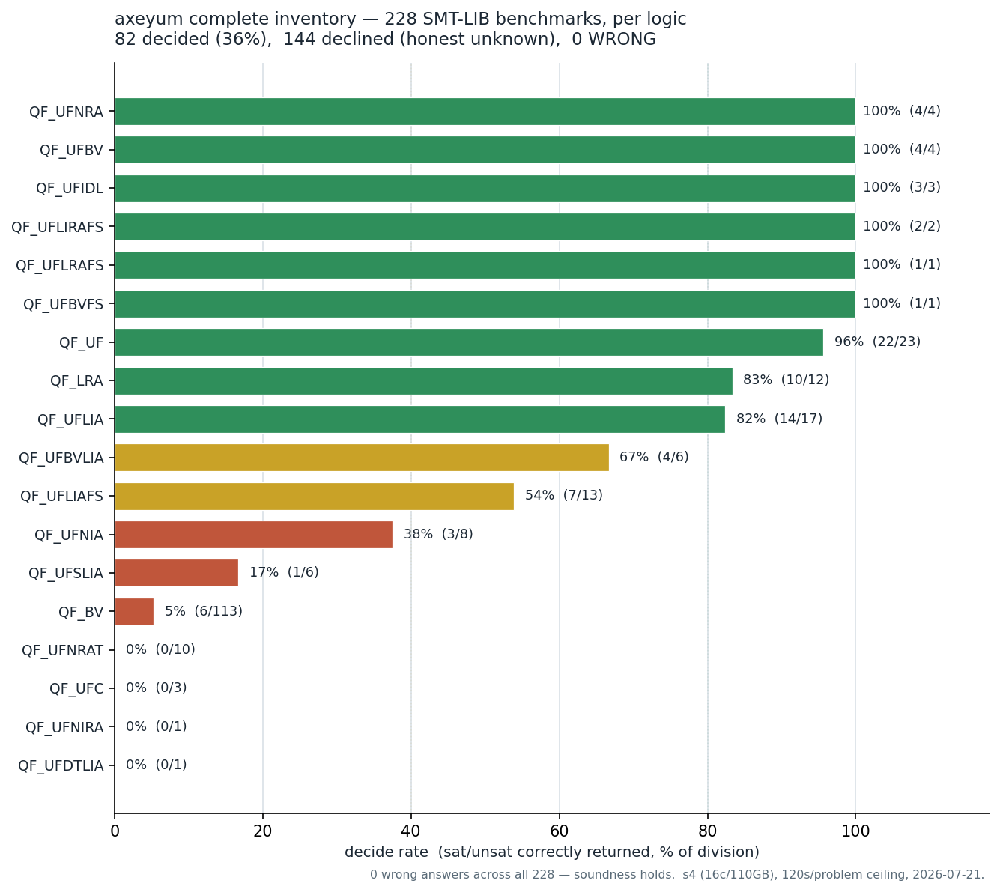
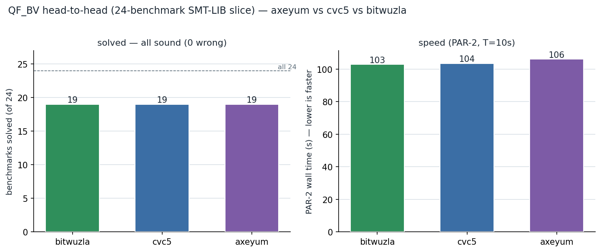

# SMT-COMP scoring reproduction + complete axeyum inventory — 2026-07-21

A local, in-tree replica of the **entire SMT-COMP 2026 scoring pipeline**, plus
the first **complete capability + soundness inventory** of axeyum over a real
SMT-LIB benchmark set. Built by reading the official rules/tooling for reference
only — nothing was pushed to or PR-ed against the SMT-COMP repositories.

> **Headline:** axeyum is **never wrong** — 0 incorrect verdicts across 228 real
> SMT-LIB benchmarks *and* across a 3-solver QF_BV head-to-head (72 runs). On the
> fragments it targets it decides most (UF 96 %, UFBV/UFIDL/UFNRA 100 %, UFLIA
> 82 %, LRA 83 %); it declines honestly elsewhere. On this particular slice it is
> speed-competitive with cvc5 and bitwuzla (same 19/24, ~3 % slower on PAR-2).





---

## What was measured

Three artifacts, one harness (`scripts/smtcomp_repro/`, committed at `f80b697b`):

1. **Scoring-pipeline replica** — the full SMT-COMP §7 scoring (benchmark score
   tuple ⟨e,n,aw,w,ac,c⟩ for all 5 tracks, sequential score, division scores
   parallel/PAR-2/sequential/24s/sat/unsat + disagreement removal, and the three
   competition-wide rankings), plus §6 benchmark selection and §5 resource-limited
   execution. Validated by **40 unit tests** (`tests/`), one per rule clause.
2. **QF_BV head-to-head** — axeyum vs **cvc5 1.3.4** vs **bitwuzla 0.9.1**, Single
   Query Track scoring, on a 24-benchmark SMT-LIB QF_BV slice.
3. **Complete inventory** — axeyum over **all 228 SMT-LIB benchmarks** currently
   on the NAS, on the quiet host **s4**, producing a per-logic decide/decline/
   wrong map.

## Provenance

| Item | Value |
|---|---|
| Date | 2026-07-21 |
| Harness commit | `f80b697b` (branch `repro/smtcomp-scoring`), record HEAD `cb2a44cb` |
| axeyum solver CLI | `target/release/examples/smtcomp_cli` (over `axeyum_solver::solve_smtlib`), sha256 `ff36fc2d…4c9a5d4f` |
| Reference solvers | cvc5 1.3.4 (`git f3b21c4`), bitwuzla 0.9.1 — both static, gitignored in `references/smtcomp-solvers/` |
| Rules spec | SMT-COMP 2026 Rules and Procedures (21st competition, rev. 2026-04-11), §5/§6/§7 |
| Head-to-head host | `server0`, 24 cores |
| Inventory host | `s4`, 16 cores / 110 GB, load ≈ 0 (quiet), 12-way parallel |
| Benchmark source | `/nas3/data/axeyum/corpus/public/non-incremental` (partial SMT-LIB slice: 228 files) |

## Complete inventory result (228 benchmarks)

| | count | % |
|---|---:|---:|
| decided-correct (sat/unsat matching `:status`) | 82 | 36.0 % |
| declined (honest `unknown` / unsupported) | 144 | 63.2 % |
| no answer (timeout/abort, no verdict) | 2 | 0.9 % |
| **WRONG (incorrect sat/unsat)** | **0** | **0.0 %** |

Per-logic decide rate (logic read from each file's `set-logic`, not the directory):

| logic | N | decided | decide% | note |
|---|---:|---:|---:|---|
| QF_UFNRA | 4 | 4 | 100 % | |
| QF_UFBV | 4 | 4 | 100 % | |
| QF_UFIDL | 3 | 3 | 100 % | |
| QF_UF | 23 | 22 | 96 % | |
| QF_LRA | 12 | 10 | 83 % | |
| QF_UFLIA | 17 | 14 | 82 % | |
| QF_UFBVLIA | 6 | 4 | 67 % | |
| QF_UFLIAFS | 13 | 7 | 54 % | |
| QF_UFNIA | 8 | 3 | 38 % | |
| QF_UFSLIA | 6 | 1 | 17 % | |
| **QF_BV** | **113** | **6** | **5 %** | the hard `p4dfa` composition/string family — the weak spot |
| QF_UFNRAT | 10 | 0 | 0 % | transcendentals — out of fragment, declined honestly |
| QF_UFC, QF_UFDTLIA, QF_UFNIRA | 1–3 | 0 | 0 % | exotic combined fragments |

(Full per-logic + solved-time distribution in `inventory.json`; the six 100 %
single-file logics — UFBVFS/UFLIRAFS/UFLRAFS — omitted from the table for space.)

The overall **36 %** is dragged down by the QF_BV `p4dfa` family, which is **half
the set (113/228)** and where axeyum cracks only 6, riding to the time cap on 106.
That family is a concrete, named target for word-level BV reduction (STATUS.md's
central decide-rate gap). **114 benchmarks hit the 120 s ceiling** — these are the
"does more time help?" candidates for a higher-limit re-run (see `inventory.json`
`stragglers`).

## QF_BV head-to-head result (24 benchmarks, T=10 s)

| solver | e (wrong) | n (solved / 24) | PAR-2 wall (s) | seq CPU (s) |
|---|---:|---:|---:|---:|
| bitwuzla 0.9.1 | 0 | 19 | 103.0 | 3.0 |
| cvc5 1.3.4 | 0 | 19 | 103.6 | 3.6 |
| **axeyum** | **0** | **19** | **106.1** | **6.1** |

All three sound, all solve the same 19/24 (the 5 misses are the hard
`brummayerbiere3` multiplier-unsats that time out for everyone). Best-overall
score tied at `(19/24)²·log₁₀24 = 0.865`; biggest-lead correctness rank 1.000.
axeyum is a close, honest third on speed.

## How to reproduce

```sh
# 1. build the SMT-COMP CLI + run the 40-test scoring validation
cargo build --release -p axeyum-bench --example smtcomp_cli
for t in test_scoring test_pipeline test_selection; do python3 scripts/smtcomp_repro/tests/$t.py; done

# 2. QF_BV head-to-head (this produced head_to_head_qfbv.json)
python3 scripts/smtcomp_repro/compete.py --corpus corpus/qfbv-curated \
  --solver axeyum=target/release/examples/smtcomp_cli \
  --solver cvc5=references/smtcomp-solvers/cvc5 \
  --solver bitwuzla=references/smtcomp-solvers/bitwuzla \
  --track single_query --wall-limit 10 --internal-timeout-ms 9000 --limit 24 \
  --out head_to_head_qfbv.json

# 3. complete inventory on the quiet host s4 (12-way parallel, 120s ceiling)
#    each shard: compete.py --shard i/12 --dump-raw raw_i.json ; then:
python3 scripts/smtcomp_repro/inventory.py raw_*.json --solver axeyum \
  --ceiling-s 120 --out inventory.json

# 4. regenerate the charts in this directory
python3 bench-results/smtcomp-repro-20260721/chart.py
```

## Where this sits (prior art it backfills / extends)

Interpretation boundary: this is a complete run over the 228 files currently
present on the NAS, not a complete or officially selected SMT-COMP benchmark
population. The set is source-skewed (113/228 are p4dfa), and exact/near-
duplicate source-family groups are not yet classified. Keep its 82/228 result
separate from the curated/regression scoreboard's denominator. The current
cross-artifact research plan is
[`docs/plan/gap-analysis-z3-lean-2026-07-21.md`](../../docs/plan/gap-analysis-z3-lean-2026-07-21.md).

- **[`bench-results/SCOREBOARD.md`](../SCOREBOARD.md)** — axeyum vs z3 4.13.3,
  35 division baselines, with totals generated from committed JSON and
  **DISAGREE = 0 everywhere**. This record's
  soundness result (0 wrong) is consistent with that floor; its 36 % decide is on
  a *different, harder* slice (the NAS 228, half the hard QF_BV family), not the
  curated regression baselines — the numbers measure different corpora and should
  not be compared directly.
- **[`bench-results/frontier/`](../frontier/)** — per-family capability curves
  (bv_reduction, lia_cuts, nia_unsat, nra_degree, string_bound). Same
  "capability frontier at DISAGREE=0" framing, per family.
- **Four-oracle QF_BV campaign** ([`qfbv-four-oracle-independent-20260718-600s`](../qfbv-four-oracle-independent-20260718-600s/README.md))
  — 12,000 *generated* formulas, 0 wrong across axeyum/z3/cvc5/bitwuzla. This
  record adds the same 0-wrong result on **real SMT-LIB files** for the first time.
- **Neutral warm baseline** ([`glaurung-six-cell-neutral-20260719`](../glaurung-six-cell-neutral-20260719/README.md))
  — the fair in-process axeyum/z3/bitwuzla head-to-head on consumer drivers. This
  record complements it with the *public-benchmark* head-to-head under SMT-COMP
  scoring rules.

## Roadmap / next actions

1. **Higher-limit straggler re-run** — the 114 ceiling-hitters (mostly QF_BV
   `p4dfa`) at 900–3600 s on s4, to measure how many extra time rescues.
2. **Full SMT-LIB library** — `scripts/fetch-corpus.sh` the real QF_BV/QF_ABV/…
   releases to the NAS, then this same harness produces the *real* complete
   inventory (tens of thousands of files) at competition scale.
3. **Model-Validation & Unsat-Core tracks** — wire the Dolmen model validator
   and the cross-solver core re-check (scoring is implemented + tested; the
   external validators are the remaining plumbing).
4. **SMT-COMP 2027 entry** — the CLI here is the exact Single-Query artifact an
   entrant needs; the 2026 window closed 2026-05-27, target is 2027.

## Files in this record

| File | What |
|---|---|
| `inventory.json` | complete per-logic inventory + solved-time stats + straggler list |
| `inventory_raw.json` | merged raw per-benchmark results (all 228, all 12 shards) |
| `head_to_head_qfbv.json` | the 3-solver QF_BV scoreboard |
| `inventory_decide_by_logic.png` | decide-rate-by-logic bar chart |
| `head_to_head_qfbv.png` | 3-solver solved + PAR-2 chart |
| `chart.py` | deterministic chart regenerator (reads the JSON above) |

Harness (scoring engine, runner, selection, driver, tests, CLI):
[`scripts/smtcomp_repro/`](../../scripts/smtcomp_repro/README.md) and
[`crates/axeyum-bench/examples/smtcomp_cli.rs`](../../crates/axeyum-bench/examples/smtcomp_cli.rs).
