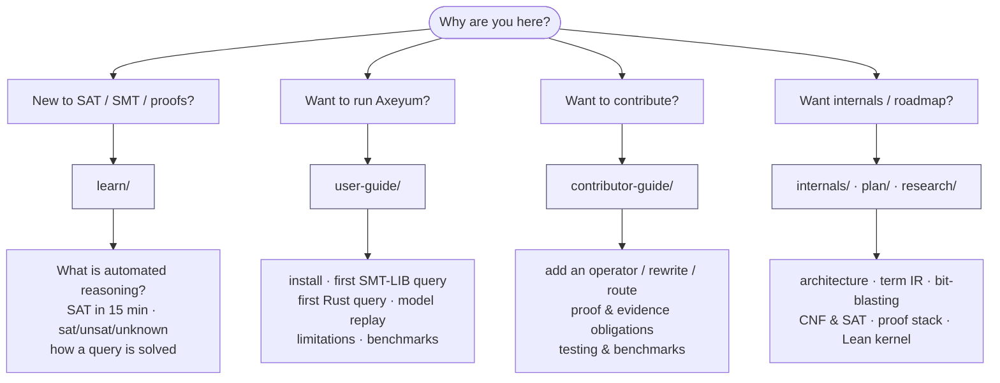

# Axeyum Documentation

> **Identity in one line:** *untrusted fast search, trusted small checking.*
> Axeyum searches for answers with fast (possibly buggy) procedures, then
> **re-checks** every answer with small, independent checkers — so a wrong
> search can never produce a wrong result, only an honest `unknown`.

This is the documentation hub. The [README](../README.md) is the lobby; this is
the directory. Pick the path that matches why you're here.



## Reader paths

| You are… | Start here |
|---|---|
| **New to automated reasoning** | [`learn/`](learn/README.md) — concepts through tiny examples, no internals |
| **A user** | [`user-guide/`](user-guide/README.md) — run a query, read a model, know the limits |
| **A contributor** | [`contributor-guide/`](contributor-guide/README.md) — the obligations for new public surface |
| **A maintainer / researcher** | [`internals/`](internals/README.md), [`plan/`](plan/README.md), [`research/`](research/README.md) |

## The honest current state

Axeyum's **north star** is Z3-class solving with Lean-grade checkable evidence.
**Today** it is a research-grade Rust stack with strong foundations and explicit
`unknown`s where support or performance is incomplete. We state this concretely,
not with broad parity language:

- ✅ **Solid today** — typed IR, the QF_BV bit-blast→SAT path, SMT-LIB front
  door, model replay, and many proof/evidence routes (DRAT/LRAT/Alethe, a Rust
  Lean kernel). See the [capability matrix](research/08-planning/capability-matrix.md).
- 🚧 **In progress** — performance, full SMT-LIB command semantics, complete
  proof coverage, NRA/quantifier completeness.
- 🔭 **North star** — general Z3 replacement, full Lean parity, unbounded
  strings.

Measured, not asserted: on the public QF_BV `p4dfa` slice, the pure-Rust path
and Z3 4.13.3 are at **parity** at second-scale budgets (8–8 @20s, 11–11 @60s);
**both** time out on ~90% of that adversarially-hard corpus. The earlier "Z3
sweeps essentially all" was an unmeasured premise. See
[`user-guide/benchmarks.md`](user-guide/benchmarks.md).

## Authoritative references

| What | Where |
|---|---|
| Capability × assurance × evidence (golden-tested) | [capability-matrix](research/08-planning/capability-matrix.md) |
| Parser / IR / solver / proof support per feature | [support-matrix](research/08-planning/support-matrix.md) |
| What is trusted vs independently checked | [trust-ledger](research/08-planning/trust-ledger.md) |
| Live status & changelog | [STATUS.md](../STATUS.md) |
| Roadmap (tracks → phases → tasks) | [PLAN.md](../PLAN.md) · [plan/](plan/README.md) |
| Design decisions | [ADRs](research/09-decisions/README.md) |
| External review | [reviews/](reviews/) |

## How this documentation is built

The guide pages are plain Markdown that render on GitHub **and** compile into a
searchable static site:

- **[mdBook](https://rust-lang.github.io/mdBook/)** — Rust-native static site
  (matches the project's toolchain), with search and themes. `book.toml` +
  [`SUMMARY.md`](SUMMARY.md) drive it.
- **[Mermaid](https://mermaid.js.org/)** diagrams (the fenced ```` ```mermaid ````
  blocks) for flows, sequences, and architecture — text-based and diffable.
- **Graphviz/SVG** for precise structural pictures (the term-IR DAG, bit-blast
  circuits) under [`assets/`](assets/).
- **A WASM solver playground** ([`playground/`](playground/README.md)) — Axeyum
  compiled to WebAssembly so you can solve a query *in your browser*, no install.

See [`internals/documentation.md`](internals/documentation.md) for the build and
the rationale (why mdBook + Mermaid + WASM over Docusaurus/Verso/Jupyter here).
