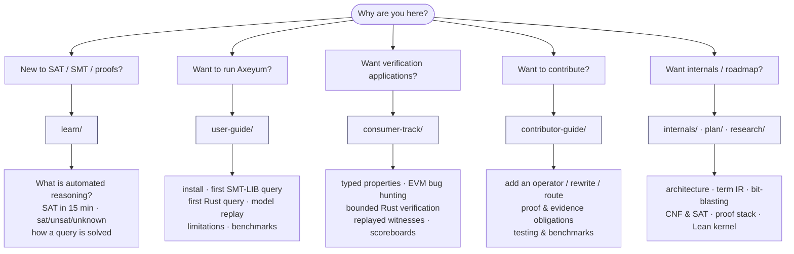

# Axeyum Documentation

> **Identity in one line:** *untrusted fast search, trusted small checking.*
> Axeyum searches for answers with fast (possibly buggy) procedures, then
> replays or certifies supported definitive results with independent checkers.
> Uncovered, incomplete, or resource-bounded routes remain explicit.

This is the documentation hub. The [README](../README.md) is the lobby; this is
the directory. Pick the path that matches why you're here.


```mermaid
flowchart TD
    start([Why are you here?])
    start --> learn[New to SAT / SMT / proofs?]
    start --> use[Want to run Axeyum?]
    start --> apps[Want verification applications?]
    start --> contrib[Want to contribute?]
    start --> deep[Want internals / roadmap?]

    learn --> L[learn/]
    use --> U[user-guide/]
    apps --> A[consumer-track/]
    contrib --> C[contributor-guide/]
    deep --> I[internals/ · plan/ · research/]

    L --> Lq["What is automated reasoning?<br/>SAT in 15 min · sat/unsat/unknown<br/>how a query is solved"]
    U --> Uq["install · first SMT-LIB query<br/>first Rust query · model replay<br/>limitations · benchmarks"]
    A --> Aq["typed properties · EVM bug hunting<br/>bounded Rust verification<br/>replayed witnesses · scoreboards"]
    C --> Cq["add an operator / rewrite / route<br/>proof &amp; evidence obligations<br/>testing &amp; benchmarks"]
    I --> Iq["architecture · term IR · bit-blasting<br/>CNF &amp; SAT · proof stack · Lean kernel"]

    classDef path fill:#eef,stroke:#557,stroke-width:1px;
    class L,U,A,C,I path;
```

## Reader paths

| You are… | Start here |
|---|---|
| **Evaluating what exists today** | [`PROJECT-STATE.md`](PROJECT-STATE.md) — built vs measured vs partial, with exact Z3/Lean scope |
| **New to automated reasoning** | [`learn/`](learn/README.md) — concepts through tiny examples, no internals |
| **A user** | [`user-guide/`](user-guide/README.md) — run a query, read a model, know the limits |
| **Looking for verification applications** | [`consumer-track/`](consumer-track/README.md) — property SDK, EVM bug-hunter, bounded Rust verifier, and measured scoreboards |
| **Evaluating the proof-assistant design** | [`prover-track/`](prover-track/README.md) — landed kernel prerequisites vs the not-yet-built goal/tactic layer |
| **A contributor** | [`contributor-guide/`](contributor-guide/README.md) — the obligations for new public surface |
| **Looking up an API or support boundary** | [`reference/`](reference/README.md) — stable entry points into source and generated truth |
| **Looking for a runnable example** | [`reference/examples.md`](reference/examples.md) — all Cargo examples, prerequisites, and mutation boundaries |
| **A maintainer / researcher** | [`internals/`](internals/README.md), [`plan/`](plan/README.md), [`research/`](research/README.md) |
| **Planning a refactor or cleanup** | [`refactor-2026-08/`](refactor-2026-08/README.md) — measured baseline and four ordered findings from the 2026-08-14 campaign |
| **Asking how each field of mathematics would judge us** | [`math-department/`](math-department/README.md) — twelve standing reviewers, one file per field: measured state, projected verdict, next five, progress log |
| **Asking what mathematics the stack can do** | [`mathematics-2026-08/`](mathematics-2026-08/README.md) — decide vs certify, the library, values vs theorems, reachability |
| **Bringing in the world's formalized mathematics** | [`formalized-math-2026-08/`](formalized-math-2026-08/README.md) — collect, synthesize, integrate, and what to build instead |
| **Planning verified self-extension** | [`autogenesis/`](autogenesis/README.md) — current gaps, target architecture, phased programme, trust boundaries, and Autogenesis-1 |
| **Checking where a roadmap number came from** | [`campaign-2026-08-13/`](campaign-2026-08-13/README.md) — the twelve lanes' diaries, feedback and results that every measurement traces to |

Multi-agent sessions should use the
[worktree collaboration protocol](contributor-guide/multi-agent-worktrees.md).
Potential educational, ontology, law/rules, and downstream sibling projects are
tracked in [Sibling Project Notes](sibling-projects.md). The first detailed
incubator plans are the [SMT Fragment Atlas](atlas/README.md),
[Proof Certificate Cookbook](proof-cookbook/README.md), and
[Rules-as-Code Verification Lab](rules-as-code/README.md). A broader researched
plan for mathematics, computer science, logic, and statistics resources lives in
[Foundational Resource Expansion](foundational-resources/README.md), with the
mathematics lane grounded by the
[University Math Field Taxonomy](foundational-resources/MATH-FIELDS.md).

## The honest current state

Axeyum's north star is Z3-class solving with Lean-grade checkable evidence. Its
current state is not one scalar percentage: selected solver fragments are
already competitive, proof coverage is substantial but incomplete, and
production SMT-LIB plus full Lean-core compatibility remain materially open.

Read **[Project State](PROJECT-STATE.md)** for the short, evidence-linked account
of what exists, what the committed measurements establish, and what the project
does not claim. Use the [benchmark guide](user-guide/benchmarks.md) for the
performance cells and [limitations](user-guide/limitations.md) before relying on
a fragment.

## Authoritative references

| What | Where |
|---|---|
| Plain-English built / measured / partial summary | [Project State](PROJECT-STATE.md) |
| Capability × assurance × evidence (golden-tested) | [capability-matrix](research/08-planning/capability-matrix.md) |
| Parser / IR / solver / proof support per feature | [support-matrix](research/08-planning/support-matrix.md) |
| What is trusted vs independently checked | [trust-ledger](research/08-planning/trust-ledger.md) |
| Mathematical claims, their epistemic status, and the evidence checking them | [claim ledger](../artifacts/claims/README.md) |
| Live status, ordered work, and resume protocol | [PLAN.md](../PLAN.md) |
| Detailed phase and result documents | [plan/](plan/README.md) |
| Design decisions | [ADRs](research/09-decisions/README.md) |
| Point-in-time review archive | [reviews](reviews/README.md) |

## How this documentation is built

The guide pages are plain Markdown that render on GitHub **and** compile into a
searchable static site:

- **[mdBook](https://rust-lang.github.io/mdBook/)** — Rust-native static site
  (matches the project's toolchain), with search and themes. `book.toml` +
  [`SUMMARY.md`](SUMMARY.md) drive it.
- **[Mermaid](https://mermaid.js.org/)** diagrams (the fenced ```` ```mermaid ````
  blocks) for flows, sequences, and architecture — text-based and diffable.
- **Graphviz/SVG** for precise structural pictures (the term-IR DAG, bit-blast
  circuits) under [`assets/`](assets/).
- **A WASM solver playground** ([`playground/`](playground/README.md)) — Axeyum
  compiled to WebAssembly so you can solve scalar QF_BV queries *in your
  browser*; the [WASM guide](user-guide/wasm.md) gives the exact build and trust
  boundary.

See [`internals/documentation.md`](internals/documentation.md) for the build and
the rationale (why mdBook + Mermaid + WASM over Docusaurus/Verso/Jupyter here).
