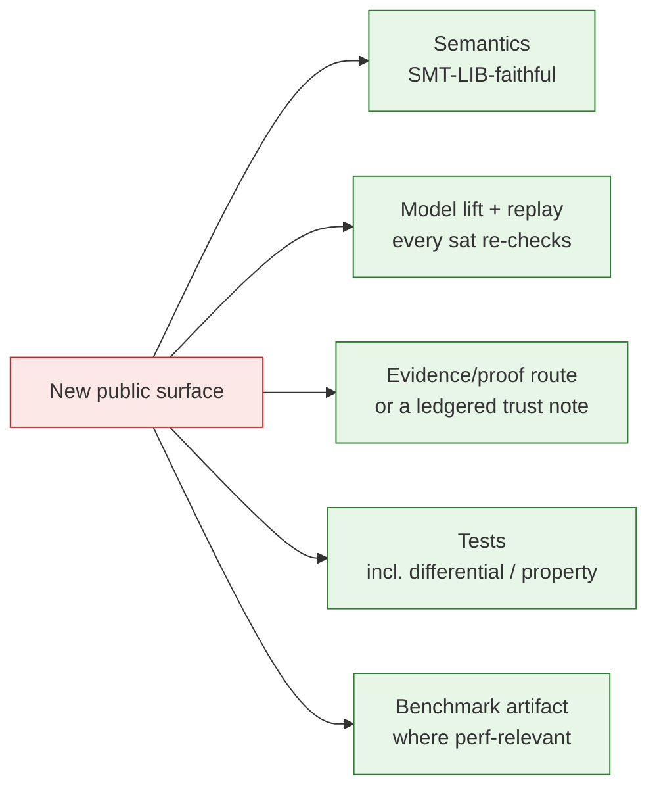

# Contributor Guide

How to change Axeyum *safely* — the obligations that come with new public
surface. The detailed how-to pages are planned (see the
[documentation plan](../documentation-plan.md)); this hub captures the
non-negotiables now.

## Start with the session protocol

1. [PLAN.md](../../PLAN.md) — the map and standing rules.
2. [STATUS.md](../../STATUS.md) — live state, current focus, next actions.
3. [docs/plan/01-dependency-dag.md](../plan/01-dependency-dag.md) — what depends on what.
4. The foundational DAG before adding operators/encodings/logics:
   [foundational-dag.md](../research/08-planning/foundational-dag.md).

## Obligations for new public surface

Before an operator, rewrite, encoding, backend, evidence artifact, or logic
fragment becomes public, **all** of these must be explicit:



- **Semantics first.** Match SMT-LIB totality verbatim (e.g. `bvudiv x 0` =
  all-ones). See [bv-semantics](../research/01-foundations/bv-semantics-and-partial-operations.md).
- **Every `sat` replays.** Provide the model lift so the result re-checks against
  the original terms.
- **Every new `unsat` route** gets an independent checker *or* an explicit entry
  in the [trust ledger](../research/08-planning/trust-ledger.md).
- **`unknown` is first-class.** Degrade to a deterministic `unknown` under a
  bound — never crash, hang, or guess.
- **Decisions aren't made silently in code.** Open/close questions with an
  [ADR](../research/09-decisions/README.md).

## Validate before you push

```sh
just check          # fmt + clippy (-D warnings, pedantic) + test + doc + link check
./scripts/check.sh  # same gate without `just`
```

CI also runs MSRV (1.85) and `cargo deny`. Keep the
[capability](../research/08-planning/capability-matrix.md) /
[support](../research/08-planning/support-matrix.md) matrices in sync with what
you add.

## Planned how-to pages

`adding-an-operator` · `adding-a-rewrite` · `adding-a-solver-route` ·
`proof-and-evidence-obligations` · `testing-and-validation` ·
`benchmark-artifacts` — see the [documentation plan](../documentation-plan.md).
