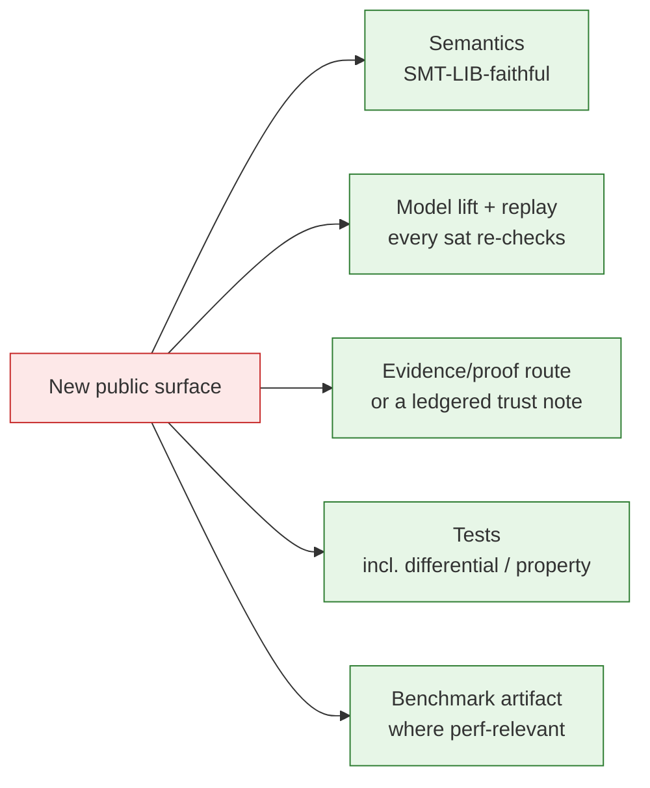

# Contributor Guide

How to change Axeyum *safely* — the obligations that come with new public
surface. Start with the generated [measured-gap ownership map](gap-ownership.md)
when choosing work: it routes every current G0-G10 gap to code owners, committed
evidence, executable gates, decision anchors, and the next safe action.

## Start with the session protocol

1. [Project State](../PROJECT-STATE.md) — what is built, measured, partial, and
   explicitly not claimed.
2. [Measured-gap ownership map](gap-ownership.md) — the owning module, evidence,
   checker, ADR, and next action for G0-G10.
3. [PLAN.md](../../PLAN.md) — the single current status, ordered work queue,
   standing rules, and resume protocol. [STATUS.md](../../STATUS.md) is a
   compatibility pointer only.
4. [docs/plan/01-dependency-dag.md](../plan/01-dependency-dag.md) — what depends on what.
5. The foundational DAG before adding operators/encodings/logics:
   [foundational-dag.md](../research/08-planning/foundational-dag.md).
6. When multiple agents are active, follow the
   [multi-agent worktree protocol](multi-agent-worktrees.md) (the model) and
   [multi-agent operations](multi-agent-operations.md) (the operating discipline:
   green-before-merge gate + cross-worktree resource rules).
7. Before believing a gate you ran on a compute host, check
   [fleet hosts](fleet-hosts.md) — the capability baseline a machine must meet,
   which gate needs which toolchain, and how to provision one. A gate's scope
   silently depends on the machine it ran on: measured 2026-08-16, `lean` and
   `just` existed on one host of five and the fleet's Rust nightlies spanned
   109 days.

## Working on the kernel and the proof library

The measured failure modes, moved out of CLAUDE.md so the trigger index there
stays short. Read the one that matches what you are about to do.

- [Finding Existing Lemmas](finding-existing-lemmas.md) — **start here.** More
  lane-hours have gone to re-deriving what existed than to proof difficulty.
  Where lemmas hide, which tools reach them, and the one hiding place no tool can.
- [Kernel Proof Engineering](kernel-proof-engineering.md) — why
  `add_declaration` rejected your term, and the failures it cannot detect at all
  (a `Definition` that computes the wrong value type-checks).
- [Prelude Build Cost](prelude-build-cost.md) — the same kernel, slow rather than
  wrong: unary numerals, forced unfolds, stack envelopes, and how to bisect.
- [Measurement Hazards](measurement-hazards.md) — tools that exit 0 and print
  something plausible that is wrong. Banned shell idioms, inert gates, inventory
  tools that discard arguments, stale binaries.
- [Evidence and Checker Discipline](evidence-and-checker-discipline.md) — a
  checker that cannot fail is worse than no checker; what mutation testing
  cannot see; blind evaluation populations.

## Obligations for new public surface

Before an operator, rewrite, encoding, backend, evidence artifact, or logic
fragment becomes public, **all** of these must be explicit:


```mermaid
flowchart LR
    A[New public surface] --> B[Semantics<br/>SMT-LIB-faithful]
    A --> C[Model lift + replay<br/>every sat re-checks]
    A --> D[Evidence/proof route<br/>or a ledgered trust note]
    A --> E[Tests<br/>incl. differential / property]
    A --> F[Benchmark artifact<br/>where perf-relevant]
    classDef r fill:#fde8e8,stroke:#c62828;
    classDef g fill:#e7f6e7,stroke:#2e7d32;
    class A r;
    class B,C,D,E,F g;
```

- **Semantics first.** Match SMT-LIB totality verbatim (e.g. `bvudiv x 0` =
  all-ones). See [bv-semantics](../research/01-foundations/bv-semantics-and-partial-operations.md).
- **Every `sat` replays.** Provide the model lift so the result re-checks against
  the original terms.
- **Every new `unsat` route** gets an independent checker *or* an explicit entry
  in the [trust ledger](../research/08-planning/trust-ledger.md).
- **`unknown` is first-class.** Degrade to a deterministic `unknown` under a
  bound — never crash, hang, or guess.
- **Decisions aren't made silently in code.** Open/close questions with an
  [ADR](../research/09-decisions/README.md).

## Validate before you push

```sh
just check          # fmt + clippy (-D warnings, pedantic) + test + doc + foundational resources + link check
just foundational-resources  # validate foundational atlas/example packs + dashboards
./scripts/check.sh  # same gate without `just`
```

CI also runs MSRV (1.88) and `cargo deny`. Keep the
[capability](../research/08-planning/capability-matrix.md) /
[support](../research/08-planning/support-matrix.md) matrices in sync with what
you add.

## Task guides

Start with [Development setup](development-setup.md), then use the guide that
matches your change:

| Task | Guide |
|---|---|
| Choose focused and pre-merge gates | [Testing and validation](testing-and-validation.md) |
| Add typed semantics and every downstream layer | [Adding an operator](adding-an-operator.md) |
| Add a denotational or equisatisfiable transform | [Adding a rewrite](adding-a-rewrite.md) |
| Add a backend, theory procedure, or bounded fast path | [Adding a solver route](adding-a-solver-route.md) |
| Classify SAT replay and UNSAT checking | [Proof and evidence obligations](proof-and-evidence-obligations.md) |
| Produce a reproducible performance/capability record | [Benchmark artifacts](benchmark-artifacts.md) |
| Confirm Lean accepts a preregistered statement (needs a BUILT Mathlib — s5) | [Lean surface attestation](lean-surface-attestation.md) |

For concurrent work, read both the [worktree model](multi-agent-worktrees.md)
and [multi-agent operating discipline](multi-agent-operations.md) before
creating or integrating a branch.
