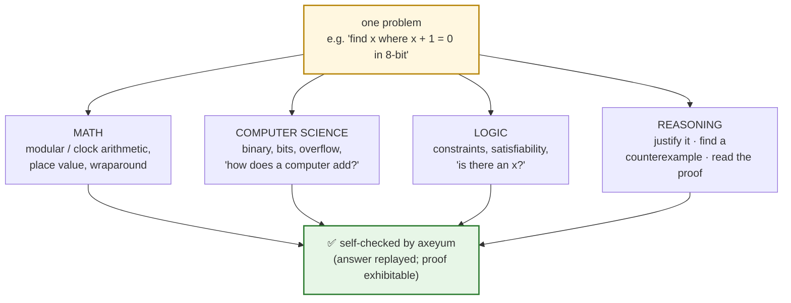
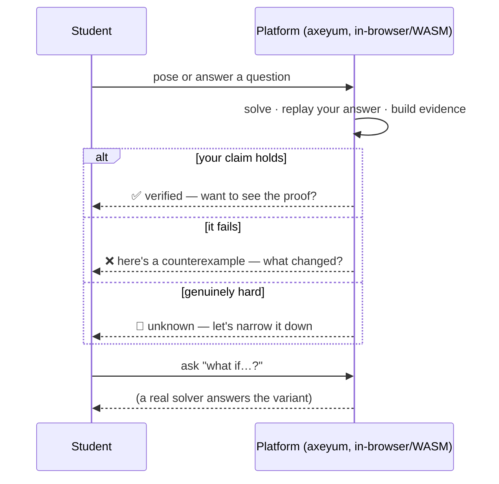

# K-12: Logic, Reasoning, Math, and CS as One Subject

> A vision (and a buildable plan) for using axeyum as the engine of a K-12
> curriculum where students develop **logic, reasoning, mathematics, and
> computer science *together*** — because they were never really separate.

This is the school-facing layer of the curriculum. The
[Formal Mathematics Tour](../README.md) is the rigorous *backbone* (university-
level, decidability-organized); this layer projects that backbone — plus logic,
proof, and computing — down onto grade bands and a single integrated pedagogy.

## The idea in one paragraph

We teach kids arithmetic in one class, "if-then" sentences in another (if at
all), and "coding" in a third — as if a number, a logical claim, and a program
were unrelated. They aren't: a number is a fact, a claim is a thing that's true
or false, and a program is a recipe for deciding which. **axeyum is a machine
that does all three at once and *proves it was right*.** Built into a learning
platform, it lets a student pose a question, get a *trustworthy* answer, and —
crucially — **see the reasoning or the counterexample**. That feedback loop is
the whole game.

## Why axeyum is the right substrate: self-checking *is* the pedagogy

Most learning software hides an **answer key** and compares your answer to it.
That teaches "match the key," and it breaks the moment a student tries something
the author didn't anticipate.

axeyum's identity is the opposite — *untrusted search, trusted checking* — and
that maps onto teaching almost perfectly:

| Classroom need | What an answer key does | What axeyum does |
| --- | --- | --- |
| "Is my answer right?" | compares to a stored string | **evaluates your answer against the actual math** (model replay) |
| "Why is it wrong?" | "✗ try again" | **hands back a concrete counterexample** ("try x = 255") |
| "Why is it *right*?" | "✓" (trust me) | **emits a checkable proof** you can inspect (DRAT / Alethe / Lean) |
| "What if I try…?" | undefined behavior | **answers any well-posed variant**, because it's a real solver |
| "I don't know" | usually impossible to express | **`unknown` is a first-class, honest result** |

A platform built on this can say, truthfully, to a 12-year-old: *"You claimed
`x + 1` is never `0`. Here's `x = 255`, where it is. Want to see why?"* No teacher,
no answer key — the **subject itself** is the grader, and it never lies.

## The four strands, developed simultaneously

The thesis is that one well-chosen problem grows **all four** strands at once.

- **Math** — number, structure, and quantity (the [Tour](../README.md) backbone).
- **Computer science** — representation and computation: bits, binary, finite
  precision, algorithms, "what can a machine decide?"
- **Logic** — statements that are true/false, connectives, satisfiability,
  validity (the platform's native Bool/SAT layer).
- **Reasoning** — the human skill: justify a claim, find a counterexample,
  follow (and trust) a proof, and say "I don't know" honestly.

The fourth strand is the point. A calculator gives answers; this gives **answers
plus accountability** — and accountability is the transferable life skill.

## Grade bands (sketch)

A spiral: the *same* four strands revisited with widening tools. Each band names
the axeyum capability that makes it self-checkable today.

| Band | Logic & reasoning | Math | Computer science | axeyum engine |
| --- | --- | --- | --- | --- |
| **K–2** | true/false, and/or/not games | counting, parity (even/odd) | "a computer follows exact rules" | Bool/SAT (tiny) |
| **3–5** | if-then promises, simple proofs by cases | place value, factors, remainders | binary numbers, base-2 ↔ base-10 | Bool/SAT, modular |
| **6–8** | satisfiability, counterexamples, spotting fallacies | modular ("clock") arithmetic, integers, fractions | bits, bytes, overflow, how addition works | Bool/SAT, **bit-vectors**, LIA |
| **9–12** | validity vs soundness, proof by contradiction, quantifiers | linear systems, polynomials, intro real analysis | algorithms, complexity, verification, "can we *prove* the code is right?" | BV, LIA/LRA, EUF, proofs → Lean |

Detail and progressions: [strands.md](strands.md).

## The learning loop

This is **inquiry that can't cheat the student and can't be cheated**: the
feedback is correct by construction, explainable on demand, and open-ended.

## What's already here to build on

This isn't starting from zero — the pieces exist in this repo:

- **The math backbone** — the [Formal Mathematics Tour](../README.md) DAG
  (`curriculum.toml`) already maps concepts to the axeyum theory that
  self-checks them, with a decidability ceiling marked honestly.
- **The self-checking engine** — `axeyum-scenarios` already generates
  oracle-free exercise families (SAT-by-witness, UNSAT-by-bounded-verification)
  across Logic, Arithmetic, Number Theory, Counting, Algebra, and more
  ([ADR-0008](../../research/09-decisions/README.md)).
- **The kid-facing voice** — the *explained-simply* pedagogy (story → idea →
  picture → *you-try-it* → level-up) is prototyped and proven legible for
  ≈ages 11+.
- **The platform delivery** — axeyum **compiles to WebAssembly and runs
  client-side** ([ADR-0017](../../research/09-decisions/README.md);
  [playground](../../playground/README.md)). A student can solve and self-check
  *in a browser tab*, no install, no server, no account — exactly what a school
  device needs.

So the future platform = **explained-simply content × the self-checking solver ×
the WASM delivery**, organized by these four strands.

## Worked modules (the template in action)

Each module integrates all four strands around one idea, with exercises axeyum
grades by *checking*, not by answer key:

| Module | Band | Strands in play |
| --- | --- | --- |
| [Binary & wraparound](modules/binary-and-wraparound.md) | 6–8 | CS (bits/overflow) · math (modular) · logic (constraints) · reasoning (counterexamples) |
| [Truth & counterexamples](modules/truth-and-counterexamples.md) | 6–8 | logic · reasoning · (math/CS as content) |

## Honest scope

This is a **vision with a real substrate**, not a shipped product. What's true
*today*: the solver, the self-checking, the WASM delivery, and the content
templates all exist and work. What's *aspirational*: the lesson sequencing, a
student-facing UI, teacher tooling, and standards alignment. The value of
writing it down now is that it shapes design choices — keep the IR, evidence
formats, and WASM surface friendly to a learner, not just a researcher.

## Build roadmap

1. Flesh out [strands.md](strands.md) into per-band, per-strand skill lists, each
   tagged with the self-checking family/engine that grades it.
2. Author ~3 modules per band on the [module template](modules/binary-and-wraparound.md),
   reusing `axeyum-scenarios` families as the graders.
3. ✅ **Prototyped:** the [self-checking exercise widget](../../playground/exercises.html)
   (pose → student answers → the real solver grades by *replay* or
   *assert-the-negation*, in the browser). Verified end-to-end in a headless
   browser: student answers are graded correctly by the actual solver, no answer
   key. Next: richer item types + showing the solver's *own* counterexample
   value (a small model-export addition to the WASM binding).
4. Map modules to common standards (CCSS-M, CSTA) so a teacher can adopt them.
