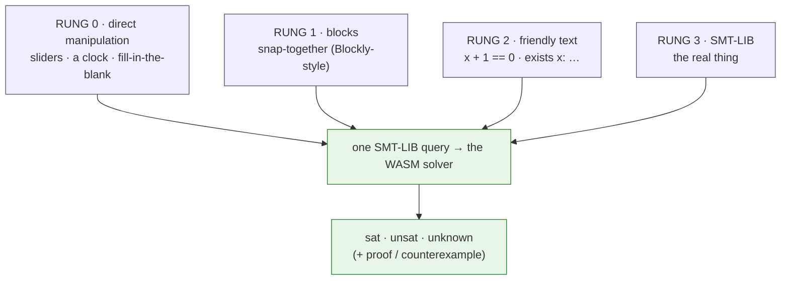

# The Interface Ladder: Hiding (and Teaching) the Notation

SMT-LIB — `(assert (= (bvadd x #x01) #x00))` — is precise, but it's a wall for
most people, and a brick wall for a 12-year-old. This page is the strategy for
getting past it: **don't choose between hiding it and teaching it — do both, as a
ladder of friendlier surfaces that all compile to the *same* SMT-LIB the solver
runs.**

## The core principle: the surface *is* the code

Every rung of the ladder is a **transpiler** to one target (SMT-LIB), and every
rung has a **"show the code"** reveal. This buys three things at once:

1. **Accessibility** — beginners never type a paren.
2. **Honesty** — because the friendly surface compiles to exactly what runs, a
   "show the code" peek can never be a faked example (the same no-drift property
   as executable docs).
3. **A real CS skill** — reading and writing machine-checkable specs *is* the
   computer-science learning goal, so we reveal the notation, we don't bury it.

This is the **DragonBox move**: start with playful, notation-free representations,
then *progressively replace them with real symbols* as the learner internalizes
the rules — except here the reveal is one toggle away at every step, and it's the
truth, not a picture of the truth.



## The four rungs

### Rung 0 — direct manipulation (K–5)

No syntax at all. The student manipulates **objects**, and the platform builds the
query invisibly.

- a **slider** for a value (and the platform replays it);
- a **clock face** for modular arithmetic ("what's 11 + 2 on a 12-hour clock?");
- a **number line** you drag on;
- **fill-in-the-blank** with the structure fixed (this is what the
  [exercise widget](../../playground/exercises.html) "find x" tasks already do —
  the student supplies only the number).

> The math/logic is real; only the *typing* is removed. "Find an x where x+1=0"
> is a slider you drag to 255 and watch the platform confirm.

### Rung 1 — blocks (3–8, the K-12 sweet spot)

Snap-together blocks, in the **Scratch / Code.org mental model** kids already
know — built with **[Blockly](https://developers.google.com/blockly/)**, which
generates code in any custom language (here: SMT-LIB). You **cannot** build a
malformed claim, so the learner explores logic structure, not syntax errors.

A plain-language block vocabulary (each block → an SMT-LIB fragment):

| Block (what the kid sees) | compiles to |
| --- | --- |
| `is there a number  ☐  where …` | `(declare-const x …) (assert …) (check-sat)` |
| `this is always true: …` | `(assert (not …)) (check-sat)`  → unsat = yes |
| `[ a ]  +  [ b ]` | `(bvadd a b)` |
| `[ a ]  equals  [ b ]` | `(= a b)` |
| `[ A ]  AND / OR  [ B ]` ·  `NOT [ A ]` | `(and …)` · `(or …)` · `(not …)` |
| `if  [ A ]  then  [ B ]` | `(=> A B)` |
| `for every number  ☐ , …` | `(forall ((x …)) …)` |

Building "is there an 8-bit number where x + 1 = 0?" is then three snapped blocks
— and a 👁 *show the code* button reveals the SMT-LIB it generated.

### Rung 2 — friendly text (8–10)

A tiny **math-like surface syntax** that transpiles to SMT-LIB — the bridge from
blocks to "real code" (the way `z3py`'s `x + 1 == 0` is friendlier than raw
SMT-LIB):

```text
find x in 8 bits where  x + 1 == 0
prove  forall x: x + 1 > x          # (the platform will find the wraparound counterexample)
is it always true:  (p or q) -> p
```

Infix operators, named quantifiers, and bit-width annotations — readable by a
middle schooler, one transpile step from the target. This is the cheapest rung to
build (a small parser) and a big legibility win.

### Rung 3 — SMT-LIB (9–12)

The real thing, now **taught**, not hidden: students see that their blocks/text
compiled to it, then write it directly. Knowing that a tool a professional uses
for verification is *the same tool that graded their middle-school puzzles* is the
payoff — the notation becomes a reward for curiosity, not a barrier.

## How a learner moves up the ladder

The DragonBox progression, concretely: a unit introduces an idea at the lowest
rung that fits the band, and the **same idea** reappears one rung higher next
band — with "show the code" always exposing the next rung down. So a student
*chooses* to climb when ready, and the climb is always grounded in something they
already made work.

| Band | works at | reveal shows |
| --- | --- | --- |
| K–2 | rung 0 | (nothing — pure play) |
| 3–5 | rung 0 → 1 | the first blocks |
| 6–8 | rung 1 | the SMT-LIB (rung 3) |
| 9–12 | rung 2 → 3 | the proof / certificate |

## Why blocks over free natural language

We deliberately *don't* lead with "type your question in English." Free natural
language is **brittle** (ambiguous, easy to phrase un-parseably) and hides the
logical structure we want students to *see*. Blocks make the structure visible
and unbreakable. (A templated natural-language *input* — pick from sentence frames
— is a fine optional rung-1.5; open-ended NL parsing is a research stretch, not
the foundation.)

## Build plan (bottom-up)

1. ✅ **Rung 0 / fill-in** — the [exercise widget](../../playground/exercises.html)
   already grades student-supplied values by replay.
2. **Rung 2 (cheapest next): a friendly-text → SMT-LIB transpiler** — a small JS
   parser (`x + 1 == 0` → SMT-LIB) wired into the widget. Proves the "readable
   math" feel immediately.
3. **"Show the code" toggle** on every exercise — the DragonBox reveal in
   miniature (surface ↔ generated SMT-LIB side by side).
4. **Rung 1: the Blockly constraint builder** — the real K-12 unlock. Define the
   block set above + an SMT-LIB generator; feed the same WASM solver.
5. **Rung 0 richer widgets** — clock (modular), number line, binary toggles — for
   the youngest bands.

Each rung reuses the *same* WASM solver and the *same* self-checking semantics
(`sat`/`unsat` + proof/counterexample) from the
[exercise widget](../../playground/exercises.html); only the input surface
changes.

## See also

- The sequencing that uses these rungs: [teaching plan §4–5](teaching-plan.md).
- The delivery engine: [WASM playground](../../playground/README.md).

---

**Sources / inspiration:**
[Blockly — custom code generation (Google)](https://developers.google.com/blockly/publications/papers/TipsForCreatingABlockLanguage.pdf) ·
[Blockly powers Code.org / Scratch](https://codedocs.org/what-is/blockly) ·
[DragonBox: progressive notation replacement (EdSurge)](https://www.edsurge.com/news/2016-03-13-enter-the-dragonbox-can-a-game-really-teach-third-graders-algebra) ·
[Analysis of DragonBox's design & pedagogy (ISLS)](https://repository.isls.org/bitstream/1/10064/1/ICLS2023_1873-1874.pdf)
