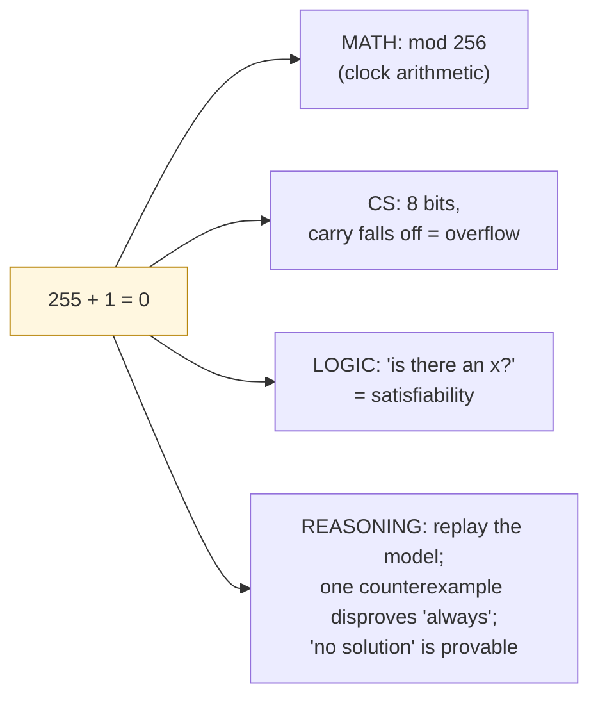

# Module: Binary & Wraparound (grades 6–8)

> **One idea, four strands.** Around a single puzzle — *"is there an 8-bit number
> where adding 1 gives 0?"* — students grow math (modular arithmetic), computer
> science (bits & overflow), logic (satisfiability), and reasoning
> (counterexamples & proof). Every exercise is **self-checked by axeyum**: no
> answer key, just the math grading itself.

| | |
| --- | --- |
| **Band** | 6–8 |
| **Strands** | CS · math · logic · reasoning |
| **Engine** | bit-vectors (BV), Bool/SAT, proofs (DRAT) — runs in the [browser](../../../playground/README.md) |
| **Prereq** | counting; place value; *and/or/not*; [if-then promises](truth-and-counterexamples.md) |

## Hook (5 min)

Ask the class: *"On a normal calculator, what's the biggest number? Is there
one?"* Then: *"Your phone stores a number in a fixed number of little switches.
What happens when you run out of switches?"*

Show the puzzle:

> Find an 8-bit number `x` such that `x + 1 = 0`.

Most students say "impossible — adding 1 always makes it bigger." Hold that
thought. We'll let the **machine** settle it.

## Strand: computer science — bits and switches

A **bit** is one switch: `0` or `1`. Eight of them make a **byte**, and a byte
counts from `00000000` (0) to `11111111` (255). That's it — there is no 256.

| binary | base-10 |
| --- | --- |
| `00000000` | 0 |
| `00000001` | 1 |
| `00001010` | 10 |
| `11111111` | 255 |

Adding works like grade-school addition with carries — but in base 2, and **the
last carry falls off the end** (there's no 9th switch). That "falling off" is
**overflow**, and it's why `255 + 1` becomes `00000000` again.

> 🧠 *CS idea:* computers use **fixed precision**. This isn't a bug — it's a
> deliberate trade (speed/space for a bounded range), and knowing it prevents
> real bugs later.

## Strand: math — clock arithmetic

This is the same math as a **clock**: 11 + 2 = 1 (not 13), because a clock
*wraps* at 12. An 8-bit byte wraps at 256. We say arithmetic is **modulo 256**:

$$ 255 + 1 \equiv 0 \pmod{256} $$

> 🧮 *Math idea:* **modular arithmetic** — numbers on a circle, not a line. The
> [Tour node](../../02-structures/modular-arithmetic.md) develops this rigorously;
> here it's "clock math with 256 hours."

So the "impossible" puzzle has an answer after all: **`x = 255`**, because
`255 + 1` wraps to `0`.

## Strand: logic — is there an x?

"Find an `x` where `x + 1 = 0`" is a **satisfiability** question: *does a value
exist that makes the statement true?* We write it as a constraint and let the
platform decide:

```smt2
(set-logic QF_BV)
(declare-const x (_ BitVec 8))
(assert (= (bvadd x #x01) #x00))
(check-sat)
(get-model)
```

The platform answers **sat** — yes, a value exists — and shows it:
`x = #xff` (255). Students don't take that on faith…

## Strand: reasoning — check it, don't trust it

…they **replay** it. Plug `x = 255` back into the original: does `255 + 1` really
equal `0` in 8 bits? The platform evaluates the *original* statement under the
model and confirms it — the answer is correct **by checking, not by authority**.

Then flip the puzzle to teach disproof:

> *Claim:* "For an 8-bit `x`, `x + 1` is **always** bigger than `x`."

Ask the platform whether the claim can be **broken**:

```smt2
(set-logic QF_BV)
(declare-const x (_ BitVec 8))
; can x + 1 be NOT greater than x?  (i.e. find a counterexample)
(assert (bvule (bvadd x #x01) x))
(check-sat)
(get-model)
```

**sat**, with `x = #xff`: a single **counterexample** disproves the "always."
One counterexample beats a hundred examples — the core move of mathematical
reasoning, learned by *doing* it.

## When the answer is "no" — and provable

Now a genuinely impossible one:

> Find an 8-bit `x` with `x = 0` **and** `x = 1`.

```smt2
(set-logic QF_BV)
(declare-const x (_ BitVec 8))
(assert (= x #x00))
(assert (= x #x01))
(check-sat)
```

**unsat** — no such `x`. And the platform doesn't just assert it: it can produce
a small **proof** that re-checks independently. The lesson: "no solution" is a
*provable* statement, not a shrug.

## 🎮 You try it (self-checked)

Each task is graded by the platform *checking your answer*, not matching a key.

1. **Predict, then verify.** What 8-bit `x` makes `x + 2 = 1`? Predict with clock
   math, then confirm with `(assert (= (bvadd x #x02) #x01))`. *(x = 255.)*
2. **Find the counterexample.** Is "`x + x` is always even" true for 8-bit `x`?
   (Hint: try to break it — ask for an odd `x + x`.) *(It's always even — `unsat`
   to break — discuss why the lowest bit is always 0.)*
3. **Make it impossible.** Write two assertions about one 4-bit `x` that together
   are `unsat`, and explain why.
4. **Reach further.** Is there an 8-bit `x` with `x · 3 = 1`? Predict, then check.
   *(Yes — `x = 171`, because 3 is odd and invertible mod 256. A surprise that
   sparks the next module.)*

## What each student practiced



## For the teacher

- **No answer key to leak or game** — the solver checks each student's actual
  work and gives a counterexample when it's wrong.
- **Differentiation is free** — a curious student asks "what about 16 bits? what
  about `x · 5 = 1`?" and the *same tool* answers.
- **Standards touchpoints** (sketch): CCSS-M modular/number-system reasoning;
  CSTA data-representation & "how computers work"; mathematical-practice
  standards on *constructing arguments and critiquing reasoning* (the
  counterexample work).
- **Runs anywhere** — paste the snippets into the in-browser
  [playground](../../../playground/README.md); nothing to install.

Next: [Truth & counterexamples](truth-and-counterexamples.md) (the logic strand),
then the rigorous [modular arithmetic](../../02-structures/modular-arithmetic.md)
node when students are ready to level up.
