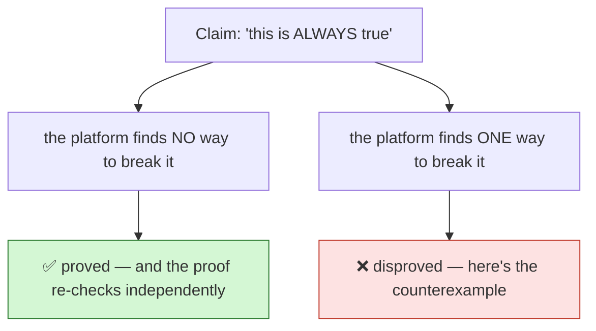
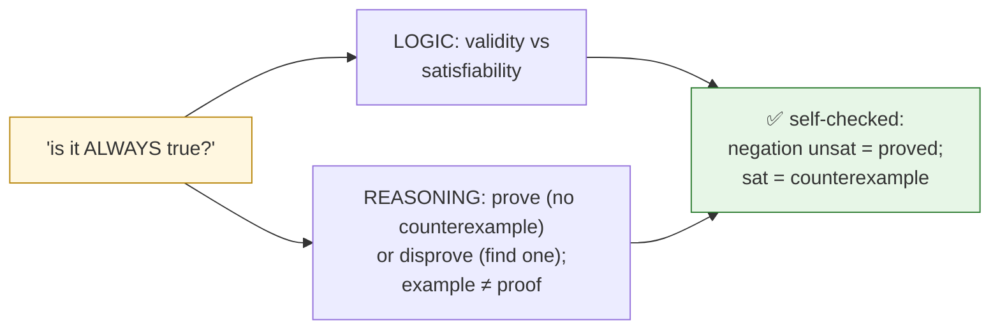

# Module: Truth & Counterexamples (grades 6–8)

> **The logic strand.** Students learn the difference between *"I have an
> example"* and *"it's always true,"* and meet the two ways the platform settles
> a claim: a **proof** (no counterexample exists) or a **counterexample** (one
> case that breaks it). Self-checked by axeyum's Bool/SAT engine — no answer key.

| | |
| --- | --- |
| **Band** | 6–8 |
| **Strands** | logic · reasoning (math/CS as the content of the claims) |
| **Engine** | Bool/SAT; re-checkable proofs (DRAT/Alethe) — runs in the [browser](../../../playground/README.md) |
| **Prereq** | *and/or/not*; "if-then" basics (the kid-facing *explained-simply* voice) |
| **Backbone** | [propositional logic](../../00-foundations/propositional-logic.md) |

## Hook (5 min)

Write two claims on the board:

- A: *"Every odd number, when you double it, becomes even."*
- B: *"Every number is the sum of two smaller numbers."*

Ask: *how would you convince a stubborn friend each one is true — or false?*
Examples feel persuasive ("3 → 6, 5 → 10…") but **examples never prove an
"every."** You either show it *can't fail*, or you find the one case that breaks
it. That's the whole lesson.

## The two outcomes

Every "is this always true?" question has exactly two honest answers, and the
platform produces the **evidence** for each:



The trick that makes it checkable: to test *"X is always true,"* the platform
**tries to make X false.** If it *can't* (the attempt is **unsatisfiable**), X is
proved. If it *can*, that satisfying case **is** the counterexample.

## Logic claims that always hold (tautologies)

Some claims are true no matter what the pieces are. Classic one — **modus
ponens**: "if P-implies-Q, and P, then Q."

```smt2
(set-logic QF_BV)
(declare-const p Bool)
(declare-const q Bool)
; try to BREAK "((p → q) and p) → q" by asserting its negation:
(assert (not (=> (and (=> p q) p) q)))
(check-sat)
```

**unsat** — there is no way to make it false. Modus ponens is **valid**, and the
platform can emit a proof of that unsatisfiability you can re-check. (This is the
kid-facing version of the [propositional-logic](../../00-foundations/propositional-logic.md)
node, graded by the same Bool/SAT engine.)

Try **De Morgan** the same way: assert the negation of
`(not (and p q)) ↔ ((not p) or (not q))` → **unsat** → it's a law.

## Claims that look true but aren't (find the counterexample)

Now the opposite — a tempting-but-false claim:

> *"If `p or q` is true, then `p` is true."*

```smt2
(set-logic QF_BV)
(declare-const p Bool)
(declare-const q Bool)
; is there a case where (p or q) holds but p does NOT?
(assert (and (or p q) (not p)))
(check-sat)
(get-model)
```

**sat**, with `p = false, q = true`. One case breaks it — so the claim is
**invalid**, and the student can plug the case back in and watch it fail. (This
mirrors the [straw-man / affirming-a-disjunct](../../00-foundations/propositional-logic.md)
family of mistakes.)

## Reasoning, not just answers

The transferable skills, named explicitly:

- **Validity vs. an example.** "It worked for 3 and 5" is not a proof; *"it can
  never fail"* is. The platform enforces the distinction.
- **Counterexamples are powerful.** One breaks an "every." Finding the *smallest*
  counterexample is a great challenge ("what's the smallest `x`…?").
- **"No counterexample exists" is provable** — and the proof is inspectable, so
  trust is *earned*, not demanded.
- **Honest uncertainty.** For hard claims the platform may say **unknown** — and
  that's a respectable answer, modeled by the tool itself.

## 🎮 You try it (self-checked)

For each, decide *valid* (no counterexample) or *invalid* (find one), then check:

1. `p → (p or q)` — valid or not? *(valid — assert its negation → unsat)*
2. `(p or q) → (p and q)` — valid or not? *(invalid — `p=true, q=false`)*
3. `(p and (not p))` — can this ever be true? *(no — `unsat` — a contradiction)*
4. **Write your own** claim about `p, q, r` that is **valid**, and prove it by
   showing its negation is `unsat`.
5. **Bridge to math:** "every 8-bit `x` has `x or 0 = x`." True? Encode it as a
   bit-vector claim and try to break it. *(valid — connects to
   [Binary & wraparound](binary-and-wraparound.md))*

## What each student practiced



## For the teacher

- **The "assert the negation" move** is the single most powerful idea here — it
  turns "prove this is always true" into a question the machine can settle, and
  it's the same move professional verification uses.
- **No key to game** — students must produce a real counterexample or a real
  proof; the solver checks both.
- **Standards touchpoints** (sketch): mathematical-practice standards on
  *constructing viable arguments and critiquing reasoning*; CSTA on logic and
  abstraction.
- **Runs in the browser** — [playground](../../../playground/README.md).

Next: the rigorous [propositional logic](../../00-foundations/propositional-logic.md)
node, or back to the [K-12 vision](../README.md).
