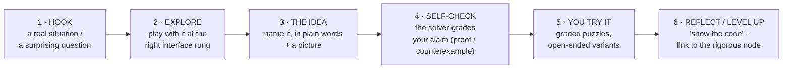

# K-12 Teaching Plan (Top-Down)

A detailed, top-down plan for teaching **logic, reasoning, math, and computer
science as one subject** on an axeyum-powered platform. We start from the
graduate capability we want, decompose it into enduring ideas, then into a
grade-band **scope-and-sequence** of units — each tagged with the interface rung
a learner uses and the self-checking engine that grades it.

> Read first: the [vision](README.md) (why), the [four strands](strands.md)
> (what), and the [interface ladder](interfaces.md) (how we hide/teach the
> notation). This page is the *sequencing* — the order and the units.

---

## 1. The north star (what a graduate can do)

A student who completes this curriculum can, **without an answer key**:

1. **State a claim precisely** — turn a fuzzy question into something true/false a
   machine can check.
2. **Get it checked and believe the result** — because a `sat` is replayed and an
   `unsat` carries a proof they can inspect.
3. **Justify or refute** — produce a proof that *no counterexample exists*, or a
   single counterexample that settles it.
4. **Connect the three subjects** — see that a number, a logical claim, and a
   program are one idea, and that proving a theorem and proving a program correct
   are the same act.
5. **Say "I don't know" honestly** — treat `unknown` as a real, respectable
   outcome, not failure.

Everything below is reverse-engineered from these five.

## 2. Enduring ideas (the threads through every grade)

Six ideas recur at every band, each time with sharper tools. The whole plan is a
**spiral** around them.

| # | Enduring idea | First met | Matured into |
| --- | --- | --- | --- |
| E1 | A claim is **true or false**, and that can be **checked**. | K–2 ("true/false") | satisfiability / validity (6–8) |
| E2 | An **example is not a proof**; a **counterexample is a disproof**. | 3–5 ("find one that breaks it") | proof by contradiction (9–12) |
| E3 | The same thing can be **represented** different ways. | 3–5 (ten = `1010`) | encodings, bit-blasting (6–8+) |
| E4 | Computers **decide** by following exact rules on finite data. | K–2 ("exact rules") | algorithms, complexity, `unknown` (9–12) |
| E5 | **"No solution" is a provable statement**, with checkable evidence. | 6–8 (`unsat` + proof) | certificates, Lean-checked proofs (9–12) |
| E6 | **Math, logic, and computing are one subject.** | woven throughout | verifying programs = proving theorems (9–12) |

A unit is "good" when it advances at least two enduring ideas in two strands at
once.

## 3. How the strands interleave

We never teach a strand in isolation. The design rule: **one artifact, multiple
strands.** A single problem (`is there an 8-bit x with x+1=0?`) is simultaneously
math (modular), CS (overflow), logic (satisfiability), and reasoning
(counterexample). See the [strands matrix](strands.md) for per-band skills; the
[modules](modules/binary-and-wraparound.md) show the interleaving in a lesson.

## 4. The interface ladder (how the notation stays out of the way)

Learners never start at SMT-LIB. Each band works at a **rung** of the
[interface ladder](interfaces.md), and every rung **compiles to the same SMT-LIB**
the solver runs, with a "show the code" reveal:

| Rung | Surface | Bands |
| --- | --- | --- |
| 0 | direct manipulation (sliders, a clock, fill-in) | K–5 |
| 1 | **blocks** (Blockly-style, snap-together) | 3–8 |
| 2 | friendly text (`x + 1 == 0`, `exists x: …`) | 8–10 |
| 3 | SMT-LIB itself (revealed, then taught) | 9–12 |

This is the DragonBox move (play first, reveal notation gradually) made honest by
"the surface *is* the code." Full rationale + build plan: [interfaces.md](interfaces.md).

---

## 5. Scope and sequence

Each unit lists: **goal · enduring ideas · strands · interface rung · how it
self-checks · the axeyum engine.** A teaching order is any path that respects the
prerequisite arrows; the order below is one good spiral.

### Band K–2 · "true, false, and exact rules"

> Interface: **rung 0** only (pictures, taps). No reading of code.

| Unit | Goal | Ideas · strands | Self-check |
| --- | --- | --- | --- |
| K2.1 **true or false** | sort statements into true / false | E1 · logic | the platform is the "judge"; tap and see |
| K2.2 **and / or / not** | combine two true/false lights | E1 · logic | light turns on only when the rule says so (Bool/SAT) |
| K2.3 **same / different · count** | equality, more/less, counting | E1,E3 · math | compare two pictures; the platform confirms |
| K2.4 **even or odd** | parity as a yes/no property | E1 · math/CS | check "is this even?" by pairing |
| K2.5 **the computer follows exact rules** | a machine does *exactly* what you say | E4 · CS | run a 2-step rule; predict the output |

### Band 3–5 · "if-then, examples, and base-2"

> Interface: **rung 0 → rung 1** (first blocks appear).

| Unit | Goal | Ideas · strands | Self-check |
| --- | --- | --- | --- |
| 35.1 **if-then promises** | when is an "if… then…" *broken*? | E1 · logic/reasoning | the one broken case; replay it |
| 35.2 **find an example** | exhibit a value that makes a claim true | E2 · reasoning | replay the student's value (sat) |
| 35.3 **find a counterexample** | one case that breaks an "always" | E2 · reasoning | the breaking case (sat) disproves it |
| 35.4 **proof by checking cases** | small claims true in *every* case | E1,E5 · logic | platform finds no counterexample (unsat) |
| 35.5 **binary numbers** | base-2 ↔ base-10; a bit; "two-finger counting" | E3 · CS | convert and check both ways (BV) |
| 35.6 **remainders & factors** | division with remainder; multiples | E3 · math | check `a = q·b + r` (LIA) |

### Band 6–8 · "satisfiability, bits, and clock arithmetic"

> Interface: **rung 1** primary (blocks), **rung 3** as a reveal.
> Anchor modules: [Binary & wraparound](modules/binary-and-wraparound.md),
> [Truth & counterexamples](modules/truth-and-counterexamples.md).

| Unit | Goal | Ideas · strands | Self-check |
| --- | --- | --- | --- |
| 68.1 **is there a number?** | satisfiability as "find an x" | E1,E2 · logic/CS | replay the model (sat) / none (unsat) |
| 68.2 **bits, bytes, overflow** | how a computer adds; `255+1=0` | E3,E4 · CS/math | bit-vector add; replay (BV) |
| 68.3 **clock (modular) arithmetic** | numbers on a circle, mod n | E3 · math | check `≡ (mod n)` facts |
| 68.4 **validity vs an example** | "always true" needs *no counterexample* | E2,E5 · logic/reasoning | **assert the negation** → unsat = valid |
| 68.5 **spotting fallacies** | straw man, false dilemma, affirming-the-consequent | E2 · reasoning | encode the bad inference → sat counterexample |
| 68.6 **De Morgan & equivalences** | laws that always hold | E1,E5 · logic | negation unsat → it's a law; emit a proof |

### Band 9–12 · "proof, validity, and verifying programs"

> Interface: **rung 2 → rung 3** (friendly text, then real SMT-LIB).

| Unit | Goal | Ideas · strands | Self-check |
| --- | --- | --- | --- |
| 912.1 **validity vs soundness** | a valid argument can still have false premises | E1,E2 · logic/reasoning | separate form (SAT) from content |
| 912.2 **proof by contradiction** | assume the opposite, derive `unsat` | E2,E5 · reasoning | the platform's core move, made explicit |
| 912.3 **quantifiers ∀ / ∃** | "for all" vs "there exists" (finite) | E1 · logic | finite-domain decision; counterexample on ∀ |
| 912.4 **linear systems & inequalities** | solve/refute systems over ℝ, ℤ | E5 · math | **Farkas-certified** unsat (LRA); exact models |
| 912.5 **polynomials & nonlinear facts** | e.g. `a²+b² ≥ 2ab`; identities | E5,E6 · math | NRA (sound); honest `unknown` where incomplete |
| 912.6 **algorithms & complexity** | what a machine can decide, and how fast | E4 · CS | reason about decision procedures themselves |
| 912.7 **verifying programs** | "can we *prove* this code never crashes?" | E5,E6 · CS | BMC / k-induction; replay-checked counterexample |
| 912.8 **reading & checking a proof** | trust a proof by checking it (→ Lean) | E5,E6 · all | reconstruct to a kernel-checked `False` (Lean-horizon) |

---

## 6. The lesson template

Every unit becomes lessons on one repeatable arc — the same one the
[explained-simply](modules/binary-and-wraparound.md) modules use, so it scales:

Non-negotiables per lesson: a self-checking step (no answer key), at least two
strands, and a "show the code" reveal at one rung deeper than the student worked.

## 7. Assessment (mastery, not matching)

Assessment *is* the self-checking. Mastery of an enduring idea looks like:

| Idea | "Can do" evidence |
| --- | --- |
| E1 | states a claim the platform decides true/false |
| E2 | produces a **real counterexample** to a false "always," and a no-counterexample argument for a true one |
| E3 | converts a value between representations and checks both |
| E4 | predicts a machine's output / says *why* an answer is `unknown` |
| E5 | gets an `unsat` and **explains the certificate** |
| E6 | poses one problem and names the math, logic, and CS in it |

Formative feedback is instant and trustworthy (the solver). Summative tasks ask
students to **author** a claim and its check. Standards touchpoints (to be
mapped, [§9](#9-build--authoring-roadmap)): CCSS-M content + the *mathematical
practices* (esp. "construct viable arguments and critique the reasoning of
others"); CSTA standards on data representation, algorithms, and abstraction.

## 8. Mapping to the rigorous backbone

Each band hands ready students to the [Formal Mathematics Tour](README.md) nodes:
35.6/68.3 → [modular arithmetic](../02-structures/modular-arithmetic.md);
68.4/68.6 → [propositional logic](../00-foundations/propositional-logic.md);
912.3 → [predicate logic](../00-foundations/predicate-logic.md);
912.4 → [linear algebra](../03-destinations/linear-algebra.md);
912.2/912.8 → [proof methods](../00-foundations/proof-methods.md). The K-12 layer
is the **on-ramp and pedagogy**; the Tour is the **destination and rigor**.

## 9. Build / authoring roadmap

Order of construction (each step is shippable on its own):

1. **Lock the lesson template** as a reusable page/component (done — the modules
   are the template).
2. **Build the interface ladder bottom-up** ([interfaces.md](interfaces.md)):
   the [exercise widget](../../playground/exercises.html) (rung 0/1, done) →
   friendly-text transpiler (rung 2) → Blockly constraint builder (rung 1, the
   K-12 unlock) → "show the code" toggle everywhere.
3. **Author units 6–8 first** (the sweet spot: bit-vectors make the math, CS, and
   logic vivid and fully self-checkable today), then fan out to 3–5 and 9–12.
4. **Reuse `axeyum-scenarios` families as graders** so exercises generate and
   self-check without an answer key.
5. **Map units to CCSS-M / CSTA** so a teacher can adopt a band.
6. **Author-time check:** every example's stated verdict is verified against the
   real solver before publish (as the existing modules already are — 8/8).

---

This plan is intentionally **top-down and stable**: the north star and enduring
ideas don't change; the units and interfaces are where the building happens.
Start at [§5 band 6–8](#band-68--satisfiability-bits-and-clock-arithmetic) — it's
the most self-checkable today and the heart of the spiral.
