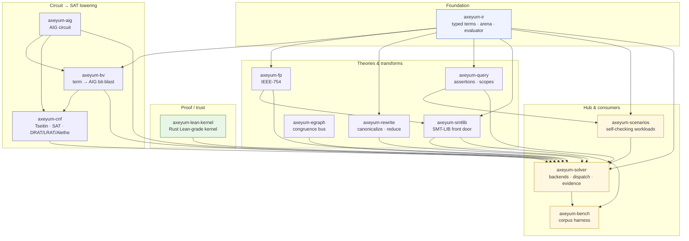

# Architecture

Axeyum is a workspace of small crates with a deliberately minimal split (crates
are added only when a boundary is proven by use — see
[ADR-0001](../research/09-decisions/README.md)). The shape mirrors the
[solve pipeline](../learn/07-how-axeyum-solves-a-query.md): a typed IR at the
base, a circuit/SAT lowering stack, theory and proof modules, and one solver hub
that ties them together.

## Crate dependency graph

Notable independents: `axeyum-aig`, `axeyum-egraph`, and `axeyum-lean-kernel`
depend on **nothing** in the workspace — they're self-contained, separately
testable engines. `axeyum-solver` is the only hub.

## Pipeline → crates

| Stage | Crate(s) | Trust |
|---|---|---|
| Parse / build query | `axeyum-smtlib`, `axeyum-ir`, `axeyum-query` | input |
| Word-level preprocess | `axeyum-rewrite` | untrusted |
| Bit-blast → AIG | `axeyum-bv`, `axeyum-aig` | untrusted |
| Tseitin → CNF, SAT | `axeyum-cnf` | untrusted |
| Theory engines (EUF, LRA, NRA, FP…) | `axeyum-solver`, `axeyum-egraph`, `axeyum-fp` | mixed |
| **Model replay** | `axeyum-ir` (ground evaluator) | **trusted** |
| **Proof check** (DRAT/LRAT/Alethe) | `axeyum-cnf` | **trusted** |
| **Lean reconstruction** | `axeyum-lean-kernel` | **trusted** |
| Dispatch + evidence | `axeyum-solver` | orchestration |

## Hard rules that shape the design

- **No C/C++ in the default build.** Native solver backends (Z3) are
  feature-gated leaf dependencies only — the pure-Rust stack is the product.
- **`unsafe_code` is denied** workspace-wide (exceptions need an ADR).
- **Lifetime-free `Copy` term IDs.** Backend FFI types and lifetimes never leak
  into public APIs — which (among other things) is what makes the arena `Sync`
  and a parallel strategy portfolio feasible.
- **Determinism** is a public promise: stable iteration order, explicit seeds,
  explicit budgets.

## Read next

- [Term IR](term-ir.md) *(planned)* — the arena and evaluator.
- [Bit-blasting](bit-blasting.md) *(planned)* — term → AIG → CNF.
- [Proof stack](proof-stack.md) and [Lean kernel](lean-kernel.md) *(planned)*.
- [How this documentation is built](documentation.md) — the diagram/site/WASM
  approach.
