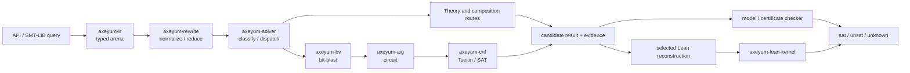

# Architecture

Axeyum is a Rust workspace organized around one rule: fast search may be large
and specialized, while higher-assurance results should end at a smaller checked
boundary. Crates are added only after a boundary is exercised, as recorded by
[ADR-0001](../research/09-decisions/README.md).

## Core reasoning dataflow

This diagram is the stable dataflow, not an exhaustive Cargo dependency graph.
Some routes bypass stages, and adjacent crates provide other theory, parsing,
verification, application, or benchmark surfaces.

```mermaid
flowchart LR
    input["API / SMT-LIB query"] --> ir["axeyum-ir<br/>typed arena"]
    ir --> rewrite["axeyum-rewrite<br/>normalize / reduce"]
    rewrite --> dispatch["axeyum-solver<br/>classify / dispatch"]
    dispatch --> theory["Theory and composition routes"]
    dispatch --> bv["axeyum-bv<br/>bit-blast"]
    bv --> aig["axeyum-aig<br/>circuit"]
    aig --> cnf["axeyum-cnf<br/>Tseitin / SAT"]
    theory --> result["candidate result + evidence"]
    cnf --> result
    result --> replay["model / certificate checker"]
    result --> reconstruct["selected Lean reconstruction"]
    reconstruct --> lean["axeyum-lean-kernel"]
    replay --> verdict["sat / unsat / unknown"]
    lean --> verdict
```

`axeyum-solver` is the hub. `axeyum-aig`, `axeyum-egraph`, and
`axeyum-lean-kernel` have no dependencies on other workspace crates, so they can
be tested as independent engines. The kernel still uses a small pure-Rust
numeric dependency; “independent” does not mean literally dependency-free.

Other exercised boundaries include floating point, strings, CAS, property and
program verification, EVM reasoning, Lean import, benchmarks, scenarios, and
the WASM binding. The root [workspace layout](../../README.md) is the better
inventory; the internals path focuses on the contracts shared by solver routes.

## Stage ownership and checks

| Stage | Primary crate(s) | Required retained state or check |
|---|---|---|
| Parse and construct | `axeyum-smtlib`, `axeyum-ir`, `axeyum-query` | typed source arena and stable labels |
| Rewrite and reduce | `axeyum-rewrite`, theory routes | preservation report and reconstruction/evidence bridge |
| Bool/BV lowering | `axeyum-bv`, `axeyum-aig` | term bits and symbol-input maps |
| CNF and SAT | `axeyum-cnf` | AIG/CNF bindings; model, and a proof when checked UNSAT is claimed |
| Theory search | `axeyum-solver`, `axeyum-egraph`, theory crates | fragment-specific model or certificate |
| Source SAT replay | `axeyum-ir`, fragment checkers | original assertions evaluate true |
| UNSAT assurance | `axeyum-cnf`, solver certificate checkers | exact artifact/checker coverage, or an explicit lower-assurance boundary |
| Lean route | `axeyum-lean-import`, `axeyum-lean-kernel` | untrusted parsing separated from kernel admission |
| Dispatch and reporting | `axeyum-solver` | one deadline, route trace, assurance metadata |

The generated [trust ledger](../reference/trust-ledger.md) is authoritative for
which concrete route currently ends at which checker. A checker being small is
not enough: the evidence must also cover the transformations that led to its
input.

## Rules that shape every boundary

- The default build has no C or C++ dependency. Native backends are optional
  oracle leaves; the pure-Rust stack is the product.
- Workspace code denies `unsafe_code` unless a future ADR explicitly changes
  that policy.
- Term handles are lifetime-free `Copy` IDs, but remain owned by one arena.
- Output, seeds, traversal order, resource limits, and evidence identities are
  deterministic.
- `unknown` is a logical result for honest incompleteness or exhausted limits,
  not an error and never a disguised guess.
- Every `sat` result needs source-level model checking. An `unsat` result must
  state its assurance level; a checked claim needs a certificate/checker route
  and checked transformation coverage.

## Read next

Follow the data: [Term IR](term-ir.md) → [Ground evaluation](evaluator.md) →
[Rewriting](rewriting.md) → [Bit-blasting](bit-blasting.md) →
[CNF and SAT](cnf-and-sat.md) → [Solver dispatch](solver-dispatch.md). Then read
[Proof and evidence routes](proof-stack.md) and the [Lean kernel](lean-kernel.md)
for assurance boundaries.
