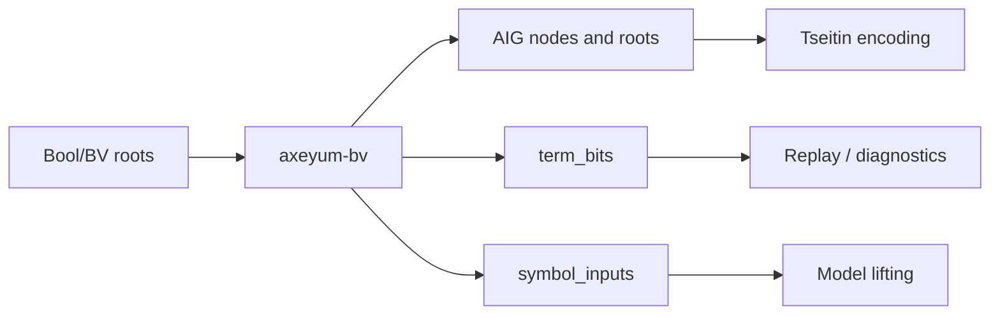

# Bit-blasting: terms to AIG

The finite-domain path lowers typed Boolean and bit-vector terms into an
and-inverter graph (AIG). The circuit is a search representation; the lowering
object also carries the maps required to recover source values.

## The AIG layer

[`axeyum-aig`](../../crates/axeyum-aig/src/lib.rs) is a small independent
circuit engine. An `AigLit` is a node reference plus an inversion bit. Nodes are
constants, inputs, or two-input ANDs; OR, XOR, equality, and multiplexers are
derived from that basis.

The graph performs deterministic structural hashing and local simplification.
Constructing the same AND again returns the same node, while identities such as
`x & true = x` avoid unnecessary nodes. The crate can evaluate circuits and
write an ASCII AIGER form for debugging.

## Typed lowering

[`axeyum-bv`](../../crates/axeyum-bv/src/lib.rs) translates each supported term
to one Boolean root or a vector of bits. Bit vectors are consistently
least-significant-bit first. Adders, comparisons, shifts, division, and other
word operations become circuits whose Boolean behavior matches the IR
semantics—including SMT-LIB's total corner cases.

The returned `BitLowering` retains:

- the AIG and output roots;
- a term-to-bits map;
- a source-symbol-to-input-bits map; and
- demand, memoization, and shape statistics.

Those maps are correctness data. Given SAT input bits, they reconstruct typed
source assignments for [ground replay](evaluator.md).

## Variants and limits

The crate exposes one-shot lowering as well as incremental lowering that reuses
an AIG across related checks. Demand- and range-aware entry points can avoid
building bits that a route has proved irrelevant. Deadline and profile variants
make resource behavior explicit.

Only admitted operators and sorts are lowered. Unsupported structure, width
overflow, or a budget/deadline stop is reported explicitly; the solver turns a
legitimate inability to decide into `unknown`. It must never substitute an
approximate circuit and return a definitive verdict.

Continue with [CNF and SAT](cnf-and-sat.md) for Tseitin encoding, solving, and
the mappings on the other side of the circuit boundary.
