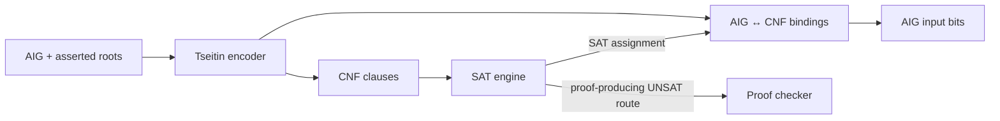

# CNF, SAT, and propositional evidence

`axeyum-cnf` converts AIG roots to conjunctive normal form (CNF), runs pure-Rust
SAT engines, and supplies the propositional proof formats and checkers used by
finite-domain routes.

## Tseitin encoding

[`tseitin_encode`](../../crates/axeyum-cnf/src/lib.rs) assigns a CNF variable to
each relevant AIG node and emits clauses enforcing the node's Boolean meaning.
It returns a `CnfEncoding`, not just a bag of clauses. The encoding retains root
variables, AIG-variable bindings, and statistics so models and diagnostics can
cross the boundary in either direction.

`CnfFormula` has deterministic variable and clause order, DIMACS I/O, and an
evaluator. Constants and root polarity are handled explicitly rather than
being inferred later from solver state.

## Solving modes

The first product SAT adapter is BatSat through RustSAT. The crate provides
one-shot solving with time and resource limits, plus incremental CNF/SAT
objects for callers that retain clauses between checks. The generic SAT trait
reports capabilities and keeps `sat`, `unsat`, and `unknown` distinct.

CNF preprocessing includes bounded variable elimination, subsumption,
vivification, and compaction. Any pass that changes variable meaning retains a
mapping or reconstruction object. A smaller formula is useful only if a model
or proof can still be related to its input.

The crate also includes an in-tree proof-producing CDCL core. The default
search adapter remains BatSat because changing that default is benchmark-gated;
for SAT-backed BV solving, `native_cdcl` selects the native core explicitly and
`prove_unsat` selects it as the primary search so an UNSAT proof can be checked
inline. The public contract is independent of which search engine wins: SAT
models must replay, and UNSAT assurance is stated at the level actually checked.
In particular, a proofless BatSat UNSAT result remains lower assurance; the
search verdict is not relabeled as a checked proof. See the
[`SolverConfig` reference](../reference/solver-config.md) for the exact selection
and fail-closed behavior.

## DRAT, LRAT, Alethe, and XOR

The crate can produce and check DRAT, elaborate supported **RUP-only** DRAT
proofs into LRAT, check that positive-hint LRAT slice, and parse/write/check a
selected Alethe core. RAT additions (negative hints) are outside the current
LRAT checker and elaborator and are rejected rather than silently accepted. It
also includes XOR extraction and GF(2) reasoning; bounded Gaussian conflicts
can emit a propositional justification for the conflict subset.

A checked DRAT or LRAT proof establishes that the encoded **CNF** is
unsatisfiable. It does not by itself prove that every earlier word-level or
theory transformation preserved the original query. End-to-end assurance also
needs checked lowering/normalization bridges recorded by the solver's evidence
route.

See [Proof and evidence routes](proof-stack.md) for that composition and the
[QF_BV proof cookbook recipe](../proof-cookbook/recipes/qf-bv-bitblast.md) for a
concrete artifact flow.
