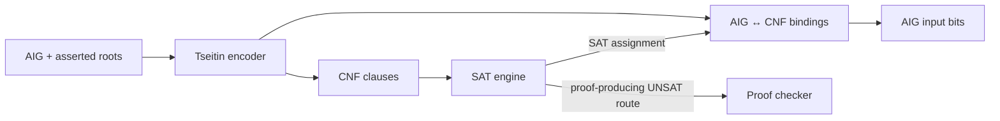

# CNF, SAT, and propositional evidence

`axeyum-cnf` converts AIG roots to conjunctive normal form (CNF), runs pure-Rust
SAT engines, and supplies the propositional proof formats and checkers used by
finite-domain routes.

## Tseitin encoding

[`tseitin_encode`](../../crates/axeyum-cnf/src/lib.rs) assigns a CNF variable to
each relevant AIG node and emits clauses enforcing the node's Boolean meaning.
It returns a `CnfEncoding`, not just a bag of clauses. The encoding retains root
variables, AIG-variable bindings, and statistics so models and diagnostics can
cross the boundary in either direction.

`CnfFormula` has deterministic variable and clause order, DIMACS I/O, and an
evaluator. Constants and root polarity are handled explicitly rather than
being inferred later from solver state.

## Solving modes

**The in-tree native CDCL core is the SAT engine, on every path**
([ADR-1703](../research/09-decisions/adr-1703-the-native-core-is-the-sat-engine-batsat-is-demoted-to-a-differential-oracle.md)).
It is `crates/axeyum-cnf/src/proof_sat.rs`: a flat clause arena with per-clause
headers, blocking-literal watch lists, VSIDS with geometric decay and rescale,
phase saving plus target rephasing, Luby restarts by default (an EMA/Glucose
restart schedule is implemented behind the private `use_ema_restart` field but
has no public setter — reachable only from `#[cfg(test)]` code, not a
runtime-selectable option), LBD glue tiers and `reduce_db`.

Three entry shapes:

| Entry | Use |
|---|---|
| `solve_with_native_core{,_timeout,_limits}` | one-shot, a `SatResult` |
| `solve_with_drat_proof*` | one-shot, and hand back the DRAT proof |
| `NativeIncrementalCdcl` / `IncrementalSat` / `IncrementalCnf` | warm: clauses added between solves, assumptions per solve, learned clauses and heuristics retained |

Deterministic budgets are in **conflicts**; wall-clock deadlines are checked on
a fixed conflict cadence, so the search trajectory up to the stopping point is
identical to an unbounded run and only *whether* it stops is time-dependent.
Neither limit ever produces a verdict — both yield `unknown`.

The generic SAT trait reports capabilities and keeps `sat`, `unsat`, and
`unknown` distinct.

CNF preprocessing includes bounded variable elimination, subsumption,
vivification, and compaction. Any pass that changes variable meaning retains a
mapping or reconstruction object. A smaller formula is useful only if a model
or proof can still be related to its input.

### What that changed about UNSAT assurance

Every `unsat` the native core reports is derived by learning RUP clauses ending
in the empty clause, so a DRAT proof exists **by construction** and is checkable
by `check_drat`, or — with hints — by the linear `check_lrat`. "Proofless
UNSAT" is no longer a category of result this crate can produce; spending or not
spending the checking time is a per-call choice, made by `prove_unsat`.

Two limits, stated rather than smoothed over: proof recording is **off on the
warm path** for speed, so a warm `unsat` is still stamped `Unchecked` unless
recording is requested; and an `unsat` **under assumptions** derives no empty
clause at all, reporting a failed-assumption core instead — that is inherent to
assumption-based solving.

**A theory changes the claim, so it changes the artifact.** "Every learned clause
is RUP" holds for the Boolean core alone; a **theory lemma is not RUP against the
CNF**, so learning one into the stream would turn the emitted refutation into a
refutation-*modulo-theory* with nothing in the artifact saying so. ADR-1704
settles that: a CDCL(T) `unsat` is **two streams** — the Boolean DRAT/LRAT proof,
checked over the CNF **extended by the enumerated theory lemmas as additional
input clauses**, plus the lemma list itself, each entry carrying its theory and
its theory-level explanation (a Farkas combination, a negative cycle, a
congruence chain) for the per-theory checkers to discharge. `check_drat` and
`check_lrat` are unchanged — the contract is about which formula they are handed,
not about what they accept. The lemma count is read off the artifact rather than
asserted, prints beside `certified`/`checked` as `theory_lemmas_unchecked`, and a
refutation modulo N ≥ 1 lemmas is graded at `TrustId::SatRefutationModuloTheory`,
never at `SatRefutation`. See
[ADR-1704](../research/09-decisions/adr-1704-cdclt-unsat-is-two-streams-a-boolean-refutation-over-cnf-plus-enumerated-theory-lemmas.md);
the boundary is pinned by
`crates/axeyum-cnf/tests/theory_lemma_proof_contract.rs`.

**How a theory lemma actually enters the clause database.** A variable's
antecedent in the native core is a one-word `Reason`: a decision, an arena
clause, or a **theory explanation the theory has not materialised** (S6 of the
SMT parity plan; the slice-2 design memo section 4.4 (ii)). Conflict analysis,
recursive minimization and the failed-assumption walk each resolve that third
case by asking the theory for its clause, installing it in the arena as an
**input** clause and rewriting the reason in place, so a handle is resolved at
most once per assignment and the search never pays for an explanation it does
not resolve against. The installed clause is registered with
`learned[cid] = false`, which is ADR-1704's classification and also makes it
structurally impossible for `reduce_db` -- which only ever considers learned
clauses -- to delete the justification of an assigned literal. Nothing is
emitted to the DRAT sink for such a clause: a lemma is an input clause, not a
derived step, and emitting it would be the unlabelled learned clause ADR-1704
section 5 forbids. Every shipping entry point attaches `NullTheory`, which never
propagates, so on those paths no theory reason is ever created and the lemma
list is empty. Measured, no verdict and no proof byte changed: see the
[S6 measurement note](../research/11-design-review/2026-09-06-s6-reason-repr-measured.md).

The public contract is unchanged in shape: SAT models must replay, and UNSAT
assurance is stated at the level actually checked — a search verdict is never
relabelled as a checked proof. See the
[`SolverConfig` reference](../reference/solver-config.md) for the exact selection
and fail-closed behavior.

### BatSat

`rustsat-batsat` was the first pure-Rust adapter (ADR-0007) and is retired as an
engine. It survives only behind the non-default `batsat-reference` cargo
feature, as an independent referee for differential testing — the role ADR-0002
gives Z3 — in
`crates/axeyum-cnf/tests/native_vs_batsat_differential.rs`. **The default
dependency graph contains no `batsat`, `rustsat`, or `rustsat-batsat`**; confirm
with `cargo tree -e normal -p axeyum-cnf`. Every suite behind that feature
compiles to zero tests without it and exits 0, so confirm a nonzero test count
before believing one of them passed.

## DRAT, LRAT, Alethe, and XOR

The crate can produce and check DRAT; the LRAT checker (`check_lrat`) and the
*forward* elaborator (`elaborate_drat_to_lrat`) both handle RUP **and RAT**
additions (`LratStep::AddRat`, `verify_rat_addition`), and it can
parse/write/check a selected Alethe core. The *backward*, core-first
elaborator (`elaborate_drat_to_lrat_backward`/`certify_unsat_via_lrat`,
ADR-0382) is narrower: it still declines to elaborate a RAT core lemma
(`RatNotSupported`) — a gap specific to that one engine's backward walk, not a
format or checker limitation. It also includes XOR extraction and GF(2)
reasoning; bounded Gaussian conflicts can emit a propositional justification
for the conflict subset.

A checked DRAT or LRAT proof establishes that the encoded **CNF** is
unsatisfiable. It does not by itself prove that every earlier word-level or
theory transformation preserved the original query. End-to-end assurance also
needs checked lowering/normalization bridges recorded by the solver's evidence
route.

See [Proof and evidence routes](proof-stack.md) for that composition and the
[QF_BV proof cookbook recipe](../proof-cookbook/recipes/qf-bv-bitblast.md) for a
concrete artifact flow.
