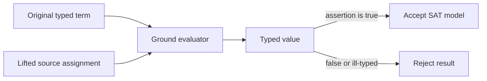

# Ground evaluation and model replay

The evaluator in [`axeyum-ir`](../../crates/axeyum-ir/src/eval.rs) is the
executable semantic reference for ground terms. Solver engines may search with
specialized representations, but a reported model is checked in the language
of the original term.

## Inputs and result

Evaluation takes a term arena, a root term, and an assignment. Assignments map
symbols to typed values and can also supply interpretations for functions and
other model-chosen values. `eval_with_memo` adds a caller-owned memo table so
shared subterms are computed once and multiple roots can reuse work.

Evaluation is total where SMT-LIB defines a total operation. For example,
bit-vector division by zero follows the SMT-LIB result rather than raising a
host-language exception. Where a theory deliberately leaves a result chosen by
the model, the assignment carries that choice. Missing assignments, sort
mismatches, malformed applications, and exceeded representation limits remain
explicit failures.

`Int` arithmetic among purely `i128`-representable operands still returns
`IrError::ArithmeticOverflow` when the `i128` computation itself overflows; a
solver route must decline the dependent model or verdict rather than wrap,
panic, or reinterpret the formula. But `Int` is no longer `i128`-only (ADR-1702
slice 2, landed): an integer literal or intermediate result outside the `i128`
reference range is `Value::WideInt`/`TermNode::WideIntConst`
(`crates/axeyum-ir/src/int_wide.rs`), an exact `BigInt`. Once *either* operand
of `Eq`, `IntNeg/Add/Sub/Mul/Div/Mod/Abs`, or an int comparison is `WideInt`,
the evaluator takes the exact wide-int path (`apply_wide_int`,
`crates/axeyum-ir/src/eval.rs:548-564` and following) instead of the narrow
`i128` closure, and cannot fail: `BigInt` has no overflow. Every wide result
demotes back to `Value::Int` when it fits, so a computation that grows past
`i128` and cancels back returns the ordinary narrow representation.

Rational arithmetic can similarly exceed `i128`, but only where a route opts in
(ADR-1702 slice 1). The evaluator's `Real` path uses the **declining** family, so
`real_add`/`real_mul`/`real_neg` still return `IrError::ArithmeticOverflow`
outside `i128` range; the opt-in `Rational::wide_*` family, used by the
exact-rational simplex, promotes instead. Both families compute the same
mathematical value, so widening a route can only turn an `unknown` into a
decision. `Int`'s wide path (above) is not opt-in in the same sense — it
engages automatically whenever a `WideInt` value is already present, most
commonly because the SMT-LIB integer-literal parser produced one directly for
an out-of-`i128`-range literal.

## Replay is a pipeline property

A backend rarely returns source-level values directly. The replay path is:

1. preserve symbol-to-input maps while lowering terms;
2. solve the lowered problem;
3. lift SAT variables and circuit inputs back to typed values;
4. run any rewrite model-reconstruction trail in reverse; and
5. evaluate every original assertion and active assumption.

Dropping any map makes the result unauditable. This is why `BitLowering`, CNF
encodings, and rewrite reports retain provenance even after their immediate
stage has finished.

## Evaluator scope

The evaluator is a checker for a concrete ground assignment, not a general
decision procedure. Quantifiers, partially interpreted functions, or a theory
value that the assignment does not define may prevent replay. A solver must
then use a fragment-specific checker or return `unknown`; it must not treat the
absence of a replay path as evidence that the assertion is true.

For the public model contract, see
[Models and replay](../user-guide/models-and-replay.md). For transformation
bookkeeping, continue with [Rewriting](rewriting.md).
