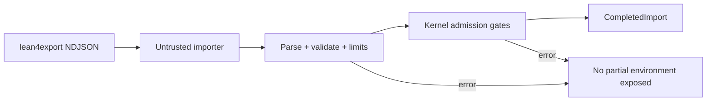

# Lean kernel and import boundary

The Lean route is split into two crates so untrusted wire parsing does not
silently become part of the checking kernel.

## `axeyum-lean-kernel`

[`axeyum-lean-kernel`](../../crates/axeyum-lean-kernel/src/lib.rs) is an
independent, pure-Rust checker for a selected Lean core. It forbids unsafe code
and depends on no other Axeyum workspace crate. Names, universe levels, and
expressions are hash-consed into deterministic identifiers; a segmented arena
and sharded interner support large shared proof DAGs without changing identity
semantics.

The environment admits declarations only through checked gates. Type inference,
weak-head normalization, definitional equality, inductive checks, and prelude
construction live behind those gates. Callers cannot insert an unchecked
declaration and later present it as a theorem.

After `release_transient_tables_for_export`, an environment is export-only:
memory used by construction can be released, but further construction or
checking is rejected. That lifecycle transition is explicit rather than a
hidden performance mode.

## `axeyum-lean-import`

[`axeyum-lean-import`](../../crates/axeyum-lean-import/src/lib.rs) owns the
untrusted `lean4export` NDJSON boundary. It handles JSON parsing, format
versions, ordering, malformed input, resource limits, and identity manifests;
only successful kernel admission is trusted.

The importer is fail-closed. A `CompletedImport` publishes the kernel and report
only after the full stream succeeds; an error does not expose a partially
admitted environment. Default limits bound line size and record count, and the
report records deterministic identity information for reproducibility. Those
defaults are 16 MiB per NDJSON record and 2,000,000 records per stream.

## Compatibility boundary

The current importer admits only `lean4export` wire format 3.1.0. Its selected
Lean 4.30 construct matrix now independently admits the retained direct,
recursive-indexed, reflexive-higher-order, mutual, nested-inductive, and
pre-elaborated well-founded streams. Registered computations are checked for the
recursive-indexed, reflexive, mutual, and nested rows. That is exact-fixture
kernel/import evidence, not native Lean source parsing, elaboration, termination
checking, or broad library compatibility.

The fixed four-member quotient package also has an atomic admission gate,
registered `Quot.lift`/`Quot.ind` reduction, and one retained official closure.
That quotient result is the offline TL2.10 M1--M3 slice: the separately
authorized M4 official differential, ADR acceptance, and final TL2.10 credit
remain open. Do not generalize it to complete `Init`, `Std`, mathlib, or Lean
ecosystem support.

The generated [official construct
matrix](../plan/generated/lean-official-construct-matrix.md) and
[compatibility matrix](../plan/generated/lean-compatibility.md) carry the exact
rows. Native syntax/macros, elaboration, pattern/equation compilation,
well-founded source lowering, tactics, runtime/compiler behavior, packages, and
editor integration remain separate work.

Current coverage belongs in the generated
[support matrix](../reference/support-matrix.md) and
[trust ledger](../reference/trust-ledger.md). An unsupported or malformed
construct must be rejected; import success alone is never proof validity.
