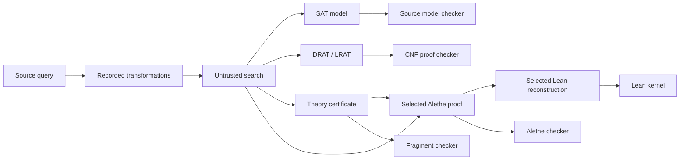

# Proof and evidence routes

Axeyum's trust model is **untrusted fast search, trusted small checking**.
Evidence is not one universal linear format: different fragments produce
different certificates, and each route must say exactly what was checked.

## Two definitive-result obligations

For `sat`, the usual certificate is a model. Lowering maps and rewrite trails
recover a source assignment, and the ground or fragment-specific checker
validates the original assertions.

For `unsat`, a route may produce a propositional proof, a theory certificate, an
Alethe derivation, a Lean reconstruction, or a checked composition of these.
The artifact must cover both search and every meaning-changing transformation
between the source query and the checked endpoint.

Not every current backend produces such an artifact. A proofless UNSAT search
result is reported at a lower assurance level and must not be described as
certificate-checked.

The arrows show possible relationships, not a requirement that every result
passes through every box. For example, a supported RUP-only DRAT proof can be
elaborated to the current positive-hint LRAT slice for a more explicit
propositional check; RAT additions are rejected. A linear-arithmetic certificate
has a different structure.

## Evidence reports and trust IDs

[`axeyum-solver` evidence](../../crates/axeyum-solver/src/evidence.rs) packages
the verdict, artifacts, replay/check results, and deterministic diagnostics.
Stable trust IDs identify assumptions and checker steps so generated artifacts
can be audited against the [trust ledger](../reference/trust-ledger.md).

The distinction matters:

| Statement | What it establishes |
|---|---|
| SAT assignment satisfies CNF | propositional target is satisfiable |
| Lifted model satisfies source assertions | original query is satisfiable |
| DRAT/LRAT checker accepts | encoded CNF is unsatisfiable |
| Theory checker accepts a certificate | the documented theory lemma is valid |
| Importer parses a Lean export | wire data is well-formed enough to attempt admission |
| Lean kernel admits declarations | reconstructed theorem checks under the admitted environment |

No row establishes a different row without a checked bridge.

## Current checker families

- `axeyum-cnf` provides DRAT, a RUP-only positive-hint LRAT checker and
  elaborator, and a selected Alethe core.
- `axeyum-solver::certificates` groups fragment-specific certificate checkers.
- `axeyum-solver::proofs` groups proof-facing APIs and reconstruction routes.
- `axeyum-lean-kernel` checks selected reconstructed Lean terms independently;
  `axeyum-lean-import` keeps the untrusted wire parser outside that kernel.

Alethe rule coverage and Lean reconstruction are intentionally selected rather
than universal. Current scope is generated into the support and trust ledgers;
unsupported proof constructs must fail closed or remain `unknown`.

For concrete artifacts, use the [Proof Certificate
Cookbook](../proof-cookbook/README.md). Contributors should follow
[Proof and evidence obligations](../contributor-guide/proof-and-evidence-obligations.md).
