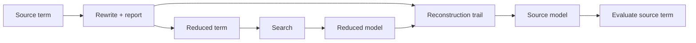

# Rewriting and reconstruction

`axeyum-rewrite` turns source terms into forms that later routes can decide.
Because a convenient search form is not automatically equivalent to the input,
every public rewrite declares what it preserves and how models return to the
source language. The crate is 16 files and roughly 17k lines; see
[`docs/solver-inventory-2026-09/02-frontend-ir-and-rewriting.md`](../solver-inventory-2026-09/02-frontend-ir-and-rewriting.md)
for the full traced inventory this page summarizes.

## Manifest contract

The manifest types in
[`axeyum-rewrite`](../../crates/axeyum-rewrite/src/lib.rs) record:

- a stable rule identifier;
- whether the rule preserves denotation or only equisatisfiability;
- whether model projection is the identity or requires reconstruction; and
- which testing route exercises the contract.

Invalid combinations are rejected. In particular, a rule cannot claim that
model reconstruction is required while providing no implementation route.

| Preservation | What the transformed term guarantees | Model obligation |
|---|---|---|
| Denotation | Same value under every relevant assignment | Identity — **enforced**: `validate_projection` (`lib.rs:310-318`) rejects a `Denotation` rule whose `projection` is not `Identity` (`ManifestError::UnexpectedProjection`), it is not merely the common case |
| Equisatisfiable | Same existence of a satisfying assignment | May require projection or reconstruction |

All 59 shipped canonicalizer rules are `Denotation` + `Identity`
(`canonical.rs:847-861`); the `Equisatisfiable` validation arms exist and are
enforced, but are exercised only by `lib.rs`'s own unit tests, not by a
shipped rule.

## Machine-checked guard tiers

The manifest governs the *canonicalizer*, not the whole pipeline (see below).
At canonicalization time, `PreconditionPolicy` (`canonical.rs:328-348`,
default `Denotational`) selects two tiers a committed rewrite must pass:

1. **Structural, always on.** Every committed rewrite is checked against its
   rule's declared operator scope and sort agreement.
2. **Denotational, on by default.** Each committed rewrite is additionally
   evaluated on both sides under `DENOTATION_GUARD_SAMPLES = 4` fixed
   assignments (`canonical.rs:312`), using the `axeyum-ir` ground evaluator —
   a code path independent of the matcher that decided to fire. A
   disagreement is a refusal, not a rewrite.

This is a runtime check on every commit, not just a build-time manifest
validation: a rule can be well-formed by the manifest's rules and still be
refused at the point it tries to fire, if its two sides disagree on a sampled
assignment.

## The default preprocessing pipeline

The manifest's canonicalizer is one step of a fixed five-step sequence that
runs once (not to a fixpoint) on the default `check_sat` path, gated on
`config.preprocess && !has_quantifier`
(`crates/axeyum-solver/src/auto.rs:1760`, function `preprocess_reduce` at
`auto.rs:2158-2199`):

1. `canonicalize_terms` (the manifest's 59 denotation rules, guard on)
2. `propagate_values` — pin `x = c` from top-level facts
3. `solve_eqs_bounded` — orient and substitute `x := t`
4. `elim_unconstrained` — peel invertible layers off single-use variables
5. `canonicalize_terms` again — re-normalize what substitution disturbed

The reduction is kept only if it does not grow the eventual AIG encoding
(`reduction_shrinks_encoding`, `auto.rs:2233-2264`); otherwise the original
query is dispatched unchanged. A second, near-identical pipeline
(`preprocess::check_with_preprocessing`, up to 8 rounds) exists but is not
what the SMT-LIB front door uses — see the inventory doc linked above for the
gap between the two.

Steps 2-4 above are equisatisfiable passes with their own reconstruction
types, not manifest rules — the manifest and the pipeline are separate
contract mechanisms that happen to share the canonicalizer.

## The sixteen files

Beyond `lib.rs` (manifest types) and `canonical.rs` (the canonicalizer and its
59 rules):

- `alpha.rs` — alpha-equivalence up to bound-variable renaming and
  quantifier-negation duality.
- `arrays.rs` — eager array elimination (QF_ABV → QF_BV) via
  read-over-write + Ackermann (ADR-0010).
- `datatypes.rs` — read-over-construct datatype simplification (ADR-0022),
  the datatype analogue of array read-over-write.
- `elim_unconstrained.rs` — unconstrained-variable elimination: a variable
  with exactly one parent in the assertion DAG is peeled via its inverter.
- `functions.rs` — eager uninterpreted-function elimination (QF_UFBV →
  QF_BV) by Ackermann reduction (ADR-0013).
- `int_blast.rs` — bounded bit-blasting of QF_LIA to QF_BV (ADR-0014).
- `int_divmod.rs` — eliminates integer `div`/`mod` by a constant divisor
  and `abs` into linear constraints, so the complete QF_LIA path (not just
  the bounded bit-blaster) decides them.
- `inverter.rs` — the shared per-theory term-inverter plugin registry that
  `elim_unconstrained` (and others) consume.
- `lower_bv.rs` — denotation-preserving lowering of derived bit-vector
  operators to the QF_BV bitblast core (the operator set the Alethe
  emitter, Carcara, and Lean reconstruction all support).
- `pass_stats.rs` — opt-in, clock-free term-size diagnostics across the
  rewrite passes; has no caller outside its own test module.
- `propagate_values.rs` — constant propagation: pins `x = c` from top-level
  equalities/Booleans and substitutes throughout.
- `quantifiers.rs` — finite-domain quantifier expansion (`forall`/`exists`
  over a finite sort become a conjunction/disjunction of instances).
- `reconstruct.rs` — `ModelReconstructionTrail`, replayed in reverse to
  recover source-level values from a reduced-problem model.
- `solve_eqs.rs` — top-level equation solving: orients `(= x t)` into a
  definition `x := t` under an occurs-check and substitutes.

## Canonicalization

The default canonicalizer is deliberately conservative. It applies a
deterministic collection of denotation-preserving rules, reports stable rule
IDs, and consumes explicit fuel. Its job is to remove incidental syntax and
expose sharing without changing meaning.

Broader transformations — eliminating arrays, functions, or datatypes,
blasting bounded integers, expanding quantifiers, solving equations, or
removing unconstrained values — are separate routes with stronger
preconditions, listed above. They are not silently part of the default
canonicalizer, though several of them (`propagate_values`, `solve_eqs_bounded`,
`elim_unconstrained`) are part of the default *pipeline*.

## Model reconstruction

When a transformation removes or replaces source variables, it appends steps to
a [`ModelReconstructionTrail`](../../crates/axeyum-rewrite/src/reconstruct.rs).
After a transformed problem is satisfiable, the solver replays that trail in
reverse to recover source-level values before ground evaluation.

An `unsat` route has the dual obligation: its proof or certificate must justify
the transformation from source constraints to the checked target. A successful
SAT replay does not by itself validate an UNSAT preprocessing step.

## Determinism and testing

Rewrite order, fuel, report order, and introduced names are observable. Tests
therefore cover semantic equivalence or equisatisfiability, reconstruction,
stable reporting, and resource exhaustion. Contributors adding a rule should
follow [Adding a rewrite](../contributor-guide/adding-a-rewrite.md) and record a
new design decision when the preservation or evidence boundary changes.
