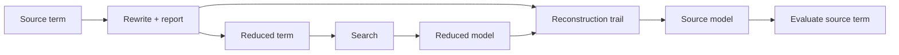

# Rewriting and reconstruction

`axeyum-rewrite` turns source terms into forms that later routes can decide.
Because a convenient search form is not automatically equivalent to the input,
every public rewrite declares what it preserves and how models return to the
source language.

## Manifest contract

The manifest types in
[`axeyum-rewrite`](../../crates/axeyum-rewrite/src/lib.rs) record:

- a stable rule identifier;
- whether the rule preserves denotation or only equisatisfiability;
- whether model projection is the identity or requires reconstruction; and
- which testing route exercises the contract.

Invalid combinations are rejected. In particular, a rule cannot claim that
model reconstruction is required while providing no implementation route.

| Preservation | What the transformed term guarantees | Model obligation |
|---|---|---|
| Denotation | Same value under every relevant assignment | Usually identity |
| Equisatisfiable | Same existence of a satisfying assignment | May require projection or reconstruction |

## Canonicalization

The default canonicalizer is deliberately conservative. It applies a
deterministic collection of denotation-preserving rules, reports stable rule
IDs, and consumes explicit fuel. Its job is to remove incidental syntax and
expose sharing without changing meaning.

Broader transformations—such as eliminating arrays or functions, blasting
bounded integers, expanding quantifiers, solving equations, or removing
unconstrained values—are separate routes with stronger preconditions. They are
not silently part of the default canonicalizer.

## Model reconstruction

When a transformation removes or replaces source variables, it appends steps to
a [`ModelReconstructionTrail`](../../crates/axeyum-rewrite/src/reconstruct.rs).
After a transformed problem is satisfiable, the solver replays that trail in
reverse to recover source-level values before ground evaluation.

An `unsat` route has the dual obligation: its proof or certificate must justify
the transformation from source constraints to the checked target. A successful
SAT replay does not by itself validate an UNSAT preprocessing step.

## Determinism and testing

Rewrite order, fuel, report order, and introduced names are observable. Tests
therefore cover semantic equivalence or equisatisfiability, reconstruction,
stable reporting, and resource exhaustion. Contributors adding a rule should
follow [Adding a rewrite](../contributor-guide/adding-a-rewrite.md) and record a
new design decision when the preservation or evidence boundary changes.
