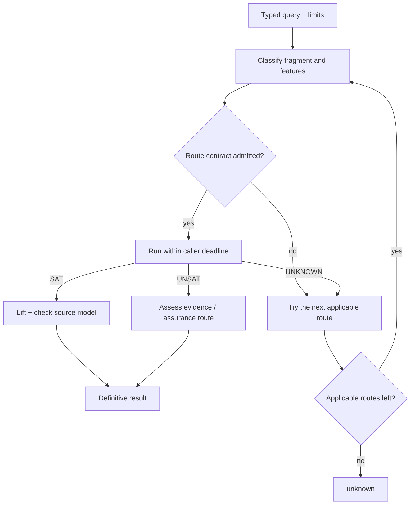

# Solver dispatch and route contracts

`axeyum-solver` is the orchestration hub. Its job is not to pretend every term
belongs to one algorithm; it classifies a query, admits only routes whose
contracts apply, and returns a definitive verdict only when that route's replay
or evidence obligations are met.

## Front doors

The unified `solve` front door accepts an arena, assertions, and a `SolveConfig`.
It normalizes the query, considers quantified and ground paths, dispatches the
quantifier-free subset, and safely falls back to incomplete quantified routes.
The quantifier-free `check_auto` dispatcher selects among theory-specific and
combination engines.

The precise route order evolves, so the stable mental model is:

Fallback happens after `unknown`, not after a contradictory definitive result,
and all routes share the caller's remaining deadline. The explained dispatcher
adds a deterministic route trace without changing the verdict.

Current fragment coverage belongs in the generated
[support matrix](../reference/support-matrix.md), not in a hard-coded route list
on this page.

## Backends and solver state

`SolverBackend` defines a one-shot semantic boundary: a backend reports `sat`
with a model, `unsat` at its documented assurance level, or `unknown` with a
reason. Infrastructure faults remain errors rather than logical results.

The high-level `Solver<B>` adds assertions, assumptions, and push/pop scopes.
Those are interface-level incremental semantics; they do not promise that every
backend keeps a warm native solver between calls. Dedicated incremental BV/SAT
paths exist where reuse is implemented and measured.

## Stage accounting

Typed layer statistics separate normalization, bit-blasting, CNF encoding,
inprocessing, SAT solving, model lifting, and evidence work. Shapes and digests
make artifacts comparable without relying on unstable debug output. This split
is essential for deciding whether performance work belongs in encodings,
theory propagation, or the SAT core.

The typed split above (`BvLayerStats`) only ever covered the pure-Rust
bit-blast path. Every arithmetic/EUF/string/combined-theory route instead runs
the generic CDCL(T) driver (`crate::cdclt::CdclT`), which had no stage
attribution at all until `TheoryLayerStats` (`crate::layers`): time in Boolean
unit propagation, `TheorySolver::assert`, `TheorySolver::propagate`,
`push`/`pop`, and 1-UIP conflict analysis, plus theory-conflict, theory-
propagation, decision, and restart counts. It is off by default — a search
pays no extra clock read unless `crate::theories::cdclt_diagnostics::
TheoryLayerStatsGuard::enable()` is active on the current thread — and reads
the clock only at stage boundaries (once per driver call to the theory, never
per trail literal), so the accounting itself cannot become the thing being
measured. `RouteTrace` gained the matching piece on the dispatch side: each
recorded attempt now carries wall-clock elapsed time since the previous one
(`RouteTrace::elapsed`/`total_elapsed`), exposed through the opt-in
`RouteTrace::to_json_with_timing` alongside the unchanged `to_json`, so a
*declined* route's cost is visible without hand-classifying per-file TSVs
(the 2026-08-21 linear-arithmetic diagnosis's workaround for not having
either instrument).

## Result discipline

- `sat` requires a source-level model accepted by the appropriate checker.
- `unsat` records any certificate/checker path and the resulting assurance
  boundary; a proofless backend result remains explicitly lower assurance.
- `unknown` is normal for unsupported fragments, incomplete algorithms, or
  exhausted explicit limits.
- an error means the request or infrastructure failed; it is never converted
  into `unsat`.

See [Solver configuration](../reference/solver-config.md) for public controls,
[Adding a solver route](../contributor-guide/adding-a-solver-route.md) for the
implementation checklist, and [Proof and evidence routes](proof-stack.md) for
how definitive results are audited.
