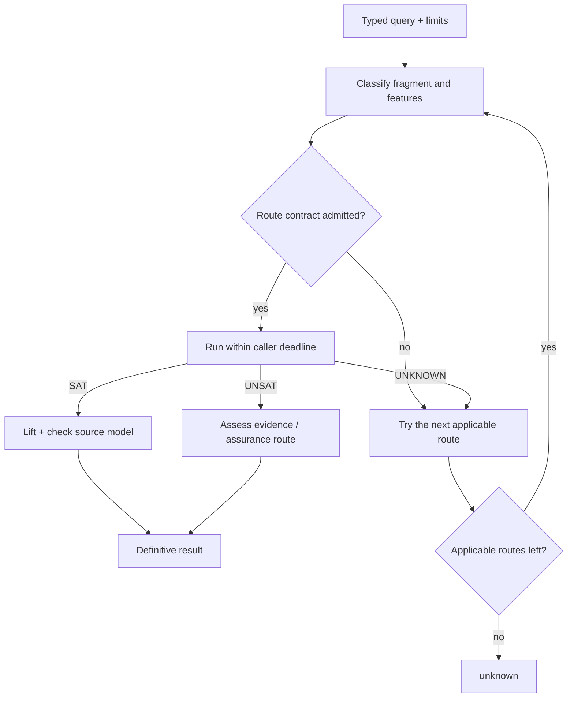

# Solver dispatch and route contracts

`axeyum-solver` is the orchestration hub. Its job is not to pretend every term
belongs to one algorithm; it classifies a query, admits only routes whose
contracts apply, and returns a definitive verdict only when that route's replay
or evidence obligations are met.

## Front doors

The unified `solve` front door accepts an arena, assertions, and a `SolveConfig`.
It normalizes the query, considers quantified and ground paths, dispatches the
quantifier-free subset, and safely falls back to incomplete quantified routes.
The quantifier-free `check_auto` dispatcher selects among theory-specific and
combination engines.

The precise route order evolves, so the stable mental model is:

Fallback happens after `unknown`, not after a contradictory definitive result,
and all routes share the caller's remaining deadline. The explained dispatcher
adds a deterministic route trace without changing the verdict.

Current fragment coverage belongs in the generated
[support matrix](../reference/support-matrix.md), not in a hard-coded route list
on this page.

## Backends and solver state

`SolverBackend` defines a one-shot semantic boundary: a backend reports `sat`
with a model, `unsat` at its documented assurance level, or `unknown` with a
reason. Infrastructure faults remain errors rather than logical results.

The high-level `Solver<B>` adds assertions, assumptions, and push/pop scopes.
Those are interface-level incremental semantics; they do not promise that every
backend keeps a warm native solver between calls. Dedicated incremental BV/SAT
paths exist where reuse is implemented and measured.

## Stage accounting

Typed layer statistics separate normalization, bit-blasting, CNF encoding,
inprocessing, SAT solving, model lifting, and evidence work. Shapes and digests
make artifacts comparable without relying on unstable debug output. This split
is essential for deciding whether performance work belongs in encodings,
theory propagation, or the SAT core.

The typed split above (`BvLayerStats`) only ever covered the pure-Rust
bit-blast path. Every arithmetic/EUF/string/combined-theory route instead runs
the generic CDCL(T) driver (`crate::cdclt::CdclT`), which had no stage
attribution at all until `TheoryLayerStats` (`crate::layers`): time in Boolean
unit propagation, `TheorySolver::assert`, `TheorySolver::propagate`,
`push`/`pop`, and 1-UIP conflict analysis, plus theory-conflict, theory-
propagation, decision, and restart counts. It is off by default — a search
pays no extra clock read unless `crate::theories::cdclt_diagnostics::
TheoryLayerStatsGuard::enable()` is active on the current thread — and reads
the clock only at stage boundaries (once per driver call to the theory, never
per trail literal), so the accounting itself cannot become the thing being
measured. `RouteTrace` gained the matching piece on the dispatch side: each
recorded attempt now carries wall-clock elapsed time since the previous one
(`RouteTrace::elapsed`/`total_elapsed`), exposed through the opt-in
`RouteTrace::to_json_with_timing` alongside the unchanged `to_json`, so a
*declined* route's cost is visible without hand-classifying per-file TSVs
(the 2026-08-21 linear-arithmetic diagnosis's workaround for not having
either instrument).

## Theory interface

`pub trait TheorySolver` (`crate::euf_egraph`) is the boundary every
arithmetic/EUF/string/combined-theory adapter implements for `CdclT`.
[ADR-1701](../research/09-decisions/adr-1701-the-theory-interface-gains-final-check-a-driver-owned-queue-lazy-explanation-and-dynamic-atoms.md)
widened it with four defaulted hooks, so all ten existing implementors compile
and behave unchanged unless they opt in: `final_check` (a complete check at a
total Boolean assignment, separate from the cheap check `assert` used to run
on every call — the default just returns `Sat`, so a theory that already
decides everything on `assert` needs no second opinion), `propagate_into` (a
driver-owned `PropagationQueue` in place of a freshly allocated `Vec` per
propagation round), `explain` (resolves a deferred `ExplanationId` — lazy
explanation, so a propagation reason materializes only if conflict analysis
actually reaches it), and `take_new_atoms` (dynamic theory-atom registration
through the trait instead of a driver-side table). `DlTheory` (`dl_online.rs`)
and `LraTheory` (`lra_online.rs`) are the two opt-ins: LRA moves `assert` to
cheap bound bookkeeping with the complete feasibility decision deferred to
`final_check` (the Dutertre–de Moura split its simplex engine was built for),
and DL keeps its incremental negative-cycle check on `assert` but opts into
the queue and lazy explanation. A [2026-09-05 before/after
measurement](../research/11-design-review/2026-09-05-adr-1701-slice-1-measured.md)
on the 2026-08-21 diagnosis's own miss populations found the two opt-ins
convert some QF_LRA timeouts to a decided verdict (2 of 33 traced, one
already-decided file 13x faster) with zero regressions, and no effect on the
traced QF_IDL population — `TheoryLayerStats` attribution on that population
shows its bottleneck is the CDCL(T) driver's own Boolean search, not the
theory's `assert`/`propagate` cost, so widening the theory interface had
nothing to speed up there.

That Boolean search is now watch-based. `CdclT::unit_propagate` used to rescan
the whole clause database on every fixpoint pass and clone the reason clause at
each implication; it is now **two-watched-literal propagation with blocking
literals**, with the clause store a flat literal arena plus `(offset, len)`
headers, and a reason recorded as a clause id read out of the arena only when
conflict analysis asks for it. The design is ported verbatim from the
proof-producing native core (`axeyum_cnf`'s `proof_sat.rs`: `Watch`,
`ClauseHeader`, `lit_code`, the `i`/`j` watch-list compaction) so that moving
CDCL(T) onto that engine is a deletion rather than a reconciliation of two
watch schemes. The `TheorySolver` trait, the ten `CdclT::new` call sites and
`TheoryLayerStats` are untouched, so `boolean_propagate` measures the same
stage before and after and is its own scoreboard: on the two profiled QF_IDL
files that emit a trace line it falls from 17.5 s / 16.9 s of a 24 s budget to
1.9 s / 1.1 s, and `decisions` rises from zero — the search had never left its
first propagation fixpoint. Clauses inserted mid-search at the final-check
boundary (`CdclT::add_permanent_clause`) get their watches chosen against the
*current* assignment and one full evaluation from a pending queue, so a clause
that arrives already unit implies and one that arrives already falsified
conflicts. [Measurement](../research/11-design-review/2026-09-05-s1-watched-literals-measured.md).

## Result discipline

- `sat` requires a source-level model accepted by the appropriate checker.
- `unsat` records any certificate/checker path and the resulting assurance
  boundary; a proofless backend result remains explicitly lower assurance.
- `unknown` is normal for unsupported fragments, incomplete algorithms, or
  exhausted explicit limits.
- an error means the request or infrastructure failed; it is never converted
  into `unsat`.

See [Solver configuration](../reference/solver-config.md) for public controls,
[Adding a solver route](../contributor-guide/adding-a-solver-route.md) for the
implementation checklist, and [Proof and evidence routes](proof-stack.md) for
how definitive results are audited.
