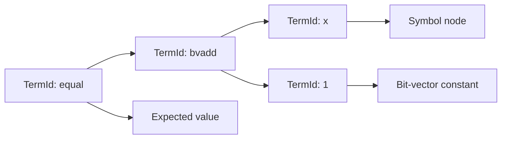

# Term IR and arenas

`axeyum-ir` is the common language between parsers, rewrites, evaluators, and
solver routes. It deliberately separates a term's compact identity from the
arena that owns its structure.

## Handles and ownership

[`TermId`](../../crates/axeyum-ir/src/term.rs) is a lifetime-free, `Copy`
handle. A [`TermArena`](../../crates/axeyum-ir/src/arena.rs) stores the nodes:

- nodes are append-only and receive dense, insertion-order identifiers;
- construction is hash-consed, so structurally equal terms in one arena share
  the same identifier;
- child identifiers always belong to the same arena; and
- an identifier has no meaning in a different arena, even if its integer value
  happens to match.

This design makes terms cheap to copy and compare without leaking backend or
FFI lifetimes into public APIs. Cloning an arena preserves its identifiers, but
it is a deep clone intended for disposable transformation state rather than a
way to combine independently built terms.

The arena also keeps user symbols separate from internal symbols and functions.
That namespace split is a soundness boundary: preprocessing may introduce
auxiliary names without colliding with input names.

## Sorts, terms, and values

The IR represents more than the finite-domain core. Its sorts and nodes cover
Booleans and bit-vectors as well as integers, reals, arrays, functions,
datatypes, sequences, floating point, and quantified forms. A route may support
only a subset, but the shared IR must not force the solver architecture into a
quantifier-free corner.

Concrete model values are similarly typed. Bit-vector values retain their
width, integer and rational values are exact, and wide values do not silently
truncate to machine integers. The canonical bit convention is **least
significant bit first** when a value is converted to a vector of Boolean bits;
the bit-blaster and model lifter use the same convention.

## Construction invariants

Public constructors check arity and sort compatibility before interning a node.
Callers should use those constructors rather than manufacture raw nodes. That
keeps these invariants centralized:

1. every term has one well-defined sort;
2. operator arguments have the required sorts and widths;
3. structurally equal nodes share identity within the arena; and
4. output order and diagnostics remain deterministic.

Resource or representation limits are explicit errors. They do not wrap into a
different mathematical term, and a solver route that cannot proceed should
return `unknown` rather than invent a verdict.

## Why the arena survives solving

The original arena is needed after fast search. A `sat` result is accepted only
after the returned assignment can be evaluated against the original assertion.
For `unsat`, evidence must likewise remain connected to the source query through
checked transformations. Lowering maps and reconstruction trails are therefore
part of the solve state, not temporary debug data.

Read [Ground evaluation](evaluator.md) for the executable semantics and
[Rewriting](rewriting.md) for transformations that preserve or reconstruct
source meaning. The crate's runnable API examples live in
[`axeyum-ir`'s crate documentation](../../crates/axeyum-ir/src/lib.rs).
