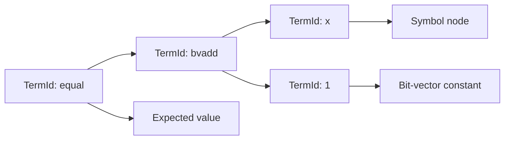

# Term IR and arenas

`axeyum-ir` is the common language between parsers, rewrites, evaluators, and
solver routes. It deliberately separates a term's compact identity from the
arena that owns its structure.

## Handles and ownership

[`TermId`](../../crates/axeyum-ir/src/term.rs) is a lifetime-free, `Copy`
handle. A [`TermArena`](../../crates/axeyum-ir/src/arena.rs) stores the nodes:

- nodes are append-only and receive dense, insertion-order identifiers;
- construction is hash-consed, so structurally equal terms in one arena share
  the same identifier;
- child identifiers always belong to the same arena; and
- an identifier has no meaning in a different arena, even if its integer value
  happens to match.

This design makes terms cheap to copy and compare without leaking backend or
FFI lifetimes into public APIs. Cloning an arena preserves its identifiers, but
it is a deep clone intended for disposable transformation state rather than a
way to combine independently built terms.

The arena also keeps user symbols separate from internal symbols and functions.
That namespace split is a soundness boundary: preprocessing may introduce
auxiliary names without colliding with input names.

## Sorts, terms, and values

The IR represents more than the finite-domain core. Its sorts and nodes cover
Booleans and bit-vectors as well as integers, reals, arrays, functions,
datatypes, sequences, floating point, and quantified forms. A route may support
only a subset, but the shared IR must not force the solver architecture into a
quantifier-free corner.

Concrete model values are similarly typed. Bit-vector values retain their
width, and wide bit-vector values do not silently truncate to machine integers.
Integer values are exact within the current `i128` reference range, and
out-of-range integer evaluation is an explicit `ArithmeticOverflow`, never
wrapped arithmetic.

**Rational values can be unbounded, but only where a route asks for it**
(ADR-1702). `Rational` carries an `i128` fast path and an arbitrary-precision
slow path, and promotion is **opt-in per route**: `new`, the `checked_*` family
and the arithmetic operators still decline (or panic) on `i128` overflow exactly
as before, while a parallel `wide_new` / `wide_add` / `wide_sub` / `wide_mul` /
`wide_div` / `wide_neg` / `wide_recip` family promotes to a
`num_rational::BigRational` held in a capped, deduplicating process-global pool.
Any result that fits `i128` again is *demoted* back, so the fast path is retaken
after transient growth.

Global promotion was implemented first and rejected on measurement: it broke
`axeyum-cas`, which uses `i128` exhaustion as a cost bound and a termination
argument. The one exception to opt-in is comparison — `Ord::cmp` is now always
exact and can no longer panic, because comparing allocates nothing.

The type stays `Copy` and two `i128` fields wide (a promoted value is identified
by the otherwise-impossible `den == 0`), and `Eq`, `Ord`, `Hash` and `Display`
are all defined on the *value*, never on the pool id, so determinism is
unaffected. The declining family accepts promoted operands: it computes exactly
and demotes, returning `None` if the result does not fit, so a promoted value
never produces a wrong answer anywhere. The one place representation shows
through is `numerator()`/`denominator()`, which return `i128` and therefore panic
rather than truncate on a promoted value; a route that opts in must keep such
values internal or use `checked_numerator()` / `numerator_big()`. The first —
and so far only — route to opt in for `Real`/`Rational` is the exact-rational
simplex, which narrows at its own boundary.

ADR-1702's slice 2 raises the same ceiling for `Value::Int`, and **is landed**:
`TermNode::WideIntConst` / `Value::WideInt` (`crates/axeyum-ir/src/int_wide.rs`)
hold an exact `BigInt` for an integer literal or arithmetic result outside the
`i128` reference range, the SMT-LIB integer-literal parser constructs
`WideIntConst` directly for an out-of-range literal
(`crates/axeyum-smtlib/src/parse.rs:16055`), and the ground evaluator's
`apply_wide_int` path (`crates/axeyum-ir/src/eval.rs:548-564`) computes exactly
and demotes back to `Value::Int` whenever the result fits — the same
opt-in/demote shape as the `Real` family above.

The canonical bit convention is
**least significant bit first** when a value is converted to a vector of
Boolean bits; the bit-blaster and model lifter use the same convention.

## Construction invariants

Public constructors check arity and sort compatibility before interning a node.
Callers should use those constructors rather than manufacture raw nodes. That
keeps these invariants centralized:

1. every term has one well-defined sort;
2. operator arguments have the required sorts and widths;
3. structurally equal nodes share identity within the arena; and
4. output order and diagnostics remain deterministic.

Resource or representation limits are explicit errors. They do not wrap into a
different mathematical term, and a solver route that cannot proceed should
return `unknown` rather than invent a verdict.

## Why the arena survives solving

The original arena is needed after fast search. A `sat` result is accepted only
after the returned assignment can be evaluated against the original assertion.
For `unsat`, evidence must likewise remain connected to the source query through
checked transformations. Lowering maps and reconstruction trails are therefore
part of the solve state, not temporary debug data.

Read [Ground evaluation](evaluator.md) for the executable semantics and
[Rewriting](rewriting.md) for transformations that preserve or reconstruct
source meaning. The crate's runnable API examples live in
[`axeyum-ir`'s crate documentation](../../crates/axeyum-ir/src/lib.rs).
