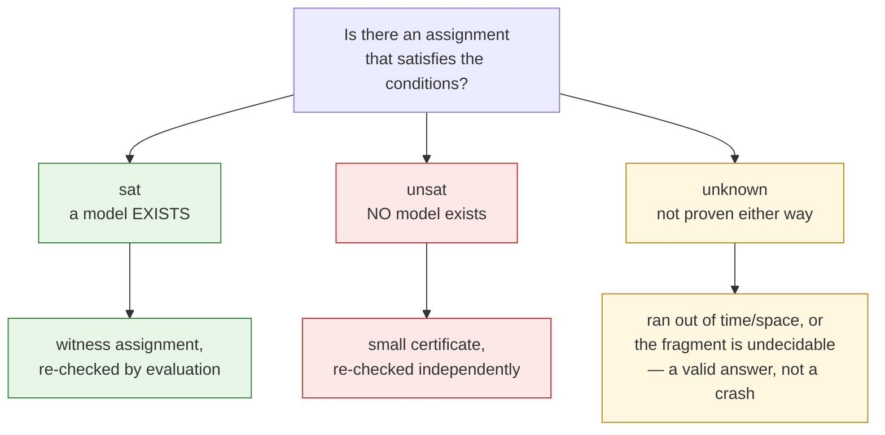

# What Is Automated Reasoning?

An automated reasoning tool — a **solver** — answers questions of the form:

> *Is there an assignment of values that makes these conditions true?*

That one question, asked well, covers a startling amount of software work:
finding a bug-triggering input, proving a function can never overflow, scheduling
under constraints, optimizing a configuration, or checking that a refactor
preserves behavior.

## A first taste

Suppose `x` is an 8-bit number (so `0 … 255`, and arithmetic *wraps around*).
Is there a value of `x` with `x + 1 = 0`?

```smt2
(set-logic QF_BV)            ; quantifier-free bit-vectors
(declare-const x (_ BitVec 8))
(assert (= (bvadd x #x01) #x00))
(check-sat)
(get-model)
```

A solver answers **`sat`** ("yes, there is one") and hands back a witness:
`x = #xff` (255), because `255 + 1` wraps to `0` in 8 bits. You don't have to
trust that blindly — Axeyum **re-evaluates** `255 + 1 = 0` to confirm it before
reporting `sat`.

Now ask something impossible — can `x` be both `0` and `1`?

```smt2
(set-logic QF_BV)
(declare-const x (_ BitVec 8))
(assert (= x #x00))
(assert (= x #x01))
(check-sat)
```

The answer is **`unsat`** ("no value works"). A good solver doesn't just say so —
it can produce a small **certificate** that an independent checker verifies.

## The three answers

A solver gives one of three results, and they are genuinely different:



- **`sat`** — there *is* a solution; the solver returns one (a *model*).
- **`unsat`** — there is *provably no* solution.
- **`unknown`** — the solver couldn't settle it within its resources, or the
  question lies in an undecidable fragment. This is a **first-class, honest**
  result in Axeyum — never an error or a crash.

That last point is a design principle: a solver that occasionally says "I don't
know" but is *never wrong* is far more useful than one that always answers but
sometimes lies.

## SAT vs SMT

The engine underneath is **SAT** — satisfiability of pure Boolean formulas
(variables that are only true/false). SAT is the workhorse, but raw Booleans are
a painful language for real problems.

**SMT** ("SAT Modulo Theories") keeps SAT's Boolean structure and adds
*theories* that give variables meaning:

| Theory | Variables range over | Example fact |
|---|---|---|
| Bit-vectors (`BV`) | fixed-width machine words | `x + 1 = 0` for `x = 255` (8-bit) |
| Integers / Reals (`LIA`/`LRA`) | ℤ / ℝ | `2·m = a + b ⇒ m − a = b − m` |
| Arrays | maps/memory | `select(store(a, i, v), i) = v` |
| Uninterpreted functions (`UF`) | unknown functions | `a = b ⇒ f(a) = f(b)` |
| Floating point (`FP`) | IEEE-754 | `x + 0.0` is not always `x` |

Axeyum implements many of these end to end. What's supported, and how strongly
it's checked, is in the [capability matrix](../research/08-planning/capability-matrix.md).

## Next

- [`sat` / `unsat` / `unknown`](05-models-unsat-and-unknown.md), in depth.
- [How Axeyum solves a query](07-how-axeyum-solves-a-query.md) — the pipeline and
  the trust boundary that keeps it honest.
- Or just [run one](../user-guide/first-smtlib-query.md).
