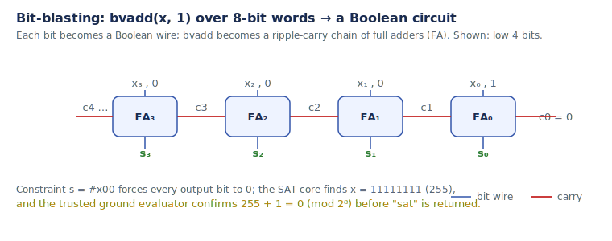

# Bit-Vectors and Bit-Blasting

> 📝 This page is being expanded (see the [documentation plan](../documentation-plan.md)).
> The essentials are here; the worked pipeline is in
> [How Axeyum solves a query](07-how-axeyum-solves-a-query.md).

A **bit-vector** is a fixed-width machine word — say 8 bits, ranging over
`0 … 255`. Arithmetic **wraps** modulo 2ⁿ, exactly like hardware: in 8 bits,
`255 + 1 = 0`. The logic of quantifier-free bit-vector queries is **QF_BV**.

**Bit-blasting** is how a bit-vector query becomes something a SAT solver can
chew on: each n-bit value becomes n Boolean wires, and each operator becomes a
Boolean **circuit**. Addition becomes a ripple-carry adder; comparison, equality,
shifts, and multiplication each have standard circuit encodings.

The circuit is then turned into [CNF](glossary.md) (Tseitin encoding) and handed
to the SAT core. This is powerful (any bit-precise operation is expressible) but
can be expensive — a wide multiply explodes into a huge circuit, which is why
Axeyum refuses oversized encodings with a graceful
[`unknown`](05-models-unsat-and-unknown.md) and pursues word-level *preprocessing*
to shrink problems before blasting.

**Next:** [sat / unsat / unknown](05-models-unsat-and-unknown.md) ·
[How Axeyum solves a query](07-how-axeyum-solves-a-query.md) ·
internals: [architecture](../internals/architecture.md).
