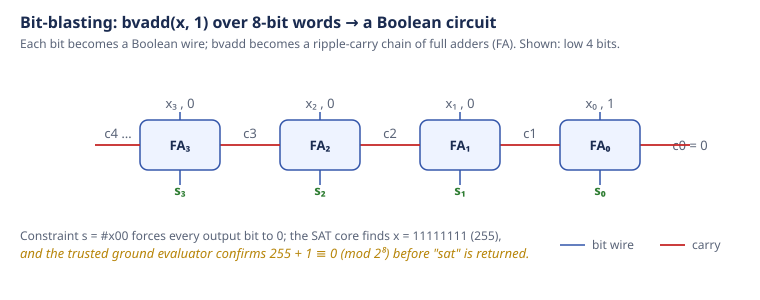

# Bit-Vectors and Bit-Blasting

A **bit-vector** is a fixed-width sequence of bits. It models a hardware word or
machine register more precisely than an unbounded mathematical integer.

An 8-bit vector has 256 possible bit patterns. The same pattern can be read as
unsigned `0 … 255` or signed `-128 … 127`; the bits do not carry signedness on
their own. The selected operation determines how they are interpreted.

## Fixed width changes arithmetic

Bit-vector arithmetic wraps modulo `2^width`:

```text
8-bit:  255 + 1 = 0
4-bit:   15 + 1 = 0
```

Widths are part of the sort. Adding an 8-bit word to a 16-bit word is not
well-typed until the encoder explicitly extends or truncates one operand. This
is essential in binary analysis: silently changing a width can change overflow,
comparison, shift, and mask behavior.

Common operations include:

| Family | Examples |
|---|---|
| arithmetic | addition, subtraction, multiplication, unsigned/signed division |
| bitwise | and, or, xor, not |
| comparison | unsigned and signed less-than/less-than-or-equal |
| structure | concatenate, extract, zero-extend, sign-extend |
| movement | logical/arithmetic shifts, rotates |

SMT-LIB defines these operations for every input, including edge cases. For
example, unsigned bit-vector division by zero returns the all-ones vector.
Axeyum's builders, evaluator, lowering, and model replay must agree on those
total semantics.

## From words to wires

SAT understands Boolean variables, not addition or 32-bit registers.
**Bit-blasting** turns every bit-vector into Boolean wires and every operation
into a Boolean circuit.



For a two-bit addition `x + y`, write the low bits as `x0` and `y0`:

```text
sum0   = x0 xor y0
carry0 = x0 and y0
sum1   = x1 xor y1 xor carry0
```

The carry beyond `sum1` is discarded because the result is two bits wide. That
discard is exactly modular wraparound, not an approximation.

Other operators become different circuits: equality compares corresponding
bits, a constant shift rewires or fills bits, and multiplication builds a
network of partial products and additions.

## AIG and CNF

Axeyum first represents the Boolean circuit as an **and-inverter graph** (AIG).
An AIG uses input nodes, two-input AND nodes, and complemented edges. Structural
hashing gives identical subcircuits one deterministic shared node.

The circuit then becomes **conjunctive normal form** (CNF) through a Tseitin
encoding. Each relevant circuit node gets a SAT variable, and a few clauses
enforce the relationship between that variable and its inputs. The formula
stays linear in the circuit size instead of expanding a nested expression
exponentially.

The SAT solver sees only clauses. Axeyum therefore retains maps in both
directions:

```text
original term bit → AIG literal → CNF variable
SAT assignment    → AIG inputs  → original symbol value
```

Without those maps, a backend could report that some Boolean encoding is
satisfiable but could not produce and replay a model for the query the user
actually asked.

## The worked query

Return to the 8-bit formula:

```smt2
(assert (= (bvadd x #x01) #x00))
```

Bit-blasting creates the eight output bits of `x + 1`. Equality to zero
constrains every output bit to false. SAT finds input bits `11111111`; model
lifting reconstructs `x = #xff`; the ground evaluator checks the original
bit-vector addition and equality.

For the contradictory query `x = #x00` and `x = #x01`, the CNF is
unsatisfiable. A proof-producing SAT route can emit a refutation that an
independent checker validates.

## Why bit-blasting can be expensive

Circuit size depends on operator and width. Bitwise operations are usually
linear and local. Wide multiplication, division, variable shifts, and repeated
array or function elimination can create much larger circuits and CNFs.

Axeyum uses deterministic node and encoding budgets. If lowering would exceed
a configured limit, the result is `unknown` with a resource classification—not
`unsat`, and not a partial model. Word-level rewriting and demand analysis can
reduce the circuit, but each transformation still needs explicit semantics and
model/proof lifting.

## Why finite does not mean cheap

Quantifier-free fixed-width bit-vector logic is decidable: there are finitely
many assignments. A 64-bit variable still has `2^64` values, and several
variables multiply the search space. Completeness says a decision exists in
principle; it does not promise that every query fits a practical budget.

## Next

Continue to [sat, unsat, and unknown](05-models-unsat-and-unknown.md), then learn
how [proofs and certificates](06-proofs-certificates-and-trust.md) let a smaller
checker validate the search result. For implementation details, see
[Bit-blasting (internals)](../internals/bit-blasting.md) and
[CNF and SAT (internals)](../internals/cnf-and-sat.md).
