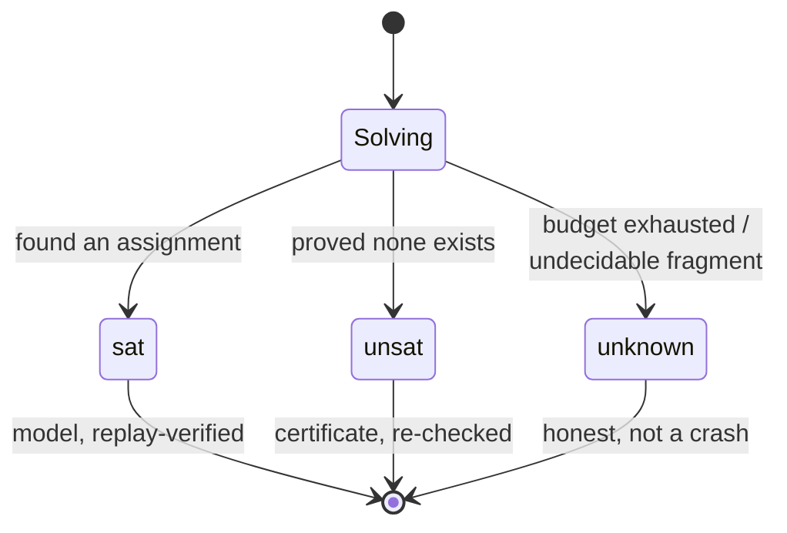
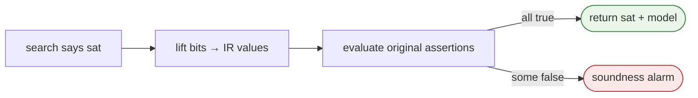

# sat, unsat, and unknown

The three results a solver can return are not "success / failure / error." They
are three *different claims*, each with a different kind of evidence.

## `sat` — and why a model is checkable

`sat` means **a model exists**, and the solver returns one: a concrete value for
each variable. The value of a solver model is that you can *use* it (the
bug-triggering input, the schedule, the counterexample).

Axeyum's rule: **every `sat` is replayed.** The model is lifted back to typed IR
values and evaluated against the *original* assertions with a small, trusted
ground evaluator. If any assertion is not `true` under the model, that's a
**soundness alarm**, not a `sat`. So a buggy search can lose you a solution
(an `unknown`), but it can never hand you a *wrong* one.

## `unsat` — and what makes it trustworthy

`unsat` means **no model exists** — a universal claim ("for *all* assignments,
the conditions fail"). You can't show that by exhibiting one example, so the
evidence is a **proof/certificate** that a small, independent checker re-verifies:

| Fragment | Evidence | Re-checked by |
|---|---|---|
| QF_BV (clausal) | DRAT / LRAT proof | `check_drat`, `check_lrat` |
| QF_LRA | Farkas certificate | re-derived coefficients |
| QF_UF | congruence explanation | independent union-find |
| covered fragments | Alethe proof | reconstructed to a `False` a Rust **Lean-grade kernel** accepts |

This is the project's identity: a wrong search can't produce a wrong `unsat`,
because the *checker* — not the search — has the last word. The full picture of
what is independently checked vs still trusted is the
[trust ledger](../research/08-planning/trust-ledger.md).

## `unknown` — a feature, not a failure

`unknown` means the solver did **not** settle the question. Causes:

- a **resource budget** (time, conflicts, or encoding size) was hit — Axeyum
  refuses oversized encodings *before* allocating them, degrading to `unknown`
  rather than running out of memory;
- the fragment is **incomplete** in Axeyum (e.g. nonlinear arithmetic is
  sound-but-incomplete) or **undecidable** in general.

The hard rule: `unknown` is **first-class**. Every path must degrade to a
deterministic `unknown` under its bound — never a crash, never a hang, and
*never* a guessed `sat`/`unsat`. A trustworthy "I don't know" beats a confident
lie.

## Next

[How Axeyum solves a query](07-how-axeyum-solves-a-query.md) shows where each of
these three outcomes is produced in the pipeline.
