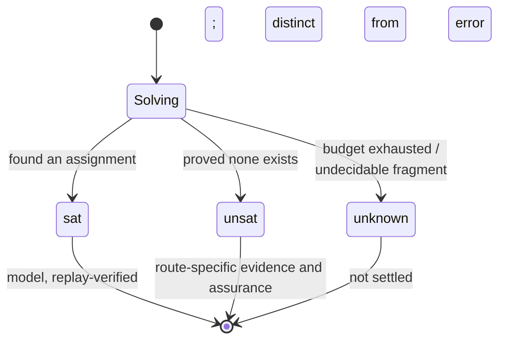
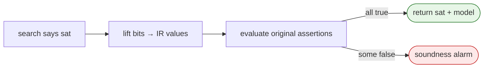

# sat, unsat, and unknown

The three results a solver can return are not "success / failure / error." They
are three *different claims*, each with a different kind of evidence.

```mermaid
stateDiagram-v2
    [*] --> Solving
    Solving --> sat: found an assignment
    Solving --> unsat: proved none exists
    Solving --> unknown: budget exhausted /<br/>undecidable fragment
    sat --> [*]: model, replay-verified
    unsat --> [*]: route-specific evidence and assurance
    unknown --> [*]: not settled; distinct from error
```

## `sat` — and why a model is checkable

`sat` means **a model exists**, and the solver returns one: a concrete value for
each variable. The value of a solver model is that you can *use* it (the
bug-triggering input, the schedule, the counterexample).

Axeyum's rule: **every `sat` is replayed.** The model is lifted back to typed IR
values and evaluated against the *original* assertions with a small, trusted
ground evaluator. If any assertion is not `true` under the model, that's a
**soundness alarm**, not a `sat`. So a buggy search can lose you a solution
(an `unknown`), but it can never hand you a *wrong* one.

```mermaid
flowchart LR
    sat["search says sat"] --> lift["lift bits → IR values"]
    lift --> eval["evaluate original assertions"]
    eval -->|all true| ok(["return sat + model"])
    eval -->|some false| alarm(["soundness alarm"])
    classDef g fill:#e7f6e7,stroke:#2e7d32;
    classDef r fill:#fde8e8,stroke:#c62828;
    class ok g;
    class alarm r;
```

## `unsat` — and what makes it trustworthy

`unsat` means **no model exists** — a universal claim ("for *all* assignments,
the conditions fail"). You can't show that by exhibiting one example. On a
certificate-bearing route, a small independent checker instead re-verifies a
**proof/certificate**:

| Selected proof route | Evidence | Re-checked by |
|---|---|---|
| QF_BV clausal exporter | DRAT / optional LRAT proof | `check_drat`, `check_lrat` |
| covered QF_LRA paths | Farkas certificate | exact certificate checker |
| covered QF_UF paths | congruence explanation | independent union-find |
| selected reconstructed fragments | Alethe proof | Alethe checker and, where supported, a Rust **Lean-grade kernel** |

On an independently checked route, a bad search trace cannot produce a checked
`unsat`: the checker has the last word. This is not yet true of every backend.
In particular, the default BatSat-backed clausal route reports raw UNSAT
evidence as `Unchecked`; proof exporters and other certificate-bearing routes
provide stronger assurance. The full per-route picture is the
[trust ledger](../reference/trust-ledger.md).

## `unknown` — a feature, not a failure

`unknown` means the solver did **not** settle the question. Causes:

- a **resource budget** (time, conflicts, or encoding size) was hit — Axeyum
  refuses oversized encodings *before* allocating them, degrading to `unknown`
  rather than running out of memory;
- the fragment is **incomplete** in Axeyum (e.g. nonlinear arithmetic is
  sound-but-incomplete) or **undecidable** in general.

The hard rule: `unknown` is **first-class**. Supported resource and
incompleteness bounds must preserve a deterministic `unknown`, never a guessed
`sat`/`unsat`. Malformed input and operational failures remain errors rather
than being mislabeled as logical outcomes.

## Next

[How Axeyum solves a query](07-how-axeyum-solves-a-query.md) shows where each of
these three outcomes is produced in the pipeline.
