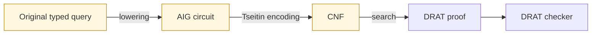

# Proofs, Certificates, and Trust

A solver answer is a claim. A **certificate** is data that lets a separate,
usually smaller program check that claim without repeating the original search.

This distinction matters because search engines are large and optimized. They
use heuristics, caches, incremental state, and complicated theory procedures.
The checker can be much simpler: it only needs to validate a proposed witness or
proof step by step.

> **Axeyum's central rule:** untrusted fast search, trusted small checking.

“Untrusted” does not mean the search code is careless. It means a supported
definitive answer should remain valid even if a bug exists in the code that
found it, because an independent boundary rejects bad evidence.

## SAT and UNSAT need different evidence

For `sat`, the certificate is usually a **model**: concrete values for symbols
and finite interpretations for functions or arrays. Checking is direct—evaluate
the original assertions under that interpretation and require `true`.

For `unsat`, no single assignment can be the witness; the claim is that every
assignment fails. A refutation records enough reasoning for a checker to derive
a contradiction from the constraints.

| Result | Typical evidence | Checker question |
|---|---|---|
| `sat` | model or counterexample | do the original assertions evaluate to true? |
| `unsat` | proof/refutation certificate | does every proof step follow, ending in contradiction? |
| `unknown` | classified reason and route data | was no definitive claim made? |

`unknown` needs no truth certificate because it makes no claim about whether a
model exists. It still benefits from structured diagnostics so users can tell a
timeout from a deterministic size limit or an incomplete procedure.

## A tiny refutation

Suppose a Boolean formula contains these clauses:

```text
(p)
(not p or q)
(not q)
```

The first clause forces `p`. With `p`, the second forces `q`. The third forces
`not q`, a contradiction. A clausal proof checker validates transformations of
this kind until the empty clause is derived.

For large formulas the trace may contain thousands or millions of steps, but
each local check remains simple.

## Certificate formats follow the theory

There is no single best proof format for every fragment:

- **DRAT** records clause additions and deletions for SAT refutations; an
  independent checker validates redundancy and the final contradiction.
- **LRAT** makes clause dependencies explicit, enabling a more direct checking
  route when a DRAT trace can be elaborated into it.
- **Farkas certificates** combine linear inequalities with exact rational
  coefficients to derive an impossible inequality.
- **Alethe-style proofs** record theory-aware equalities, congruence, and other
  SMT reasoning.
- **kernel terms** express a theorem in a small dependent type theory; a kernel
  type-checks the term.

Axeyum supports several of these routes, but coverage differs by logic and
solver path. A correct verdict, an exported clausal proof, an end-to-end checked
reduction, and a Lean-reconstructed theorem are distinct assurance levels. The
[capability matrix](../research/08-planning/capability-matrix.md) and
[trust ledger](../research/08-planning/trust-ledger.md) record the current
boundaries.

## The reduction gap

Assume an SMT bit-vector query is lowered to a circuit, then CNF, then refuted by
DRAT. Checking the DRAT proves that **the CNF** is unsatisfiable. It does not, by
itself, prove that the original bit-vector term was translated correctly.



An end-to-end claim must address each arrow. Axeyum does this incrementally with
typed semantics, retained lowering maps, independent reference lowering or
faithfulness checks on supported routes, original-model replay, and small proof
checkers. If a route covers only the CNF boundary, documentation must say so.

## Trusted computing base

The **trusted computing base** (TCB) is the code and assumptions that must be
correct for an assurance claim to hold. Smaller is easier to audit, but “small”
is meaningful only when the boundary is named.

For model replay, the TCB includes the parser/typed IR semantics and evaluator.
For a text-only CNF proof, it includes the proof checker and the interpretation
of DIMACS/DRAT, while the source-to-CNF translation remains outside that exact
claim. For a kernel-checked term, the kernel and the mapping of source concepts
into its prelude remain trusted.

External checking improves independence when it uses a separately implemented
checker, but it does not erase specification or encoding assumptions.

## Proof production and proof checking are separate outcomes

Keep these states distinct:

1. the solver returned a verdict;
2. a certificate was produced;
3. the in-tree checker accepted it;
4. a text export was parsed and checked from scratch;
5. an external checker accepted it;
6. a theorem was reconstructed and accepted by a proof kernel.

A failure at a stronger layer does not automatically reverse the underlying
logical result, but it does prevent claiming that stronger assurance. Axeyum's
public evidence APIs use explicit outcomes such as proved, not certified, or
inconclusive rather than fabricating a proof.

## Evidence does not validate the informal requirement

Even a perfect certificate proves the encoded formula, not the sentence in a
ticket, policy, protocol, or mathematical textbook. Users remain responsible
for the specification-to-formula step, scope assumptions, bounds, and the
meaning of external data.

This is why good examples state both:

- the formal claim that the checker establishes;
- the modeling boundary that remains outside that claim.

## Tamper tests are part of the design

A checker should reject corrupted evidence. Useful regression tests alter a
model value, proof clause, coefficient, hash, or dependency and require the
checker to fail closed. Acceptance tests show a successful path; tamper tests
show that the gate is actually armed.

## Next

See [How Axeyum solves a query](07-how-axeyum-solves-a-query.md) for the complete
pipeline. To export and independently recheck a concrete QF_BV refutation, use
the [UNSAT evidence guide](../user-guide/unsat-evidence.md). Current limitations
and per-route assurance are in the [user guide](../user-guide/limitations.md).
