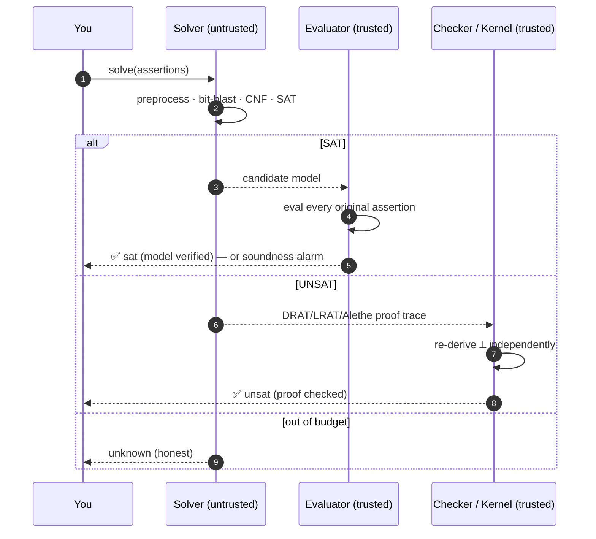

# How Axeyum Solves a Query

This page traces one query from text to answer, and shows the single most
important idea in the system: the **trust boundary** between *fast search* (which
may be buggy) and *small checking* (which guards correctness).

> Prerequisite vocabulary: [`sat` / `unsat` / `unknown`](05-models-unsat-and-unknown.md)
> and [bit-vectors & bit-blasting](04-bit-vectors-and-bit-blasting.md). New to
> all this? Start at [What is automated reasoning?](01-what-is-automated-reasoning.md)

## The pipeline

A quantifier-free bit-vector (`QF_BV`) query flows left to right. Everything in
the **blue** band is *untrusted* (optimized for speed); everything in the
**green** band is *trusted* (small, independent, the thing that must be right).

```mermaid
flowchart LR
    subgraph parse[" "]
        direction TB
        smt["SMT-LIB text<br/>or Rust IR builder"] --> ir["Typed term IR<br/>(arena, hash-consed DAG)"]
    end

    subgraph search["UNTRUSTED — fast search (may be buggy)"]
        direction TB
        ir --> pre["Word-level preprocess<br/>canonicalize · solve_eqs ·<br/>propagate · elim_unconstrained"]
        pre --> blast["Bit-blast → AIG circuit"]
        blast --> cnf["Tseitin → CNF"]
        cnf --> sat["SAT core<br/>batsat / native CDCL"]
    end

    subgraph check["TRUSTED — small independent checking"]
        direction TB
        model["Lift model to IR values"] --> replay["Replay vs ORIGINAL query<br/>(ground evaluator)"]
        drat["DRAT proof"] --> lrat["LRAT (hinted)"]
        lrat --> alethe["Alethe proof"]
        alethe --> lean["Rust Lean-grade kernel<br/>→ checked False"]
    end

    sat -->|"SAT: assignment"| model
    sat -->|"UNSAT: proof trace"| drat
    sat -->|"budget / too big"| unknown["unknown<br/>(first-class, never a crash)"]

    replay -->|"every assertion true"| satOut(["✅ sat + verified model"])
    replay -->|"mismatch"| alarm(["soundness alarm → error"])
    lean --> unsatOut(["✅ unsat + checkable proof"])

    classDef u fill:#e8eeff,stroke:#3355aa;
    classDef t fill:#e7f6e7,stroke:#2e7d32;
    classDef out fill:#fff7e0,stroke:#b8860b;
    class pre,blast,cnf,sat u;
    class model,replay,drat,lrat,alethe,lean t;
    class satOut,unsatOut,unknown,alarm out;
```



**Why the boundary matters.** The SAT core, the bit-blaster, and the
preprocessor are large and fast — and *allowed to be wrong*. They never get the
last word:

- A claimed **`sat`** is only returned after its model is lifted to IR values
  and **evaluated against the original assertions**. A bad model fails the replay
  and becomes a soundness alarm, never a wrong `sat`.
- A claimed **`unsat`** is only as trusted as the evidence behind it. The proof
  trace is re-checked by an independent `check_drat`/`check_lrat`, and (for the
  covered fragments) reconstructed to a `False` accepted by a from-scratch Rust
  **Lean-grade kernel**.
- When search runs out of budget or the encoding is too large, the answer is
  **`unknown`** — a valid, deliberate outcome, not a failure.

## The same idea, as a sequence



## Worked example

```smt2
(set-logic QF_BV)
(declare-const x (_ BitVec 8))
(assert (= (bvadd x #x01) #x00))
(check-sat)
(get-model)
```

1. **Parse → IR.** `x` becomes an 8-bit symbol; `bvadd`, the constant `#x01`,
   and the equality become nodes in a shared DAG.
2. **Preprocess.** Nothing to simplify here (a real query often shrinks a lot).
3. **Bit-blast.** Each 8-bit value becomes 8 Boolean wires; `bvadd` becomes a
   ripple-carry adder circuit (see [bit-blasting](04-bit-vectors-and-bit-blasting.md)):

   
4. **CNF → SAT.** The circuit + the constraint `x + 1 = 0` is handed to the SAT
   core, which finds an assignment.
5. **Lift + replay.** The bits decode to `x = #xff` (255). Axeyum evaluates
   `bvadd(#xff, #x01) == #x00` in the **trusted** ground evaluator: `255 + 1`
   wraps to `0` in 8 bits ✅. The model is returned only because it replayed.

The contradictory version returns `unsat`, and (with the proof-producing core)
emits a DRAT proof that `check_drat` re-validates:

```smt2
(set-logic QF_BV)
(declare-const x (_ BitVec 8))
(assert (= x #x00))
(assert (= x #x01))
(check-sat)
```

`x` cannot be both `0` and `1`, so no model exists — `unsat`, with a small
checkable certificate rather than "trust me."

## Where to go next

- The pieces of the untrusted band: [bit-blasting](04-bit-vectors-and-bit-blasting.md),
  and the internals [CNF & SAT](../internals/cnf-and-sat.md).
- The pieces of the trusted band: [proofs, certificates & trust](06-proofs-certificates-and-trust.md),
  and the internals [proof stack](../internals/proof-stack.md) and
  [Lean kernel](../internals/lean-kernel.md).
- Run it yourself: [first SMT-LIB query](../user-guide/first-smtlib-query.md), or
  the in-browser [playground](../playground/README.md).
