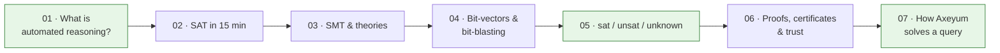

# Learn: Automated Reasoning from Scratch

These pages assume you're a capable technical reader but **new** to SAT, SMT,
and proof-producing solvers. They teach concepts through tiny examples and
diagrams — no Axeyum internals until the last page.

## Suggested order

| # | Page | You'll understand |
|---|---|---|
| 01 | [What is automated reasoning?](01-what-is-automated-reasoning.md) | the basic question a solver answers |
| 02 | 02-sat-in-15-minutes.md *(planned)* | Boolean satisfiability, the core engine |
| 03 | 03-smt-and-theories.md *(planned)* | adding theories: bit-vectors, ints, arrays, … |
| 04 | 04-bit-vectors-and-bit-blasting.md *(planned)* | turning words into Boolean circuits |
| 05 | [sat / unsat / unknown](05-models-unsat-and-unknown.md) | the three kinds of answers |
| 06 | 06-proofs-certificates-and-trust.md *(planned)* | why an answer can be *checked* |
| 07 | [How Axeyum solves a query](07-how-axeyum-solves-a-query.md) | the full pipeline + trust boundary |

> Pages marked *(planned)* are stubs in the [documentation plan](../documentation-plan.md);
> the linked ones are written. See the [glossary](glossary.md) for terms like
> QF_BV, CNF, DRAT, and Alethe before they're defined inline.

**Goal:** finish able to read the [README](../../README.md), run a query from the
[user guide](../user-guide/README.md), and know why `sat`, `unsat`, and
`unknown` are three genuinely different results.
