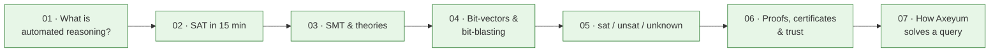

# Learn: Automated Reasoning from Scratch

These pages assume you're a capable technical reader but **new** to SAT, SMT,
and proof-producing solvers. They teach concepts through tiny examples and
diagrams — no Axeyum internals until the last page.

## Suggested order

```mermaid
flowchart LR
    A["01 · What is<br/>automated reasoning?"] --> B["02 · SAT in 15 min"]
    B --> C["03 · SMT &amp; theories"]
    C --> D["04 · Bit-vectors &amp;<br/>bit-blasting"]
    D --> E["05 · sat / unsat / unknown"]
    E --> F["06 · Proofs, certificates<br/>&amp; trust"]
    F --> G["07 · How Axeyum<br/>solves a query"]
    classDef done fill:#e7f6e7,stroke:#2e7d32;
    class A,B,C,D,E,F,G done;
```

| # | Page | You'll understand |
|---|---|---|
| 01 | [What is automated reasoning?](01-what-is-automated-reasoning.md) | the basic question a solver answers |
| 02 | [SAT in 15 minutes](02-sat-in-15-minutes.md) | Boolean satisfiability, clauses, CNF, and checked results |
| 03 | [SMT and theories](03-smt-and-theories.md) | typed terms, theory combination, logic names, and outcomes |
| 04 | [Bit-vectors and bit-blasting](04-bit-vectors-and-bit-blasting.md) | turning words into Boolean circuits |
| 05 | [sat / unsat / unknown](05-models-unsat-and-unknown.md) | the three kinds of answers |
| 06 | [Proofs, certificates, and trust](06-proofs-certificates-and-trust.md) | why an answer can be *checked* |
| 07 | [How Axeyum solves a query](07-how-axeyum-solves-a-query.md) | the full pipeline + trust boundary |

## Math Resource Path

The [math learner path](math/README.md) connects the curriculum and foundational
example packs. It is organized by concept cluster and keeps a hard boundary
between finite checkable slices and Lean or numerical horizons.

## Rules/Law Resource Path

[Rules/Law Trust Boundary](rules-law-trust-boundary.md) shows how the same
resource pattern applies to human-authored eligibility, authorization,
tax/benefit, and procurement rule packs: replay concrete witnesses, check small
obligations, and keep legal interpretation outside the solver claim.

The seven-part introductory sequence is complete. See the
[documentation plan](../documentation-plan.md) for the broader guide roadmap and
the [glossary](glossary.md) for terms like QF_BV, CNF, DRAT, and Alethe.

**Goal:** finish able to read the [README](../../README.md), run a query from the
[user guide](../user-guide/README.md), and know why `sat`, `unsat`, and
`unknown` are three genuinely different results.
