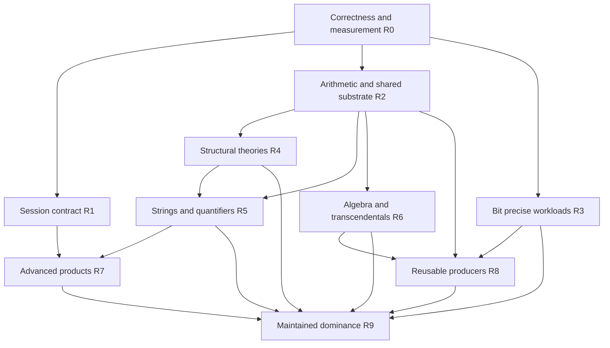

# Axeyum capability and Pareto-dominance roadmap

Date: 2026-09-05
Status: researched proposal; no dominance result or implementation completion claimed
Baseline: Axeyum `cc8cb0861002c12394857548143d1e76227d4c33` (published main)

## Objective and scope

Make Axeyum at least as capable as each reference solver on explicitly registered
workloads, without sacrificing correctness, resource behavior, or usability, and
strictly improve at least one measured axis. Extend that position through the
solver → certificate → kernel → reusable fact → solver cycle. Broad support is a
necessary part of this objective; adding theory names to a table is insufficient.

This is the capability programme requested after the comparison-table audit. It
covers Z3, cvc5, and Bitwuzla as SMT products, plus Axeyum's integration with its
CAS, kernel, and autonomous library construction. It does not silently redefine
this request as full Lean source, Mathlib coverage, or Mathematica compatibility.
Those comparisons need their own statement/operation populations.

This document proposes dependencies and gates, not a replacement execution queue.
[PLAN.md](../../../PLAN.md) remains operational authority. Foundation phases 0–7
are already built; this programme closes their breadth, composition, evidence,
and product gaps. Respect [ADR-0717](../../research/09-decisions/adr-0717-library-construction-is-graph-directed-through-an-artifact-compatible-trust-anchor.md):
artifact compatibility and reusable discovery precede general Lean source emulation.
CAS work below is planned, not a resumption of the separately paused CAS campaign.

The baseline was fetched into an isolated worktree; the user's working branch was
older. Source inspection, retained measurements, and proposed experiments are
explicitly separated. No solver benchmark or new soundness experiment ran for this
roadmap. [sources.json](sources.json) pins inspected source files and upstream
commits. Historical numbers below were independently recomputed from the ledger.

## 1. The dominance contract

### 1.1 Three distinct claims

1. **Capability inclusion:** for a declared syntax/theory/API population, every
   reference-supported case has equivalent semantics through Axeyum's advertised
   front door. An internal helper or parser acceptance alone earns no credit.
2. **Workload Pareto dominance:** on a frozen population and configuration,
   Axeyum is no worse on every declared metric and strictly better on at least
   one. Claim this separately against each reference, each operating mode, and
   each hardware/deployment profile.
3. **Maintained dominance:** repeat the same claim against newly released pinned
   versions and fresh held-out populations. A historical win does not establish it.

Universal superiority on all formulas, all machines, and all future versions is
not a credible finite experiment or delivery promise. General quantifiers and
nonlinear integer arithmetic also cannot acquire complete decision procedures
merely by allocating more engineering effort. The terminal engineering objective
is maintained, broad, explicitly scoped dominance; any exclusions stay visible.

Let `D_R(W)` be reference R's correctly decided cases within budget on workload W.
Coverage dominance requires `D_R(W) ⊆ D_A(W)`, not merely `|D_A| ≥ |D_R|`.
Against all three references, test inclusion of their **union**. This union is a
coverage target, not a realizable zero-cost oracle portfolio or timing baseline.
A real reference portfolio must be charged for its full CPU, memory, and routing.

### 1.2 Metrics, with no compensating weighted average

| Axis | Measurement and proposed promotion rule |
|---|---|
| Correctness | Zero observed wrong verdicts, invalid models, invalid optimality claims, and accepted forged certificates in the registered evaluation. Any such failure voids the affected claim; zero observed failures is not a universal soundness proof. |
| Coverage | Reference-only correctly solved set empty, separately for SAT/UNSAT, theory, family, command mode, and declared composition tier. Unsupported and unknown remain separate. |
| Latency | Cold process, warm API, and incremental stream measured separately; total p50/p95/p99, PAR-2, and paired per-case losses reported. Parsing, replay, and mandatory checking count. |
| Memory | Peak RSS, allocation growth, proof peak memory, and retained-state growth; no claiming dominance by trading an unreported memory regression for time. |
| Evidence | Original-input binding, proof production, fresh-process independent checking, kernel reconstruction, reached assumptions, artifact size and check time measured separately. |
| Product semantics | Ordered commands, scoped declarations, resets, errors, models, assumptions, options and cancellation pass equivalent observable contracts. |
| Deployment | Reproducible native/WASM builds, dependencies, artifact size and installation/startup costs on named targets. Rust implementation is a categorical constraint for some consumers, not a universal quality score. |
| Autonomous reuse | Held-out goals admitted without authored proof, per-family yield, total search/check cost, dependency footprint, and repeatable replay; imports and bespoke human/agent proofs counted separately. |

For strict measured dominance, all metric estimates must be no worse. For noisy
latencies use preregistered paired repetitions and one-sided confidence bounds;
require the upper slowdown bound ≤1 for a strict statistical claim. A practical
engineering gate may use an explicit tolerance (proposal: 5% on latency/RSS), but
must label the result **non-inferiority within tolerance**, never exact dominance.
Publish the tolerance, uncertainty, and every violated cell; a nonsignificant
regression is not proof of equality. Per-case timing dominance is a stronger,
separate claim than dominance of aggregate metrics.

A feature advantage is Pareto-relevant only where the product contract values it.
Do not infer unique WASM availability from C++ dependencies: Z3 has JavaScript/WASM
builds. Do not infer uniquely independent checking from Rust: cvc5 supplies CPC,
Alethe and LFSC routes. Do not infer semantic superiority from fewer axioms when
the propositions or carriers differ.

## 2. Reference baseline and source-derived gaps

### 2.1 Versions

GitHub release APIs checked on 2026-09-05 identify Z3 **5.1.0**, cvc5 **1.3.4**,
and Bitwuzla **0.9.1** as their latest releases. Retain Z3 4.13.3 only as a
historical regression control. Pin release archive, commit, build options,
compiler, linked SAT/numeric libraries, executable hash, and checker versions.
Use both ordinary shipped defaults and separately named recommended/competition
configurations; neither should impersonate the other.

| Reference | Source commit | Consequence |
|---|---|---|
| Z3 5.1.0 | `0b6cdcdbc65da25ef0f73ac9da210574d0f66cf8` | Current target: monadic regex, nonlinear arithmetic refinements, finite sets, and contemporary fixes; old Z3 comparisons do not measure this target. |
| Z3 4.13.3 | `54d30f26f72ce62f5dcb5a5258f632f84858714f` | Historical table/control only. Its FP converter explicitly rejects add/sub and division when exponent width exceeds significand width; this is not an all-operator format rejection. |
| cvc5 1.3.4 | `f3b21c4483d3b88dc63cb7cd3e5eb092eee5e341` | Breadth, strings, synthesis, and proof-production reference; preserve expert-option distinctions. |
| Bitwuzla 0.9.1 | `8d1eb01093ae54d9b4586456b69c3bf31000a4c2` | Bit-precise reference, including FP, arrays/UF, abstraction and interpolation. |

[Z3 release source](https://github.com/Z3Prover/z3/blob/z3-5.1.0/RELEASE_NOTES.md),
[cvc5 release](https://github.com/cvc5/cvc5/releases/tag/cvc5-1.3.4), and
[Bitwuzla release](https://github.com/bitwuzla/bitwuzla/releases/tag/0.9.1).
The manifests record source identity; latest-release status must be refreshed at
promotion, not assumed from this document's date.

### 2.2 Corrected capability boundary

Paths below are baseline source evidence, not performance measurements.

| Area | Axeyum baseline and source | Required advance |
|---|---|---|
| Core/BV | Broad operators, `MAX_BV_WIDTH=65536`; `sbv_to_int` absent from parser dispatch. [sort.rs](../../../crates/axeyum-ir/src/sort.rs), [parse.rs](../../../crates/axeyum-smtlib/src/parse.rs). | Versioned SMT-LIB operator contract including conversions, composed widths, wide models, and proof-preserving rewrites. Width acceptance does not promise tractable solving. |
| Arithmetic | Multiple LIA/LRA/DL/NIA/NRA routes; simplex uses bounded `i128` rationals and explicit overflow decline. [simplex.rs](../../../crates/axeyum-solver/src/simplex.rs), [nia_linearize.rs](../../../crates/axeyum-solver/src/nia_linearize.rs). | Shared exact-number substrate with audited promotion/fallback, better retained theory search, and proof-producing combination; no complete-NIA claim. |
| Arrays/UF | Scalar-keyed array sorts structurally exclude nested arrays. Existing warm EUF/array machinery should be extended, not replaced wholesale. [sort.rs](../../../crates/axeyum-ir/src/sort.rs). | Recursive sort/model representation; nested extensionality and array-valued interfaces; rollback and mixed-theory evidence. |
| FP | All named operators do not work at all formats. Builders cap total width at 128. Symbolic arithmetic has operator-specific allowlists; symbolic remainder only F16/F32/F64. [FP implementation](../../../crates/axeyum-fp/src/lib.rs). | Generate format × operator × rounding × ground/symbolic × evidence matrix; close individual holes with independent semantic evidence before widening gates. |
| Strings/regex | Bounded and exact unbounded subroutes coexist; comparable solve counts do not establish equal decided sets. [parse.rs](../../../crates/axeyum-smtlib/src/parse.rs), [regex membership](../../../crates/axeyum-smtlib/src/regex_membership.rs). | General word/length cooperation and certified UNSAT; benchmark current Z3 monadic regex and cvc5, not only historical SAT-heavy samples. |
| Sequences | Soft length cap 8, total packing cap 128; Int elements use 16 bits (at most 7 elements); BV8 and other element sorts declined; several operators declined. `seq_max_len_for`, `seq_elem_sort` in parser. | Typed sequences independent of string packing; symbolic lengths and supported element-theory cooperation; explicit bounded fast path remains optional. |
| Datatypes | Parametric arity >0 rejected in parser; existing nonparametric datatype support remains. | Parameter instantiation, recursive/mutual declarations, selectors/testers and constructor models; codatatypes a separately specified later extension. |
| Sets | At most 128 modeled slots, restricted literal elements/cardinality; complement/universe/insert and other operators explicitly rejected. `UNSUPPORTED_SET_OPS`, `MAX_SET_WIDTH`. | Element equality + membership + cardinality theory with finite-model witnesses; complement/universe require explicit finite/infinite-carrier semantics. |
| Finite fields | SMT cap 16 prime bits, `ff.add/neg/mul/bitsum`; no `ff.div`. CAS `gfp.rs` is broader and has separate bounds; rational cofactor certificates already exist. | Reuse CAS only through a typed modular producer/checker contract; scalable prime fields and model/refutation lifting. `ff.div` is not a required primitive in cvc5's published FF signature, so its absence alone is not a parity blocker. |
| Bags/relations/separation | No comparable general SMT surface identified in audited parser. | Dedicated semantics, decision fragments and evidence; not aliases advertised as full theories. |
| Transcendentals | No general SMT sin/exp theory; CAS/kernel constructions are not its substitute. | Sound interval/Taylor lemmas with checked remainder bounds; explicit unknown for unresolved equalities and boundary cases. |
| Quantifiers | E-matching, MBQI, finite models, QE and recognizers exist. User patterns collect supported UF-application shapes. [qinst_egraph.rs](../../../crates/axeyum-solver/src/qinst_egraph.rs). | Better general-loop reach, supported trigger vocabulary, alternation and theory cooperation; count loop decisions separately from finite expansion/recognizers. |
| Optimization | LIA/BV optimization exists; `maximize_lia_with_config` returns Unbounded on doubling/overflow limits. [optimize.rs](../../../crates/axeyum-solver/src/optimize.rs). | Urgent correctness audit: resource exhaustion is not an unboundedness certificate. Then real strict suprema, incremental objectives, MaxSAT evidence. |
| Interpolation/CHC/QE | Theory-specific modules and Horn implementation exist. | Public ordered APIs; vocabulary checks, independently checked interpolants/invariants, quantified-equivalence validation for QE. |
| Abduction/SyGuS | Abduction enumerates up to 4096 candidates and conjunctions of at most two atoms; no general SyGuS engine. [abduct.rs](../../../crates/axeyum-solver/src/abduct.rs). | Grammar representation + CEGIS + counterexample reuse, with consistency and sufficiency proofs; expose synthesis without confusing bounded abduction with SyGuS. |
| Protocol | Generated matrix reports zero complete interactive textual sessions. | Ordered transactional session state first, rendering second; helper APIs do not satisfy command compatibility. |

Upstream qualifications matter. cvc5's basic sets are not uniformly experimental:
[sets options](https://github.com/cvc5/cvc5/blob/cvc5-1.3.4/src/options/sets_options.toml)
distinguish complement/universe, cardinality and relations. Its default FP terms
are F32/F64 unless `--fp-exp`; Bitwuzla allows F16/F32/F64/F128 without its `--fpexp`
build option. Bitwuzla's API rejects quantified function-sort variables, not all
non-BV binders; admission and deciding quantified combinations need separate probes.
Z3 4.13.3 retains a model-based interpolation command despite removal of its older
interpolation API. These details preclude the original table's blanket labels.

### 2.3 Retained performance evidence, not current-main measurements

Latest relevant ledger entries: every row uses its own pinned 200-file population;
8 GiB/24 s protocol as recorded. Ratios below are solved-count ratios, **not**
coverage inclusion or speed. BV's evidence-labelled entry retains default-route
solve counts; its separate proof pass must not be mixed into decision latency.
All rows record zero disagreements; no claim of universal correctness follows.

| Logic | Date | Solver revision | Axeyum / 200 | Reference / 200 | Count ratio | Both / A-only / R-only | Reference |
|---|---|---|---:|---:|---:|---|---|
| QF_BV | Aug 17 | `c799be2f7` | 187 | 194 | 96.4% | 187 / 0 / 7 | Bitwuzla 0.9.1 |
| QF_SLIA | Aug 21 | `cb4a391c9` | 193 | 193 | 100.0% | 186 / 7 / 7 | cvc5 1.3.4 |
| UF | Aug 21 | `9333f779d` | 83 | 93 | 89.2% | 60 / 23 / 33 | cvc5 1.3.4 |
| QF_LIA | Aug 21 | `cb4a391c9` | 113 | 139 | 81.3% | 111 / 2 / 28 | cvc5 1.3.4 |
| QF_IDL | Aug 21 | `cb4a391c9` | 66 | 118 | 55.9% | 66 / 0 / 52 | cvc5 1.3.4 |
| QF_UFLIA | Aug 21 | `cb4a391c9` | 113 | 180 | 62.8% | 113 / 0 / 67 | cvc5 1.3.4 |
| QF_RDL | Aug 21 | `cb4a391c9` | 102 | 148 | 68.9% | 101 / 1 / 47 | cvc5 1.3.4 |
| QF_LRA | Aug 21 | `cb4a391c9` | 88 | 134 | 65.7% | 88 / 0 / 46 | cvc5 1.3.4 |
| QF_NIA | Aug 21 | `cb4a391c9` | 39 | 83 | 47.0% | 27 / 12 / 56 | cvc5 1.3.4 |

Source: [PARITY.md](../../../bench-results/PARITY.md). This is nine retained
comparisons, not an exhaustive current logic census. The QF_SLIA row is an exact
counterexample to “100% count ratio implies dominance.” Reusing today's revision
beside these historical numbers would be false freshness.

The [NIA diagnosis](../../research/05-algorithms/nia-deficit-diagnosis-2026-08-21.md)
found Z3 4.13.3 substantially stronger than cvc5 on its diagnostic run and exposed
heavy VeryMax-family concentration. That separate run had different resource
conditions; do not splice its counts into this table. It establishes the need
for multiple references and family-held-out evaluation, not a current ranking.

## 3. Architecture that can reach the target

Follow the [foundational DAG](../../research/08-planning/foundational-dag.md):
semantics → typed representation → independent evaluation → front door → search →
model/proof lifting → checking. Extend existing boundaries before adding crates.

The highest reuse comes from five shared improvements:

1. **Recursive sorts and full values.** Arrays, parametric datatypes, sequences,
   finite sets and field values need canonical sort identities and model values
   that do not rely on accidental packed-BV width identity. Preserve Copy term
   handles; do not introduce backend-owned types into the public API.
2. **Exact arithmetic with a fast small representation.** Prototype checked
   small-number promotion to existing Rust big-number substrate. Preserve fast
   common cases, explicit resource limits, canonical serialization, and replay.
   Do not merely widen a constant and multiply the SAT search space.
3. **One incremental theory interface.** Reuse the CDCL(T)/EUF substrate for
   scoped propagation, explanations, combination, and model reconciliation.
   Numeric disequalities, array extensionality and quantifier lemmas must all
   carry enough provenance to reconstruct their contribution to the refutation.
4. **One evidence envelope.** Bind original source/query identity, parser and
   semantic version, reductions, witnesses, proof format, checker result and
   actual reached assumptions. A replayed final CNF proof does not certify an
   unproved FP-to-BV or theory reduction. Preserve a fast decision mode and a
   separately measured certified mode, both accurately labeled.
5. **Measured deterministic routing.** Existing routes compete under a shared
   budget with explicit reservations. Preregister dispatch features and freeze
   them before held-out tests. Charge probing overhead and preserve a known-good
   fallback budget. No external-solver portfolio may be advertised as the native
   Rust implementation, and no per-case oracle chooses the winning route for free.

The reusable-proof loop is the differentiator to invest in: source-bound solver
certificates reconstruct to kernel terms; producer contracts dispatch future
related goals; checked facts feed retrieval. It is not defensible to call this
unique without surveying peer workflows, or to count imports as autonomous yield.

## 4. Dependency-ordered delivery programme

Effort bands describe scope, not promised dates: **S** one bounded contract or
fixture family; **M** several coordinated increments within an existing theory;
**L** a new representation/decision/checking boundary; **XL** sustained research
with an unresolved completeness/performance frontier. Do not convert these into
calendar estimates until an executable pilot has measured throughput.

### R0 — Establish a falsifiable baseline and triage wrong claims (S–M)

Deliver a machine-readable capability population derived from the existing
capability, conformance and proof-gap authorities. Each cell binds theory/operator,
format/domain, ground/symbolic status, quantification, combinations, front door,
route, limits, model handling, proof/check/reconstruction and test evidence.
Generate the comparison table from this population. Missing tests count as
unmeasured, not supported. Registry coverage itself must be checked against parser
operators, public constructors and registered routes.

Before measuring optimization superiority, reproduce the cap/overflow Unbounded
paths in `optimize.rs` with a finite but large optimum. Require either a valid
unbounded ray/argument or Unknown. This is a source-confirmed risky result path,
not yet a retained executed counterexample. A confirmed wrong result preempts
breadth work. Also add FP format/operator refusal probes and sequence/set boundaries.

**Exit:** registry positive and negative fixtures; mutations that remove a row,
change its expected outcome, substitute another input, insert a trust step, or
skip a checker all fail. Every reference build and protocol has a content identity.
Run a small fresh four-solver pilot before any expensive corpus refresh.
**Stop:** no headline dominance while correctness or instrument coverage is unresolved.

### R1 — Complete the product front door (M)

Implement the existing ordered session contract, preserving command-local options,
scoped signatures, query snapshots, reset epochs, atomic errors and termination.
Then canonical responses for models, values, assumptions, cores, proofs and
objectives; expose existing advanced APIs only through that contract. Exercise
streaming input, cancellation, adversarial nesting, repeated push/pop, and recovery.

**Exit:** all applicable rows in the [conformance matrix](../generated/smtlib-api-conformance.md)
execute ordered transcripts; paired reference fixtures agree on observable semantics
without requiring identical model choices or proof text. No silent no-op claims.
**Stop:** adding another helper cannot close interactive compatibility.

### R2 — Close common-core deficits and arithmetic representation ceilings (M–L)

Re-measure P/S/I/T classes (parse rejection, admission, incompleteness, timeout)
on latest references, then extend only the mechanism explaining held-out losses.
Start with linear arithmetic and UFLIA because they also support strings, NIA,
optimization, quantifiers and interpolation. Prototype exact-number promotion and
retained sparse theory state; measure allocation/pivot and explanation costs.

**Exit:** reference-only cases decline to zero on the registered linear tier;
all prior Axeyum-only solves retained; independent arithmetic certificates on its
certified subset; no resource-abort regression; cold and warm costs reported.
**Stop:** do not repeat failed NIA admission-limit experiments without a changed
mechanism. The prior diagnostics document their negative yield.

### R3 — Earn bit-precise workload dominance (M–L)

Close BV conversions and wide-value replay. Profile rewriting, bit lowering, CNF,
SAT, model lifting and proof checking separately. Evaluate word-level interval and
polynomial lemmas, abstraction/refinement, and circuit reductions before assuming
SAT search is dominant. Extend existing custom CDCL only when profiles justify it.
Use [PolySAT](https://arxiv.org/abs/2406.04696) as an algorithmic reference for
word-level nonlinear BV reasoning, and Bitwuzla's abstraction module for candidate
lemmas; independently prove/check every adopted lemma.

For FP, first cover F16/F32/F64/F128 × the actual operator set × five rounding
modes × symbolic operands. Fix symbolic F128 remainder and other demonstrated
holes separately. Then validated nonstandard formats. Compare SMT IEEE formats
with the same semantics; OCP non-IEEE formats need their own contracts. Use exact
rational/big-integer or APFloat-based independent oracles and tiny exhaustive
cases. Same-circuit model replay is not an independent FP semantics check.

**Exit:** BV and FP reference-solved inclusion on pinned public and independent
consumer streams; certified mode measures the entire reduction chain. No inference
from “all operators named” to “all operator/format combinations supported.”
**Stop:** new exotic formats cannot displace standard-format correctness gaps.

### R4 — Remove structural theory ceilings (L)

Order: recursive sorts/full values → nested arrays and parametric datatypes →
typed sequences → finite sets/cardinality → bags/relations. Preserve old packed
fast paths where semantic admission is proved; do not make their finite bounds
implicit semantics of the general theory. Separation logic gets an independent
heap model, disjointness semantics, model replay and decidable-fragment contract.
Codatatypes require bisimulation/productivity reasoning, not ordinary acyclicity.

**Exit:** positive/negative mixed-theory fixtures (including nested arrays of
datatypes, UF-returned arrays, sequence elements, and cardinality/equality),
round-trip model checks, rollback stress, and source-bound UNSAT evidence for each
advertised certified fragment. Wider bounds alone do not satisfy this milestone.
**Stop:** any unsound finite approximation returns Unknown, not unrestricted UNSAT.

### R5 — Strengthen unbounded strings and quantified reasoning (L–XL)

Strings: prioritize unresolved word equations, length cooperation, replace/index
operations and regex complement/intersection over a larger packed bound. Inspect
Z3 5.1.0's monadic regex implementation and cvc5's word/length solver. Carry
regular-language emptiness and arithmetic explanations into the proof chain.

Quantifiers: measure which decisions actually come from general E-matching/MBQI;
complete supported trigger shapes and budgets, then model repair, finite model
finding and nested alternation by theory. Quantified SAT requires a validated
universal model or a justified complete finite-domain argument, not finitely many
successful samples. Quantified UNSAT must bind instantiated substitutions and
Skolem dependencies to the original binders.

**Exit:** held-out SAT and UNSAT populations separately meet inclusion gates;
recognizer-only gains stay separately reported; expensive instantiation cannot
starve other routes. No declaration of complete general quantifier solving.

### R6 — Scalable algebra and certified transcendental fragments (L–XL)

First inventory CAS producers and certificates actually reachable from SMT.
`gfp.rs` already provides modular univariate operations beyond the 16-bit SMT cap;
`groebner_cert.rs` already carries cofactor identities over its existing coefficient
domain. Neither alone is a scalable modular SMT theory. Build typed prime-field
values, scalable arithmetic and primality evidence, then modular polynomial search
with model witnesses and checked ideal-membership identities. Handle field
polynomials and disequality encodings explicitly. Target real 64/128/255/256-bit
prime workloads as separate tiers, measuring density and degree, not modulus alone.

cvc5's [finite-field architecture](https://github.com/cvc5/cvc5/blob/cvc5-1.3.4/src/theory/ff/Readme.md)
and [field-solving paper](https://eprint.iacr.org/2023/091.pdf) supply search/model
construction references. Reuse the cofactor-certificate pattern, but do not claim
that rational coefficients already prove modular identities. C/C++ algebra
libraries remain research oracles; the shipped default stays Rust-only.

For NIA/NRA use fresh counterexample classes to choose incremental linearization,
CAD/covering or algebraic certificates. For transcendental functions start with
sin/exp and rational interval/Taylor bounds with explicit remainders and range
reduction. Algebraic square roots are a separate, easier contract. Exact equality
and unresolved boundaries decline; approximate values cannot justify exact SAT.
The [2026 formalized calculus](https://hanielbarbosa.com/papers/2026cpp.pdf) is a
relevant proof-rule reference and evidence that foundational checking is already
being pursued upstream, not an uncontested Axeyum axis.

**Exit:** proof-producing named nonlinear/FF/transcendental fragments, independent
checking of arithmetic identities and bound side conditions, and original-term
model validation with certified algebraic/interval semantics.
**Stop:** no arbitrary-precision or universal-transcendental completeness claim
from a larger test modulus or a handful of numerical examples.

### R7 — Advanced reasoning as checked products (M–L after dependencies)

Optimization: correct bounded/unbounded/unknown first; certificates for feasible
optima plus exclusion of better solutions; recession witnesses for unboundedness;
strict-real supremum versus attained maximum; objective ordering and MaxSAT bounds.
Interpolation: verify A implies I, I and B inconsistent, and vocabulary restriction.
CHC: check inductive invariants against every clause; replay unsafe derivations.
QE: check equivalence under original quantifiers and absence of eliminated symbols.
Abduction: consistency plus sufficiency; shared grammar and CEGIS then supports
SyGuS rather than multiplying separate bounded enumerators. Synthesis outputs must
satisfy their universal specification, not only a growing sample set.

**Exit:** each facility has independent result validation, resource/status semantics,
ordered API fixtures, and a paired reference population. No combined “present” row.

### R8 — Convert solving gains into reusable autonomous proofs (M–XL)

Use the existing one-trust-anchor producer contracts, fact DAG, retrieval, kernel
admission and artifact importer. Bind each selected fact to an exact statement and
assumption footprint; add generic producers for recurring certified families.
Evaluate on held-out siblings whose proofs were not authored during training.
Measure ready → dispatched → decided → reconstructed → admitted transitions and
cost, including failed attempts, retrieval and checking. Imported scaffolding and
human/agent-authored terms remain separate. Recheck with an independent kernel
where the representation contract permits it.

**Exit:** a new reusable producer repeatedly admits a preregistered held-out family
without bespoke proof edits, with checked statement identity and no new hidden
assumptions; frozen replay survives a fresh environment. Pair statements with
semantic translations before comparing to Mathlib. Approximate existence does not
dominate a classical exact-attainment theorem merely through an empty footprint.

### R9 — Maintain broad dominance (continuous, after individual tier promotion)

Refresh versions and content-bound benchmark populations; retain old baselines.
Run native, Python and WASM consumer contracts where promised. Build cold, warm,
incremental, certified and deployment profiles separately. Publish failed and
unmeasured cells, reference-only witnesses, throughput and memory uncertainties.
Only promote the union of individually established tiers; an unimplemented cvc5
feature remains an explicit obstruction to broad capability inclusion.

## 5. Execution order and first concrete backlog

R1, R2 and the existing-core portion of R3 can proceed independently once R0
binds the contracts; this dependency graph is not authorization to launch agents
or expensive benchmark campaigns. Certified evidence is a requirement within
every phase, not a final phase appended after capability work.

| Order | Reviewable increment | Acceptance and next decision |
|---|---|---|
| 1 | Reproduce optimizer resource-limit result; add source-bound boundary fixtures | Finite optimum must never be labeled Unbounded because of a counter/overflow. Fix separately if confirmed, before optimizer comparisons. |
| 2 | Capability manifest and generated operator/format/route table | Missing registry coverage and deliberately wrong expected outcomes fail; source inventory and test population counts nonzero. |
| 3 | Version-pinned four-solver pilot on a small stratified set | All output/status/model adapters validated; ambiguous disagreements quarantined and investigated. |
| 4 | Refresh linear, BV, strings and UF reference-only sets | Same machine/budget, disjoint family-held-out set; preserve SAT/UNSAT and overlap denominators. Remeasure all routes affected by shared changes. |
| 5 | One largest reusable linear deficit with a proof route | Causal ablation and no losses on frozen controls; decide promotion from retained results, not diagnostic counts. |
| 6 | FP symbolic-format contract and first missing standard-format operator | Independent semantics control plus downstream query proof; do not just remove an allowlist check. |
| 7 | Ordered SMT-LIB runner, then recursive-sort design ADR | Reuse existing session proposal; new sort ADR resolves recursive identity, serialization and model/evidence obligations before implementation. |
| 8 | First newly reachable solver result becomes a reusable producer | Held-out sibling admitted with no hand-written proof and measured checking cost. |

Rank subsequent work by reference-only cases explained, number of dependent theory
families/consumer goals unlocked, proof-route reuse and prototype cost. This ranks
experiments, not claims: a weighted prioritization heuristic cannot turn a Pareto
tradeoff into dominance. NIA, SyGuS and separation logic remain required for broader
scope even if they are not the next cheapest increment.

## 6. Experiment protocol and promotion evidence

Use existing `parity-run.sh`, capability-route checks, conformance generator,
proof-gap generator and immutable readiness contracts before adding another harness.
Source diagnosis must distinguish P/S/I/T and replay failure from proof failure.
Population design: public SMT-LIB families plus upstream regression suites and
independent consumer streams, with family-level train/validation/held-out split.
Include combinations, malformed commands, satisfiable and unsatisfiable cases,
small/wide domains, sparse/dense algebra and long incremental streams. Report
regression-suite bias; a library's complete test suite is not the world's workload.

For each run retain source and executable hashes, options, population IDs/hashes,
query order, machine/toolchain, CPU affinity, memory limit, timeout, all raw
stdout/stderr, exit/kill reason, result, model/proof artifacts and verification
results. Run paired solvers in randomized order with controlled contention and
repetitions; freeze seeds and routing before evaluation. Select model-equivalence
observables, not byte-identical model values. For timeouts use censored status and
predeclared penalty; never average only the easy solved intersection as a headline.

Proof tiers: original-input replay; emitted certificate; fresh-process independent
check with zero trust holes; kernel reconstruction; independent foundational replay.
Do not infer one tier from another. cvc5 CPC's checker distinguishes `correct` from
`incomplete` when trust steps occur, so exit success alone is insufficient
([CPC documentation](https://cvc5.github.io/docs/cvc5-1.3.4/proofs/output_cpc.html)).
Apply the same strictness to Axeyum artifacts and structural attestations.

Minimum negative controls: corrupt input binding, swap a variable/sort, alter a
cofactor, remove a reduction proof, insert an unsupported FP format, change a
quantifier substitution, forge an optimization bound, suppress a checker subject,
and mutate a proof step. Every checker must demonstrably reject its targeted
control without depending on an earlier unrelated failure.

Promotion record: exact scope; reference versions/configurations; row identities;
reference-only set; per-axis measurements and uncertainty; all correctness checks;
strict improvement witness; excluded/unmeasured cells. A real implementation pilot
must establish expected cost before scheduling full corpora. Existing campaign
resource and launch contracts remain in force; this research does not launch them.

## 7. Decisions to resolve and limits of this research

Before public-surface implementation, ADRs must resolve recursive sort identity,
number promotion and serialization, finite/infinite set universes, certificate
composition across theories, exact transcendental result semantics, and routing
budgets. Consult the existing [research question register](../../research/08-planning/research-questions.md)
and accepted decisions before assigning new ADR numbers. This proposal does not
silently accept those choices or reverse current strategic priorities.

The critical uncertainty is engineering return per mechanism, not the existence of
algorithms. Source access establishes a place to investigate; it does not establish
that porting an upstream technique will improve Axeyum. Retained comparisons are
historical and no fresh paired timings, proof population census or theorem
inventory were executed here. The optimizer finding is a code-path concern pending
an executed reproducer. No universal performance, soundness, novelty, or dominance
claim follows from this document.

Validation of this roadmap is documentation/provenance validation. Implementation,
full solver gates, fresh baseline runs, and every R0–R9 promotion remain future work.

### Documentation validation (2026-09-05)

Passed: all 25 source-file SHA-256 values (Axeyum bytes also matched the pinned Git
objects); all 19 relative links in this roadmap; all nine historical ledger rows,
count ratios and overlap identities; repository-wide `scripts/check-links.sh`;
`python3 scripts/gen-plan.py --check`; and `git diff --check`. No Rust source was
changed, and no solver build, full Rust gate, fresh benchmark, kernel inventory,
or optimizer reproducer was run. This validates the research artifact, not the
future capability or dominance claims.
