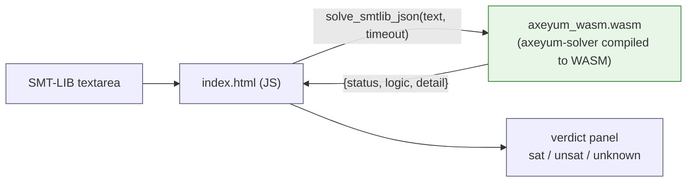

# WASM Solver Playground

Run Axeyum **in your browser** — paste an SMT-LIB query, press Solve, get a
verdict. The solver is compiled to WebAssembly and runs *client-side*: no server,
no install, nothing leaves the page.

This is our answer to "interactive, executable docs" (the Verso / Jupyter
inspiration). Instead of a notebook kernel, the reader runs the **actual solver**
— so a playground example can't silently drift from the code, because it *is* the
code. See the rationale in [internals/documentation.md](../internals/documentation.md).

## Two pages

- **[`index.html`](index.html)** — the free-form QF_BV solver: paste an SMT-LIB
  bit-vector query.
- **[`exercises.html`](exercises.html)** — the **self-checking exercise widget**
  for the [K-12 curriculum](../curriculum/k12/README.md): pose → student answers →
  the real solver grades by *replay* ("find x") or *assert-the-negation*
  ("is it always true?"), with proof/counterexample feedback. No answer key.

## Try it

Open [`index.html`](index.html) from a built docs site (or any static server).
A starter query is pre-loaded:

```smt2
(set-logic QF_BV)
(declare-const x (_ BitVec 8))
(assert (= (bvadd x #x01) #x00))
(check-sat)
```

Expected: **`sat`** (`x = #xff`). Toggle to the contradictory variant for
**`unsat`**, and try a wide multiply for an honest **`unknown`**.

## Status

The playground UI ([`index.html`](index.html)) is complete and ships with a
graceful fallback: until the WASM bundle is built, it explains how to enable
live solving and still lets you read/edit examples. The binding crate
([`crates/axeyum-wasm`](../../crates/axeyum-wasm)) is a workspace member. Host
tests exercise real SAT/UNSAT queries and CI compiles the minimal solver
profile for `wasm32-unknown-unknown`.

## Build the bundle (activation)

```sh
# one-time
rustup target add wasm32-unknown-unknown
cargo install wasm-pack

wasm-pack build crates/axeyum-wasm --target web --out-dir ../../docs/playground/pkg

# serve the docs (the page needs to be over http for ES-module imports)
python3 -m http.server -d docs/playground 8080   # → http://localhost:8080
```

`wasm-pack` emits `docs/playground/pkg/axeyum_wasm.js` + `.wasm`; the page
imports them automatically. (`pkg/` is generated — git-ignore it.)

## How it works



The binding parses SMT-LIB but deliberately admits only the scalar QF_BV
profile, then calls the same replay-checked `SatBvBackend` used by native
consumers. A `sat` is still verified against the original query before it is
shown. Broader logics fail closed instead of pulling the full solver surface
into the browser artifact.

## Why this is the right interactivity for Axeyum

- **WASM over Jupyter** — no kernel server; the solver is Rust, so WebAssembly is
  the native fit, and it runs entirely client-side (great for static docs / CI).
- **Real engine over canned output** — examples execute the committed solver, so
  they stay correct by construction (the Verso spirit, solver-flavored).
- **Pure Rust** — the default `qfbv` solver build is wasm-compatible (ADR-0017),
  so this adds no C/C++ dependency. The text parser retains its own pure-Rust
  FP/string parsing dependencies; bundle size and latency remain measured
  deployment questions rather than inferred claims.
