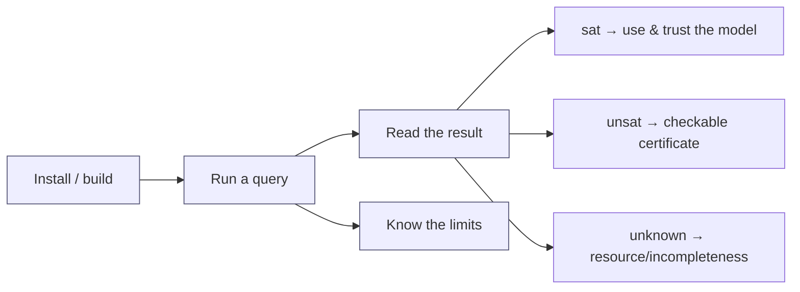

# User Guide

How to run Axeyum, read its answers, and stay inside what it actually supports.

| Page | What |
|---|---|
| installation.md *(planned)* | toolchain, `just check`, optional `z3` feature |
| [First SMT-LIB query](first-smtlib-query.md) | run a query from SMT-LIB text |
| [Rust embedding](rust-embedding.md) | typed builders, explicit width coercion, warm solving, models, and threads |
| models-and-replay.md *(planned)* | read a model; what replay guarantees |
| unsat-evidence.md *(planned)* | DRAT/LRAT/Alethe and `recheck` |
| [Limitations](limitations.md) | what's experimental/incomplete — read before trusting support |
| [Benchmarks](benchmarks.md) | the measured Z3 head-to-head + how to reproduce |
| [Versioned corpus manifests](corpus-manifests.md) | pin exact query bytes, expected verdicts, families, and representative/full tiers |
| wasm.md *(planned)* | the browser build and the [playground](../playground/README.md) |

**Golden rule for users:** read [Limitations](limitations.md) and the
[capability matrix](../research/08-planning/capability-matrix.md) before relying
on any fragment. Axeyum is honest about `unknown`; make sure your integration is
too.
