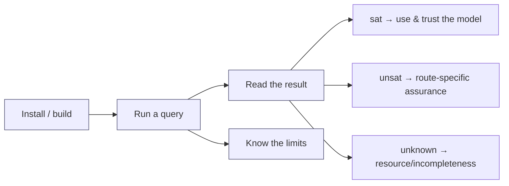

# User Guide

How to run Axeyum, read its answers, and stay inside what it actually supports.

```mermaid
flowchart LR
    I[Install / build] --> Q[Run a query]
    Q --> R[Read the result]
    R --> sat[sat → use &amp; trust the model]
    R --> unsat[unsat → route-specific assurance]
    R --> unk[unknown → resource/incompleteness]
    Q --> L[Know the limits]
    classDef a fill:#eef,stroke:#557;
    class I,Q,R,L a;
```

| Page | What |
|---|---|
| [Installation and build profiles](installation.md) | toolchain, source dependencies, `qfbv`/`full`, optional Z3, and WASM |
| [First SMT-LIB query](first-smtlib-query.md) | run a query from SMT-LIB text |
| [Rust embedding](rust-embedding.md) | typed builders, explicit width coercion, warm solving, models, and threads |
| [Models and replay](models-and-replay.md) | read typed and named models; what replay does and does not guarantee |
| [UNSAT evidence](unsat-evidence.md) | export DIMACS/DRAT/LRAT, recheck independently, and understand the clausal boundary |
| [Limitations](limitations.md) | what's experimental/incomplete — read before trusting support |
| [Benchmarks](benchmarks.md) | the measured Z3 head-to-head + how to reproduce |
| [Versioned corpus manifests](corpus-manifests.md) | pin exact query bytes, expected verdicts, families, and representative/full tiers |
| [WebAssembly and the browser playground](wasm.md) | exact build tools, QF_BV boundary, local preview, JSON API, deployment, and troubleshooting |

**Golden rule for users:** read [Limitations](limitations.md) and the
[capability matrix](../research/08-planning/capability-matrix.md) before relying
on any fragment. Axeyum is honest about `unknown`; make sure your integration is
too. A checkable UNSAT certificate is available on selected routes, not implied
by every `unsat` verdict; consult [UNSAT evidence](unsat-evidence.md) and the
[trust ledger](../reference/trust-ledger.md) for the exact boundary.
