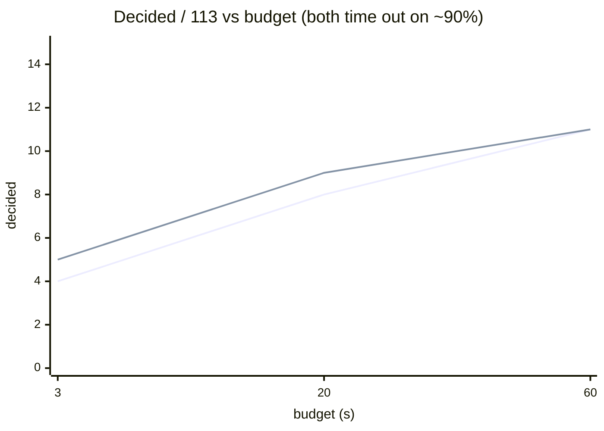

# Benchmarks

Axeyum's benchmark posture is the same as its solving posture: **measure, don't
assert.** Every number here comes from a committed artifact under
[`bench-results/`](../../bench-results/), with `DISAGREE=0` and zero replay
failures (a wrong answer would fail the harness, not just score badly).

For consumer comparisons, timing is valid only when the decided-rate gate also
passes. Operational errors make `axeyum-bench` exit nonzero, and
`--min-decided-percent P` rejects a run whose `(sat + unsat) / files` falls below
`P`. This prevents a backend that fails quickly on most inputs from appearing
faster than a backend that actually solves them.

## The measured Z3 head-to-head (public QF_BV)

On the public `QF_BV` slice `20221214-p4dfa-XiaoqiChen` (113 files, SMT-LIB 2024,
Zenodo 11061097), pure-Rust Axeyum vs Z3 4.13.3, single-threaded:

| budget | **Axeyum** (sat-bv, preprocess+inprocess) | **Z3 4.13.3** |
|---|---:|---:|
| 3 s | 4 / 113 | 5 / 113 |
| 20 s | 8 / 113 | 9 / 113 |
| 60 s | 11 / 113 | 11 / 113 |



**What this says, honestly:**

- They are at **parity** at second-scale, and parity is *budget-robust* (it holds
  at 3 s, 20 s, and 60 s).
- **Both** time out on ~**90%** (≈102/113) of this corpus even at 60 s — it is
  adversarially hard *for both solvers*, not just for Axeyum.
- The earlier "Z3 sweeps essentially all 113" was an **unmeasured premise**; when
  measured, Z3 decides 11/113 at 60 s. Axeyum even decides instances Z3 times out
  on (e.g. `string1x8.3`).

This is *not* a claim of general Z3 performance parity — it is parity *on this
corpus*. Z3's breadth (strings, FP, NRA, incremental, tactics) and its complete
nonlinear engine remain ahead. See [Limitations](limitations.md).

## Where Axeyum's design shows: embeddability + certification

On small, frequent proof obligations (e.g. Euclidean-geometry facts), the story
is different and favorable:

- **No process tax.** As an embedded Rust library, Axeyum answers in
  microseconds–milliseconds. If your integration *shells out* to the `z3` binary,
  you also pay ~100 ms of process startup *per query* — embedding wins by orders
  of magnitude there. (Against *in-process* libz3 the gap is a process-model
  effect, not solver speed — be fair about which you're comparing.)
- **Certified answers** where Z3's default `unsat` is unchecked.

See the runnable [`geometry_portfolio` example](../../crates/axeyum-solver/examples/geometry_portfolio.rs).

## Reproducing

```sh
just check                                       # fmt + clippy + test + doc gate
just bench-micro                                 # committed SMT-LIB micro corpus
just bench-public-qfbv-sat-bv-compare            # public sat-bv vs Z3 slice
just bench-public-qfbv-sat-bv-guarded            # node/CNF guarded run
just bench-public-qfbv-sat-bv-replay-refine      # replay-checked query refinement
just bench-glaurung-manifest-smoke               # client manifest/timing plumbing
just bench-glaurung-manifest-proof-smoke         # fail-closed DRAT-check plumbing
just generate-glaurung-manifest CORPUS INDEX OUT # bind capture facts to exact bytes
just bench-glaurung-qfbv-repeated CORPUS MANIFEST # process-level variance (5 trials)
just compare-glaurung-qfbv-repeated BASE CAND OUT # controlled cross-commit delta
```

**Resource rules** (this matters — the harness can OOM a small host otherwise):

- Build with capped jobs: `CARGO_BUILD_JOBS=4` / `-j4`.
- Do **not** sweep the full ~41 GB public corpus to "make progress." Measure once
  on a committed slice, then stop.

## Reading an artifact

Each JSON records the corpus + config hash, per-instance outcome, budgets,
backend stats, PAR-2, explicit `decided`/`decided_percent`, **disagreements**,
and **model-replay failures**. Artifact version 20 retains version 16's exact
floating-point millisecond values for each instance's word-level preprocessing,
bit-blast, CNF encode/inprocess, SAT, model lift, and cold total, plus corpus
totals and p50/p95 distributions. Its `client_comparison` block reports the
aggregate Axeyum/Z3 ratio plus each solver's p50/p95 over the same decided
queries. Version 17 additionally binds a run to an optional
[versioned corpus manifest](corpus-manifests.md), with exact membership,
per-query SHA-256, expected-verdict, and named-tier gates. Version 18 adds an
original-query `query_shape` block: formula and BV-width distributions,
extract/concat/extension/array-op counts, extract demanded-vs-source bits, and
exact extract-over-concat/extract/extension cancellation opportunities. The
layer block now includes AIG-input/node and CNF-variable/clause p50/p95 sizes.
Counts use unique nodes in the untouched parsed DAG; they are not distorted by
preprocessing or repeated expansion of shared terms.
Version 19 separately times original-query SAT model replay and charges it to
the cold total and Axeyum/Z3 comparison. `--prove-unsat` selects the
proof-producing native core and makes every UNSAT fail closed unless its DRAT
proof checks; the artifact records checked/missing counts and proof-check
p50/p95. Proof-check time is already inside SAT time and is marked as nested, so
it is never added twice. Keep this high-assurance artifact separate from the
default batsat performance run because it intentionally changes the SAT engine.
Version 20 adds `config.experiment`: the Axeyum source revision and source-tree
cleanliness, Cargo.lock SHA-256, rustc/cargo versions, build profile, exact
solver backend names, CPU model, OS/kernel, logical parallelism, and total memory. Its
`environment_hash` covers the locked toolchain/solvers/hardware but deliberately
excludes the source revision. Compare artifacts only when both `config_hash` and
`environment_hash` match; the differing source revisions are the commits being
compared. `--require-reproducible-run` fails before solving if the source tree is
dirty (excluding generated `bench-results/**`) or a required identity field is
unavailable. The Glaurung recipes enable this gate by default.
A comparable run requires zero errors, zero disagreements, zero replay failures,
and the declared decided-rate threshold; only then is timing a performance
signal.

Short whole-corpus measurements also require repeated independent trials. The
single-run p50/p95 values describe variation **between queries of different
shapes**; they do not measure run-to-run noise. The repeated client recipe below
launches a fresh process for every trial, keeps each artifact intact, and writes
a small `summary.json` containing nearest-rank p50/p95, sample standard
deviation, and coefficient of variation for Axeyum and Z3 corpus totals, their
ratio, and every attributed Axeyum stage. The summarizer holds only one source
artifact at a time, so repetitions do not multiply the large corpus artifact's
memory footprint.
The committed
[`glaurung-repetition-smoke`](../../bench-results/glaurung-repetition-smoke/summary.json)
exercises this plumbing on the two-query micro tier; its sub-millisecond
variance is not client performance evidence.

## Binary-analysis client gate

The primary client target accepts an external Glaurung query capture (the
client corpus is not redistributed by this repository):

```sh
just bench-glaurung-qfbv \
  /path/to/glaurung-smt2-capture \
  /path/to/glaurung-manifest-v1.json \
  representative
```

This first validates every file and SHA-256 declared by the manifest, selects
the named tier in manifest order, and gates each result against the capture's
expected verdict. It then runs one query at a time, enables word-level
preprocessing, compares every result with in-process Z3 on the **original parsed
assertions**, requires a 100% decided rate, requires in-process Z3 coverage for
every selected file, and emits a versioned artifact. Axeyum's comparison time
includes its selected word preprocessing; Z3 never receives Axeyum's reduced
assertion set. Synthetic QF_BV corpora remain useful lower-level diagnostics,
but do not replace the extract/concat/mixed-width/memory-derived client shape.
The shape block can count `select`/`store` operations that survive parsing, but
cannot infer memory provenance after a lifter has flattened memory into BV
terms; preserve that provenance in the manifest `family` and `source` fields.

For the publishable repeated measurement (five trials by default):

```sh
just bench-glaurung-qfbv-repeated \
  /path/to/glaurung-smt2-capture \
  /path/to/glaurung-manifest-v1.json \
  representative \
  bench-results/glaurung-qfbv-repeated \
  5
```

Every source artifact must have byte-identical configuration, a clean
reproducible-run identity, one worker, complete in-process Z3 coverage, 100%
decisions, and zero operational errors, manifest/oracle disagreements, or
model/proof replay failures. Any violation prevents `summary.json` from being
written. The summary records each source artifact's SHA-256 and the exact
configuration/experiment identity, so trials cannot be silently mixed across
commits, hardware, toolchains, corpus bytes, or solver settings. `summary.json`
must remain in the common source-artifact directory; its portable relative
paths let the cross-commit comparator reopen and revalidate every trial.

Compare two repeated summaries from distinct clean source revisions with:

```sh
just compare-glaurung-qfbv-repeated \
  bench-results/baseline/summary.json \
  bench-results/candidate/summary.json \
  bench-results/comparison.json
```

The comparator independently revalidates both summaries and recomputes their
variance blocks from the source-trial records. It requires identical corpus and
manifest hashes, solver configuration, toolchain, hardware, and backend
versions; only `config.experiment.source.revision` may differ, and both sources
must be clean. The report shows candidate-minus-baseline changes for raw Axeyum
time, raw Z3 control time, the Axeyum/Z3 ratio, and every attributed Axeyum
stage. `standardized_delta` is a descriptive change divided by the combined
standard error, not a statistical-significance claim.

Once the real corpus establishes an accepted regression policy, explicit gates
can be applied without changing the evidence format:

```sh
python3 scripts/compare-glaurung-repetitions.py \
  bench-results/baseline/summary.json \
  bench-results/candidate/summary.json \
  --max-ratio-regression-percent 5 \
  --max-axeyum-regression-percent 5 \
  --max-z3-drift-percent 10 \
  --out bench-results/comparison.json
```

The example thresholds illustrate the CLI only; they are not an accepted
Glaurung policy. A configured gate writes the comparison for diagnosis and
exits nonzero when exceeded. Invalid or incomparable inputs remove any stale
output and fail before producing a report.
The committed
[`glaurung-cross-commit-smoke`](../../bench-results/glaurung-cross-commit-smoke.json)
exercises this path across two clean revisions. Its high candidate variance
makes the result diagnostic plumbing only, not a speedup or threshold decision.

Run the separate proof-validation companion on the same immutable manifest:

```sh
just bench-glaurung-qfbv-proof-check \
  /path/to/glaurung-smt2-capture \
  /path/to/glaurung-manifest-v1.json \
  representative
```

It retains the decided/error/oracle/manifest gates, adds the checked-proof gate,
and writes a separate artifact. Its native-CDCL timings are assurance overhead,
not a replacement for the default client performance ratio.
