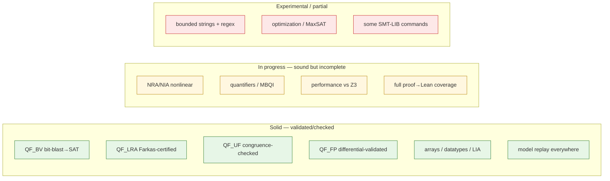

# Limitations

Read this before relying on any fragment. Axeyum is deliberately honest about
what it *doesn't* do — an explicit `unknown` is a feature. This page is the
plain-language summary; the authoritative, golden-tested detail is the
[capability matrix](../research/08-planning/capability-matrix.md),
[support matrix](../research/08-planning/support-matrix.md), and
[trust ledger](../research/08-planning/trust-ledger.md).

## The honest headline

Axeyum is a **research-grade Rust stack with strong foundations**, not a general
Z3 replacement and not yet at Lean parity. It is sound (`unknown`, never a wrong
`sat`/`unsat`) and broad, but incomplete in specific, named ways.

## Maturity by area

## Specific things to know

- **Performance is the open gate.** On the public QF_BV slice Axeyum is at
  parity with Z3 4.13.3 (both ~90% timeout), but Z3's breadth and its complete
  nonlinear engine are ahead. See [Benchmarks](benchmarks.md).
- **Nonlinear arithmetic (NRA/NIA) is sound but incomplete.** It decides a
  growing set (squares, AM–GM, single-variable polynomials, polynomial
  identities) and returns `unknown` elsewhere — it will not match Z3's complete
  `nlsat` in general.
- **Quantifiers** are complete over finite domains; otherwise sound refutation by
  instantiation, `unknown` on no progress.
- **Strings** are *bounded* (length-capped, BV-lowered) — not the unbounded
  string theory; `str.len` UNSAT can be `unknown` (a BV+LIA gap).
- **Lean parity is partial.** Several fragments reconstruct to a kernel-checked
  `False`, but not all reductions are certified yet — the
  [trust ledger](../research/08-planning/trust-ledger.md) lists exactly which
  routes are independently checked vs still trusted.
- **Some SMT-LIB commands** are parsed but not fully implemented; the
  [support matrix](../research/08-planning/support-matrix.md) marks
  "accepted-but-ignored" vs fully supported.
- **The `z3` backend is feature-gated bootstrap scaffolding** (an oracle /
  differential cross-check), not part of the pure-Rust default build.

## The contract you can rely on

Whatever the limitation, the guarantees hold:

1. **Never a wrong answer.** Every `sat` replays against the original query;
   every `unsat` route is independently checked or explicitly ledgered as
   trusted.
2. **`unknown` is first-class.** Resource limits and incompleteness produce a
   deterministic `unknown`, never a crash, hang, or guess.
3. **Determinism.** Stable iteration order, explicit seeds, explicit budgets.

If your use case needs a fragment marked *in progress* or *experimental*, treat
`unknown` as a real outcome and have a fallback — or open an issue; the roadmap
([PLAN.md](../../PLAN.md)) is followable and the gaps are named.
