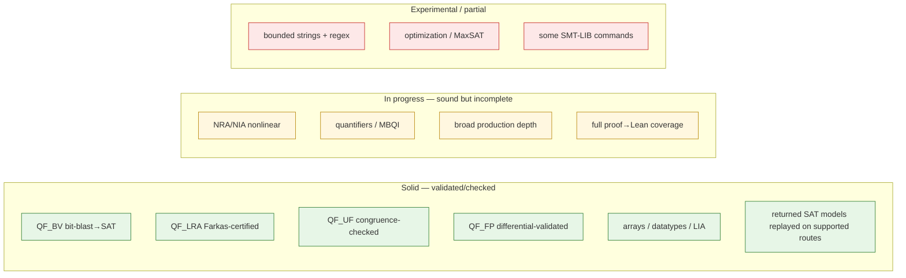

# Limitations

Read this before relying on any fragment. Axeyum is deliberately honest about
what it *doesn't* do — an explicit `unknown` is a feature. This page is the
plain-language summary; the authoritative, golden-tested detail is the
[capability matrix](../research/08-planning/capability-matrix.md),
[support matrix](../research/08-planning/support-matrix.md), and
[trust ledger](../research/08-planning/trust-ledger.md).

## The honest headline

Axeyum is a **research-grade Rust stack with strong foundations**, not a general
Z3 replacement or a replacement for the Lean system. Its architecture is
fail-closed and its committed comparisons currently record zero wrong verdicts,
but finite tests do not prove universal soundness. Coverage and assurance are
incomplete in specific, named ways. See [Project State](../PROJECT-STATE.md).

## Maturity by area

## Specific things to know

- **Performance is workload-dependent.** One registered p4dfa cell has equal
  Axeyum/Z3 solved counts, while the fair Glaurung baseline has Axeyum ahead of
  warm Z3 on three drivers, behind on one, and behind warm Bitwuzla on all four.
  This supports a characterized regime, not general parity. See
  [Benchmarks](benchmarks.md).
- **Nonlinear arithmetic (NRA/NIA) is sound but incomplete.** It decides a
  growing set (squares, AM–GM, single-variable polynomials, polynomial
  identities) and returns `unknown` elsewhere — it will not match Z3's complete
  `nlsat` in general.
- **Quantifiers** are complete over finite domains; otherwise sound refutation by
  instantiation, `unknown` on no progress.
- **Strings** are *bounded* (length-capped, BV-lowered) — not the unbounded
  string theory; `str.len` UNSAT can be `unknown` (a BV+LIA gap).
- **Lean integration is partial.** Many audited UNSATs reconstruct to a
  kernel-checked `False`, but proof coverage, full kernel compatibility, and the
  tactic/import bridge remain incomplete. Arithmetic reconstruction also uses
  an explicitly inventoried axiom prelude that is not yet discharged against
  mathlib. See the [proof-gap matrix](../plan/generated/proof-gap-matrix.md) and
  [kernel audit](../prover-track/research/06-kernel-gap-analysis.md).
- **Some SMT-LIB commands** are parsed but not fully implemented; the
  [support matrix](../research/08-planning/support-matrix.md) marks
  "accepted-but-ignored" vs fully supported.
- **The `z3` backend is feature-gated bootstrap scaffolding** (an oracle /
  differential cross-check), not part of the pure-Rust default build.

## The contract you can rely on

The intended contract is:

1. **Fail closed.** Returned SAT models on supported routes replay against the
   original query. UNSAT evidence and any remaining trusted boundary are
   recorded separately; a route without the assurance required by its caller
   must decline rather than inherit credit from another route.
2. **`unknown` is first-class.** Resource limits and incompleteness produce a
   deterministic `unknown` or explicit decline rather than a guessed verdict.
3. **Determinism.** Stable iteration order, explicit seeds, explicit budgets.

The committed zero-disagreement and zero-wrong counts are regression evidence
for this contract, not a mathematical proof that every untested input satisfies
it.

If your use case needs a fragment marked *in progress* or *experimental*, treat
`unknown` as a real outcome and have a fallback — or open an issue; the roadmap
([PLAN.md](../../PLAN.md)) is followable and the gaps are named.
